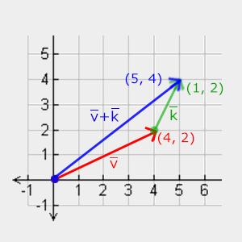

# OpenGL Notebook


## References

Learn OpenGL (EN): https://learnopengl.com/

Learn OpenGL's PDF(EN): https://learnopengl.com/book/book_pdf.pdf

The Chinese Vision: https://learnopengl-cn.github.io/intro/

## Getting started

### OpenGL

#### What's OpenGL?

Before starting our journey we should first define what OpenGL actually is. OpenGL is mainly considered an API (an Application Programming Interface) that provides us with a large set of functions that we can use to manipulate graphics and images. However, ***OpenGL by itself is not an API, but merely a specification***, developed and maintained by the [Khronos Group](http://www.khronos.org/).

The OpenGL specification specifies exactly what the result/output of each function should be and how it should perform. It is then up to the developers *implementing* this specification to come up with a solution of how this function should operate. 

Since the OpenGL specification does not give us implementation details, the actual developed versions of OpenGL are allowed to have different implementations, as long as their results comply with the specification (and are thus the same to the user).

Khronos publicly hosts all specification documents for all the OpenGL versions. The interested reader can find the OpenGL specification of version 3.3 (which is what we'll be using) [here](https://www.opengl.org/registry/doc/glspec33.core.20100311.withchanges.pdf) which is a good read if you want to delve into the details of OpenGL (note how they mostly just describe results and not implementations). The specifications also provide a great reference for finding the **exact** workings of its functions. 

#### Core-profile vs Immediate mode

**In the old days, using OpenGL meant developing in immediate mode** (often referred to as the fixed function pipeline) which was an easy-to-use method for drawing graphics. Most of the functionality of OpenGL was hidden inside the library and developers did not have much control over how OpenGL does its calculations. 

Developers eventually got hungry for more flexibility and over time the specifications became more flexible as a result; developers gained more control over their graphics. **The immediate mode is really easy to use and understand, but it is also extremely inefficient.** 

For that reason the specification started to deprecate immediate mode functionality from version 3.2 onwards and started motivating developers to develop in OpenGL's **core-profile mode**, **which is a division of OpenGL's specification that removed all old deprecated functionality.**

When using OpenGL's core-profile, **OpenGL forces us to use modern practices**. Whenever we try to use one of OpenGL's deprecated functions, OpenGL raises an error and stops drawing. The advantage of learning the modern approach is that it is very flexible and efficient. However, it's also more difficult to learn. The immediate mode abstracted quite a lot from the **actual** operations OpenGL performed and while it was easy to learn, it was hard to grasp how OpenGL actually operates. The modern approach requires the developer to truly understand OpenGL and graphics programming and while it is a bit difficult, it allows for much more flexibility, more efficiency and most importantly: a much better understanding of graphics programming.

#### Why choose OpenGL 3.3 ?

As of today, higher versions of OpenGL are available to choose from (at the time of writing 4.6) at which you may ask: why do I want to learn OpenGL 3.3 when OpenGL 4.6 is out? 

The answer to that question is relatively simple. **All future versions of OpenGL starting from 3.3 add extra useful features to OpenGL without changing OpenGL's core mechanics**; the newer versions just introduce slightly more efficient or more useful ways to accomplish the same tasks. The result is that all concepts and techniques remain the same over the modern OpenGL versions so it is perfectly valid to learn OpenGL 3.3. Whenever you're ready and/or more experienced you can easily use specific functionality from more recent OpenGL versions.

##### NOTE

When using functionality from the most recent version of OpenGL, only the most modern graphics cards will be able to run your application. **This is often why most developers generally target lower versions of OpenGL and optionally enable higher version functionality.**

#### Extensions

A great feature of OpenGL is its support of extensions. Whenever a graphics company comes up with a new technique or a new large optimization for rendering this is often found in an extension implemented in the drivers. If the hardware an application runs on supports such an extension the developer can use the functionality provided by the extension for more advanced or efficient graphics. This way, **a graphics developer can still use these new rendering techniques without having to wait for OpenGL to include the functionality in its future versions, simply by checking if the extension is supported by the graphics card.** Often, when an extension is popular or very useful it eventually becomes part of future OpenGL versions.

The developer has to query whether any of these extensions are available before using them (or use an OpenGL extension library). This allows the developer to do things better or more efficient, based on whether an extension is available:

```c++
if(GL_ARB_extension_name)
{
    // Do cool new and modern stuff supported by hardware
}
else
{
    // Extension not supported: do it the old way
}
```

With OpenGL version 3.3 we rarely need an extension for most techniques, but wherever it is necessary proper instructions are provided.

#### State machine

OpenGL is by itself a large state machine: **a collection of variables that define how OpenGL should currently operate**. The state of OpenGL is commonly referred to as the **OpenGL context**. When using OpenGL, we often change its state by setting some options, manipulating some buffers and then render using the current context.

Whenever we tell OpenGL that we now want to draw lines instead of triangles for example, we change the state of OpenGL by changing some context variable that sets how OpenGL should draw. As soon as we change the context by telling OpenGL it should draw lines, the next drawing commands will now draw lines instead of triangles. 

When working in OpenGL we will **come across several state-changing functions that change the context and several state-using functions that perform some operations based on the current state of OpenGL**. As long as you keep in mind that OpenGL is basically one large state machine, most of its functionality will make more sense. 

#### Objects

The OpenGL libraries are written in C and allows for many derivations in other languages, but in its core it remains a C-library. Since many of C's language-constructs do not translate that well to other higher-level languages, OpenGL was developed with several abstractions in mind. One of those abstractions are objects in OpenGL.

**An object in OpenGL is a collection of options that represents a subset of OpenGL's state.** For example, we could have an object that represents the settings of the drawing window; we could then set its size, how many colors it supports and so on. One could visualize an object as a C-like struct:

```c++
struct object_name {
    float  option1;
    int    option2;
    char[] name;
};
```

Whenever we want to use objects it generally looks something like this (with OpenGL's context visualized as a large struct):

```c++
// The State of OpenGL
struct OpenGL_Context {
  	...
  	object_name* object_Window_Target;
  	...  	
};
```

```c++
// create object
unsigned int objectId = 0;
glGenObject(1, &objectId);
// bind/assign object to context
glBindObject(GL_WINDOW_TARGET, objectId);
// set options of object currently bound to GL_WINDOW_TARGET
glSetObjectOption(GL_WINDOW_TARGET, GL_OPTION_WINDOW_WIDTH,  800);
glSetObjectOption(GL_WINDOW_TARGET, GL_OPTION_WINDOW_HEIGHT, 600);
// set context target back to default
glBindObject(GL_WINDOW_TARGET, 0);
```

This little piece of code is a workflow you'll frequently see when working with OpenGL. 

We first create an object and store a reference to it as an id (the real object's data is stored behind the scenes). 

Then we bind the object (using its id) to the target location of the context (the location of the example window object target is defined as `GL_WINDOW_TARGET`). 

Next we set the window options and finally we un-bind the object by setting the current object id of the window target to `0`. The options we set are stored in the object referenced by `objectId` and restored as soon as we bind the object back to `GL_WINDOW_TARGET`. 

##### Benefits

The great thing about using these objects is that we can define more than one object in our application, set their options and whenever we start an operation that uses OpenGL's state, we bind the object with our preferred settings. 

There are objects for example that act as container objects for 3D model data (a house or a character) and whenever we want to draw one of them, we bind the object containing the model data that we want to draw (we first created and set options for these objects). 

Having several objects allows us to specify many models and whenever we want to draw a specific model, we simply bind the corresponding object before drawing without setting all their options again.

#### Additional resources

- [opengl.org](https://www.opengl.org/): official website of OpenGL.
- [OpenGL registry](https://www.opengl.org/registry/): hosts the OpenGL specifications and extensions for all OpenGL versions.

### Creating a window

The first thing we need to do before we start creating stunning graphics is to create an OpenGL context and an application window to draw in. However, those operations are specific per operating system and OpenGL purposefully tries to abstract itself from these operations. This means we have to create a window, define a context, and handle user input all by ourselves.

Luckily, there are quite a few libraries out there that provide the functionality we seek, some specifically aimed at OpenGL. Those libraries save us all the operation-system specific work and give us a window and an OpenGL context to render in. Some of the more popular libraries are GLUT, SDL, SFML and GLFW. 

In this notebook we will be using **GLFW**. Feel free to use any of the other libraries, the setup for most is similar to GLFW's setup.

#### GLFW

GLFW is a library, written in C, specifically targeted at OpenGL. GLFW gives us the bare necessities required for rendering goodies to the screen. It allows us to create an OpenGL context, define window parameters, and handle user input, which is plenty enough for our purposes. 

The focus of this and the next chapter is to get GLFW up and running, making sure it properly creates an OpenGL context and that it displays a simple window for us to mess around in. 

More guides of GLFW's install can be found in https://learnopengl.com/Getting-started/Creating-a-window

##### OpenGL library on Windows

If you're on Windows the OpenGL library `opengl32.lib` comes with the Microsoft SDK, which is installed by default when you install Visual Studio. Since this chapter uses the VS compiler and is on windows we add `opengl32.lib` to the linker settings. Note that the 64-bit equivalent of the OpenGL library is called `opengl32.lib`, just like the 32-bit equivalent, which is a bit of an unfortunate name.

##### OpenGL library on Linux

On Linux systems you need to link to the `libGL.so` library by adding `-lGL` to your linker settings. If you can't find the library you probably need to install any of the Mesa, NVidia or AMD dev packages.

Then, once you've added both the GLFW and OpenGL library to the linker settings you can include the header files for GLFW as follows:

```c++
#include <GLFW/glfw3.h>
```

###### NOTE

For Linux users compiling with GCC, the following command line options may help you compile the project: `-lglfw -lGL -lX11 -lpthread -lXrandr -lXi -ldl`. Not correctly linking the corresponding libraries will generate many *undefined reference* errors.

#### GLAD

We're still not quite there yet, since there is one other thing we still need to do. Because OpenGL is only really a standard/specification it is up to the driver manufacturer to implement the specification to a driver that the specific graphics card supports. Since there are many different versions of OpenGL drivers, the location of most of its functions is not known at compile-time and needs to be queried at run-time. It is then the task of the developer to retrieve the location of the functions he/she needs and store them in function pointers for later use. Retrieving those locations is [OS-specific](https://www.khronos.org/opengl/wiki/Load_OpenGL_Functions). In Windows it looks something like this:

```c++
// define the function's prototype
typedef void (*GL_GENBUFFERS) (GLsizei, GLuint*);
// find the function and assign it to a function pointer
GL_GENBUFFERS glGenBuffers  = (GL_GENBUFFERS)wglGetProcAddress("glGenBuffers");
// function can now be called as normal
unsigned int buffer;
glGenBuffers(1, &buffer);
```

As you can see the code looks complex and it's a cumbersome process to do this for each function you may need that is not yet declared. Thankfully, there are libraries for this purpose as well where **GLAD** is a popular and up-to-date library. 

##### Setting up GLAD

GLAD is an [open source](https://github.com/Dav1dde/glad) library that manages all that cumbersome work we talked about. GLAD has a slightly different configuration setup than most common open source libraries. GLAD uses a [web service](http://glad.dav1d.de/) where we can tell GLAD for which version of OpenGL we'd like to define and load all relevant OpenGL functions according to that version.  

Go to the GLAD [web service](http://glad.dav1d.de/), make sure the language is set to C++, and in the API section select an OpenGL version of at least 3.3 (which is what we'll be using; higher versions are fine as well). Also make sure the profile is set to *Core* and that the *Generate a loader* option is ticked. Ignore the extensions (for now) and click *Generate* to produce the resulting library files.

**GLAD by now should have provided you a zip file containing two include folders, and a single `glad.c` file. Copy both include folders (`glad` and `KHR`) into your include(s) directory (or add an extra item pointing to these folders), and add the `glad.c` file to your project.**

After the previous steps, you should be able to add the following include directive above your file:

```c++
#include <glad/glad.h> 
```

#### Additional resources

- [GLFW: Window Guide](http://www.glfw.org/docs/latest/window_guide.html): official GLFW guide on setting up and configuring a GLFW window.
- [Building applications](http://www.opengl-tutorial.org/miscellaneous/building-your-own-c-application/): provides great info about the compilation/linking process of your application and a large list of possible errors (plus solutions) that may come up.
- [GLFW with Code::Blocks](http://wiki.codeblocks.org/index.php?title=Using_GLFW_with_Code::Blocks): building GLFW in Code::Blocks IDE.
- [Running CMake](http://www.cmake.org/runningcmake/): short overview of how to run CMake on both Windows and Linux.
- [Writing a build system under Linux](https://learnopengl.com/demo/autotools_tutorial.txt): an autotools tutorial by Wouter Verholst on how to write a build system in Linux.
- [Polytonic/Glitter](https://github.com/Polytonic/Glitter): a simple boilerplate project that comes pre-configured with all relevant libraries; great for if you want a sample project without the hassle of having to compile all the libraries yourself.

### Hello Window

First, add the following includes to the top of .cpp file.

```c++
#include <glad/glad.h>
#include <GLFW/glfw3.h>
```

Be sure to include GLAD before GLFW. The include file for GLAD includes the required OpenGL headers behind the scenes (like `GL/gl.h`) so **be sure to include GLAD before other header files that require OpenGL (like GLFW)**. 

Then create the main function where we will instantiate the GLFW window.

```c++
int main()
{
    glfwInit();
    glfwWindowHint(GLFW_CONTEXT_VERSION_MAJOR, 3);
    glfwWindowHint(GLFW_CONTEXT_VERSION_MINOR, 3);
    glfwWindowHint(GLFW_OPENGL_PROFILE, GLFW_OPENGL_CORE_PROFILE);
    //glfwWindowHint(GLFW_OPENGL_FORWARD_COMPAT, GL_TRUE);
  
    return 0;
}
```

In the main function we first initialize GLFW with `glfwInit`, after which we can configure GLFW using `glfwWindowHint`. 

The first argument of `glfwWindowHint` tells us what option we want to configure, where we can select the option from a large enum of possible options prefixed with `GLFW_`. 

The second argument is an integer that sets the value of our option. A list of all the possible options and its corresponding values can be found at [GLFW's window handling](http://www.glfw.org/docs/latest/window.html#window_hints) documentation. 

If you try to run the application now and it gives a lot of *undefined reference* errors it means you didn't successfully link the GLFW library.

Since the focus of this book is on OpenGL version 3.3 we'd like to tell GLFW that 3.3 is the OpenGL version we want to use. This way GLFW can make the proper arrangements when creating the OpenGL context. This ensures that when a user does not have the proper OpenGL version GLFW fails to run. We set the major and minor version both to `3`. 

We also tell GLFW we want to explicitly use the core-profile. Telling GLFW we want to use the core-profile means we'll get access to a smaller subset of OpenGL features without backwards-compatible features we no longer need. 

Note that on Mac OS X you need to add `glfwWindowHint(GLFW_OPENGL_FORWARD_COMPAT, GL_TRUE);` to your initialization code for it to work.

```c++
#ifdef __APPLE__
    glfwWindowHint(GLFW_OPENGL_FORWARD_COMPAT, GL_TRUE);
#endif
```

Next we're required to create a window object. This window object holds all the windowing data and is required by most of GLFW's other functions. 

```c++
GLFWwindow* window = glfwCreateWindow(800, 600, "LearnOpenGL", NULL, NULL);
if (window == NULL)
{
    std::cout << "Failed to create GLFW window" << std::endl;
    glfwTerminate();
    return -1;
}
glfwMakeContextCurrent(window);
```

The `glfwCreateWindow` function requires the window width and height as its first two arguments respectively. The third argument allows us to create a name for the window; for now we call it `"LearnOpenGL"` but you're allowed to name it however you like. 

We can ignore the last 2 parameters. The function returns a `GLFWwindow` object that we'll later need for other GLFW operations. After that we tell GLFW to make the context of our window the main context on the current thread.

#### GLAD

GLAD manages function pointers for OpenGL so we want to initialize GLAD before we call any OpenGL function:

```c++
if (!gladLoadGLLoader((GLADloadproc)glfwGetProcAddress))
{
    std::cout << "Failed to initialize GLAD" << std::endl;
    return -1;
} 
```

We pass GLAD the function to load the address of the OpenGL function pointers which is OS-specific. GLFW gives us `glfwGetProcAddress` that defines the correct function based on which OS we're compiling for.

#### Viewport

Before we can start rendering we have to do one last thing. We have to **tell OpenGL the size of the rendering window** so OpenGL knows how we want to display the data and coordinates with respect to the window. We can set those *dimensions* via the `glViewport` function:

```c++
glViewport(0, 0, 800, 600);
```

The first two parameters of `glViewport` set the location of the lower left corner of the window. The third and fourth parameter set the width and height of the rendering window in pixels, which we set equal to GLFW's window size. 

We could actually **set the viewport dimensions at values smaller than GLFW's dimensions**; then all the OpenGL rendering would be displayed in a smaller window and we could for example **display other elements outside the OpenGL viewport**.

> **NOTE**
>
> Behind the scenes OpenGL uses the data specified via `glViewport` to transform the 2D coordinates it processed to coordinates on your screen. For example, a processed point of location `(-0.5,0.5)` would (as its final transformation) be mapped to `(200,450)` in screen coordinates. 
>
> Note that processed coordinates in OpenGL are between -1 and 1 so we effectively map from the range `(-1 to 1)` to `(0, 800)` and `(0, 600)`.

However, the moment a user resizes the window the viewport should be adjusted as well. We can register a callback function on the window that gets called each time the window is resized. This resize callback function has the following prototype: 

```c++
void framebuffer_size_callback(GLFWwindow* window, int width, int height); 
```

The framebuffer size function takes a GLFWwindow as its first argument and two integers indicating the new window dimensions. Whenever the window changes in size, GLFW calls this function and fills in the proper arguments for you to process. 

```c++
void framebuffer_size_callback(GLFWwindow* window, int width, int height)
{
    glViewport(0, 0, width, height);
}
```

We do have to tell GLFW we want to call this function on every window resize by registering it:

```c++
glfwSetFramebufferSizeCallback(window, framebuffer_size_callback); 
```

When the window is first displayed `framebuffer_size_callback` gets called as well with the resulting window dimensions. For retina displays width and height will end up significantly higher than the original input values.

There are many callbacks functions we can set to register our own functions. For example, we can make a callback function to process joystick input changes, process error messages etc. We register the callback functions after we've created the window and before the render loop is initiated.

#### Ready you engines

We don't want the application to draw a single image and then immediately quit and close the window. We want the application to keep drawing images and handling user input until the program has been explicitly told to stop. 

For this reason we have to create a while loop, that we now call the **render loop**, that keeps on running until we tell GLFW to stop. The following code shows a very simple render loop:

```c++
while(!glfwWindowShouldClose(window))
{
    glfwSwapBuffers(window);
    glfwPollEvents();    
}
```

The `glfwWindowShouldClose` function checks at the start of each loop iteration if GLFW has been instructed to close. If so, the function returns `true` and the render loop stops running, after which we can close the application.

The `glfwPollEvents` function checks if any events are triggered (like keyboard input or mouse movement events), updates the window state, and calls the corresponding functions (which we can register via callback methods). 

The `glfwSwapBuffers` will swap the color buffer (a large 2D buffer that contains color values for each pixel in GLFW's window) that is used to render to during this render iteration and show it as output to the screen. 

##### Double buffer

When an application draws in a single buffer the resulting image may display flickering issues. This is because the resulting output image is not drawn in an instant, but drawn pixel by pixel and usually from left to right and top to bottom. Because this image is not displayed at an instant to the user while still being rendered to, the result may contain artifacts. 

To circumvent these issues, windowing applications apply a double buffer for rendering. The **front** buffer contains the final output image that is shown at the screen, while all the rendering commands draw to the **back** buffer. As soon as all the rendering commands are finished we **swap** the back buffer to the front buffer so the image can be displayed without still being rendered to, removing all the aforementioned artifacts.

#### One last thing

As soon as we exit the render loop we would like to properly clean/delete all of GLFW's resources that were allocated. We can do this via the `glfwTerminate` function that we call at the end of the main function.

```c++
glfwTerminate();
return 0;
```

This will clean up all the resources and properly exit the application.  Now try to compile your application and if everything went well you  should see the following output:  


***<u>check the full source code [here](code/01_hello_window/main.cpp)</u>*** 

#### Input

We also want to have some form of input control in GLFW and we can achieve this with several of GLFW's input functions. We'll be using GLFW's `glfwGetKey` function that takes the window as input together with a key. The function returns whether this key is currently being pressed. We're creating a processInput function to keep all input code organized:

```c++
void processInput(GLFWwindow *window)
{
    if(glfwGetKey(window, GLFW_KEY_ESCAPE) == GLFW_PRESS)
        glfwSetWindowShouldClose(window, true);
}
```

Here we check whether the user has pressed the escape key (if it's not pressed, `glfwGetKey` returns `GLFW_RELEASE`). If the user did press the escape key, we close GLFW by setting its `WindowShouldClose property` to `true` using `glfwSetwindowShouldClose`. The next condition check of the main `while` loop will then fail and the application closes.

We then call processInput every iteration of the render loop:

```c++
while (!glfwWindowShouldClose(window))
{
    processInput(window);

    glfwSwapBuffers(window);
    glfwPollEvents();
}  
```

This gives us an easy way to check for specific key presses and react accordingly every frame. An iteration of the render loop is more commonly called a frame.

#### Rendering

We want to place all the rendering commands in the render loop, since we want to execute all the rendering commands each iteration or frame of the loop. This would look a bit like this: 

```c++
// render loop
while(!glfwWindowShouldClose(window))
{
    // input
    processInput(window);

    // rendering commands here
    ...

    // check and call events and swap the buffers
    glfwPollEvents();
    glfwSwapBuffers(window);
}
```

Just to test if things actually work we want to clear the screen with a color of our choice. At the start of frame we want to clear the screen. Otherwise we would still see the results from the previous frame (this could be the effect you're looking for, but usually you don't). 

We can clear the screen's color buffer using `glClear` where we pass in buffer bits to specify which buffer we would like to clear. The possible bits we can set are `GL_COLOR_BUFFER_BIT`, `GL_DEPTH_BUFFER_BIT` and `GL_STENCIL_BUFFER_BIT`. Right now we only care about the color values so we only clear the color buffer.

```c++
glClearColor(0.2f, 0.3f, 0.3f, 1.0f);
glClear(GL_COLOR_BUFFER_BIT);
```

Note that we also specify the color to clear the screen with using `glClearColor`. Whenever we call `glClear` and clear the color buffer, the entire color buffer will be filled with the color as configured by `glClearColor`. This will result in a dark green-blueish color. 

The `glClearColor` function is a *state-setting* function and `glClear` is a *state-using* function in that it uses the current state to retrieve the clearing color from.


### Hello Triangle

In OpenGL everything is in 3D space, but the screen or window is a 2D array of pixels so **a large part of OpenGL's work is about transforming all 3D coordinates to 2D pixels that fit on your screen**. The process of transforming 3D coordinates to 2D pixels is managed by the graphics pipeline of OpenGL. 

The graphics pipeline can be divided into two large parts: 

- the first transforms your 3D coordinates into 2D coordinates
- the second part transforms the 2D coordinates into actual colored pixels. 

In this chapter we'll briefly discuss the graphics pipeline and how we can use it to our advantage to create fancy pixels.

The graphics pipeline takes as input a set of 3D coordinates and transforms these to colored 2D pixels on your screen. The graphics pipeline can be divided into several steps where each step requires the output of the previous step as its input. All of these steps are highly specialized (they have one specific function) and can easily be executed in parallel. **Because of their parallel nature, graphics cards of today have thousands of small processing cores to quickly process your data within the graphics pipeline.** The processing cores run small programs on the GPU for each step of the pipeline. These small programs are called **shaders**.

Some of these shaders are configurable by the developer which allows us to write our own shaders to replace the existing default shaders. This gives us much more fine-grained control over specific parts of the pipeline and because they run on the GPU, they can also save us valuable CPU time. 

Shaders are written in the OpenGL Shading Language (GLSL) and we'll delve more into that in [the next chapter](#shader).

Below you'll find an abstract representation of all the stages of the graphics pipeline. Note that the blue sections represent sections where we can inject our own shaders.


As input to the graphics pipeline we pass in a list of three 3D coordinates that should form a triangle in an array here called `Vertex Data`; this vertex data is a collection of vertices. A vertex is a collection of data per 3D coordinate. This vertex's data is represented using vertex attributes that can contain any data we'd like, but for simplicity's sake let's assume that each vertex consists of just a 3D position and some color value.

> In order for OpenGL to know what to make of your collection of coordinates and color values OpenGL requires you to hint what kind of render types you want to form with the data. 
>
> Do we want the data rendered as a collection of points, a collection of triangles or perhaps just one long line? 
>
> Those hints are called **primitives** and are given to OpenGL while calling any of the drawing commands. 
>
> Some of these hints are `GL_POINTS`, `GL_TRIANGLES` and `GL_LINE_STRIP`.

#### Pipeline

The first part of the pipeline is the ***<u>vertex shader</u>*** that takes as input a single vertex. The **main purpose** of the vertex shader is to **transform 3D coordinates into different 3D coordinates** and the vertex shader **allows us to do some basic processing on the vertex attributes**. 

The ***<u>primitive assembly</u>*** stage takes as input all the vertices (or vertex if GL_POINTS is chosen) from the vertex shader that **form a primitive and assembles all the point(s) in the primitive shape given**; in this case a triangle.

The output of the primitive assembly stage is passed to the **<u>*geometry shader*</u>**. The geometry shader **takes as input a collection of vertices that form a primitive** and has the ability to **generate other shapes by emitting new vertices to form new (or other) primitive(s)**. In this example case, it generates a second triangle out of the given shape.

The output of the geometry shader is then passed on to the ***<u>rasterization stage</u>*** where it **maps the resulting primitive(s) to the corresponding pixels on the final screen, resulting in fragments for the fragment shader to use**. Before the fragment shaders run, clipping is performed. Clipping discards all fragments that are outside your view, increasing performance.

**NOTE:** A **fragment** in OpenGL is all the data required for OpenGL to render a single pixel. 

The main purpose of the *<u>**fragment shader**</u>* is to **calculate the final color of a pixel** and this is usually the stage **where all the advanced OpenGL effects occur**. Usually the fragment shader contains data about the 3D scene that it can use to calculate the final pixel color (like lights, shadows, color of the light and so on).

After all the corresponding color values have been determined, the final object will then pass through one more stage that we call the **<u>*alpha test and blending stage*</u>**. This stage **checks the corresponding depth (and stencil) value of the fragment and uses those to check if the resulting fragment is in front or behind other objects and should be discarded accordingly**. **The stage also checks for alpha values (alpha values define the opacity of an object) and blends the objects accordingly.** So even if a pixel output color is calculated in the fragment shader, the final pixel color could still be something entirely different when rendering multiple triangles.

As you can see, the graphics pipeline is quite a complex whole and contains many configurable parts. However, for almost all the cases we only have to work with the vertex and fragment shader. The geometry shader is optional and usually left to its default shader. There is also the tessellation stage and transform feedback loop that we haven't depicted here, but that's something for later. 

In modern OpenGL we are **required** to define at least a vertex and fragment shader of our own (there are no default vertex/fragment shaders on the GPU). For this reason it is often quite difficult to start learning modern OpenGL since a great deal of knowledge is required before being able to render your first triangle.

- Overview
  - Vertex shader
    - transform 3D coordinates into different 3D coordinates
    - allows us to do some basic processing on the vertex attributes
  - Primitive assembly
    - form a primitive and assembles all the point(s) in the primitive shape given
  - Geometry shader
    - takes as input a collection of vertices that form a primitive
    - generate other shapes by emitting new vertices to form new (or other) primitive(s)
  - Rasterization stage
    - maps the resulting primitive(s) to the corresponding pixels on the final screen, resulting in fragments for the fragment shader to use
    - A **fragment** in OpenGL is all the data required for OpenGL to render a single pixel.
  - Fragment shader
    - calculate the final color of a pixel
    - where all the advanced OpenGL effects occur
  - Alpha test and Blending stage
    - check the corresponding depth (and stencil) value of the fragment and uses those to check if the resulting fragment is in front or behind other objects and should be discarded accordingly
    - check for alpha values (alpha values define the opacity of an object) and blends the objects accordingly

#### Vertex Input

To start drawing something we have to first give OpenGL some input vertex data. OpenGL is a 3D graphics library so all coordinates that we specify in OpenGL are in 3D (`x`, `y` and `z` coordinate). 

OpenGL doesn't simply transform **all** your 3D coordinates to 2D pixels on your screen; 

**OpenGL only processes 3D coordinates when they're in a specific range between `-1.0` and `1.0` on all 3 axes (`x`, `y` and `z`).** 

All coordinates within this so called normalized device coordinates range will end up visible on your screen (and all coordinates outside this region won't). 

> **Normalized Device Coordinates (NDC)**
>
> Once your vertex coordinates have been processed in the vertex shader, they should be in normalized device coordinates which is a small space where the `x`, `y` and `z` values vary from `-1.0` to `1.0`. **Any coordinates that fall outside this range will be discarded/clipped and won't be visible on your screen.** Below you can see the triangle we specified within normalized device coordinates (ignoring the `z` axis): 
>
> 
>
> Unlike usual screen coordinates the positive y-axis points in the up-direction and the `(0,0)` coordinates are at the center of the graph, instead of top-left. Eventually you want all the (transformed) coordinates to end up in this coordinate space, otherwise they won't be visible.
>
> Your **NDC coordinates will then be transformed to screen-space coordinates via the viewport transform using the data you provided with `glViewport`**. The resulting screen-space coordinates are then transformed to fragments as inputs to your fragment shader.

Because we want to render a single triangle we want to specify a total of three vertices with each vertex having a 3D position. We define them in normalized device coordinates (the visible region of OpenGL) in a `float` array:

```c++
float vertices[] = {
    -0.5f, -0.5f, 0.0f,
     0.5f, -0.5f, 0.0f,
     0.0f,  0.5f, 0.0f
};  
```

Because OpenGL works in 3D space we render a 2D triangle with each vertex having a `z` coordinate of `0.0`. This way the *depth* of the triangle remains the same making it look like it's 2D.

With the vertex data defined we'd like to send it as input to the first process of the graphics pipeline: the vertex shader. This is done by creating memory on the GPU where we store the vertex data, configure how OpenGL should interpret the memory and specify how to send the data to the graphics card. The vertex shader then processes as much vertices as we tell it to from its memory.

We manage this memory via so called **vertex buffer objects (VBO)** that can store a large number of vertices in the GPU's memory. The advantage of using those buffer objects is that we can send large batches of data all at once to the graphics card, and keep it there if there's enough memory left, without having to send data one vertex at a time. Sending data to the graphics card from the CPU is relatively slow, so wherever we can we try to send as much data as possible at once. Once the data is in the graphics card's memory the vertex shader has almost instant access to the vertices making it extremely fast

Just like any object in OpenGL, VBO has a unique ID corresponding to that buffer, so we can **generate one with a buffer ID using the `glGenBuffers` function**: 

```c++
unsigned int VBO;
glGenBuffers(1, &VBO);
```

OpenGL has many types of buffer objects and the buffer type of a vertex buffer object is `GL_ARRAY_BUFFER`. **OpenGL allows us to bind to several buffers at once as long as they have a different buffer type.** We can bind the newly created buffer to the `GL_ARRAY_BUFFER` target with the `glBindBuffer` function:

```c++
glBindBuffer(GL_ARRAY_BUFFER, VBO);
```

From that point on **any buffer calls we make (on the `GL_ARRAY_BUFFER` target) will be used to configure the currently bound buffer, which is VBO**. Then we can make a call to the `glBufferData` function that copies the previously defined vertex data into the buffer's memory:

```c++
glBufferData(GL_ARRAY_BUFFER, sizeof(vertices), vertices, GL_STATIC_DRAW);
```

`glBufferData` is a function specifically targeted to copy user-defined data into the currently bound buffer. Its first argument is the type of the buffer we want to copy data into: **the vertex buffer object currently bound to the `GL_ARRAY_BUFFER` target**. 

The second argument specifies the size of the data (in bytes) we want to pass to the buffer; a simple `sizeof` of the vertex data suffices. 

The third parameter is the actual data we want to send.

The fourth parameter specifies how we want the graphics card to manage the given data. This can take 3 forms:

- `GL_STREAM_DRAW`: the data is set only once and used by the GPU at most a few times.
- `GL_STATIC_DRAW`: the data is set only once and used many times.
- `GL_DYNAMIC_DRAW`: the data is changed a lot and used many times.

The position data of the triangle does not change, is used a lot, and stays the same for every render call so its usage type should best be `GL_STATIC_DRAW`. If, for instance, one would have a buffer with data that is likely to change frequently, a usage type of `GL_DYNAMIC_DRAW` ensures the graphics card will place the data in memory that allows for faster writes.

As of now we stored the vertex data within memory on the graphics card as managed by a vertex buffer object named VBO. Next we want to create a vertex and fragment shader that actually processes this data, so let's start building those.

#### Vertex Shader

The vertex shader is one of the shaders that are programmable by people like us. Modern OpenGL requires that we at least set up a vertex and fragment shader if we want to do some rendering so we will briefly introduce shaders and configure two very simple shaders for drawing our first triangle. In the next chapter we'll discuss shaders in more detail.

The first thing we need to do is **write the vertex shader in the shader language GLSL** (OpenGL Shading Language) and then **compile this shader** so we can use it in our application. Below you'll find the source code of a very basic vertex shader in GLSL:

```c++
#version 330 core
layout (location = 0) in vec3 aPos;

void main()
{
    gl_Position = vec4(aPos.x, aPos.y, aPos.z, 1.0);
}
```

As you can see, GLSL looks similar to C. **Each shader begins with a declaration of its version**. Since OpenGL 3.3 and higher the version numbers of GLSL match the version of OpenGL (GLSL version 420 corresponds to OpenGL version 4.2 for example). We also **explicitly mention we're using core profile functionality**.

Next we **declare all the input vertex attributes in the vertex shader with the `in` keyword**. Right now we only care about position data so we only need a single vertex attribute. **GLSL has a vector datatype that contains 1 to 4 floats based on its postfix digit.** 

**Since each vertex has a 3D coordinate we create a `vec3` input variable with the name aPos.** We also specifically set the location of the input variable via `layout (location = 0)` and you'll later see that why we're going to need that location.

> **Vector**
> In graphics programming we use the mathematical concept of a vector quite often, since it neatly represents positions/directions in any space and has useful mathematical properties. 
>
> A vector in GLSL has a maximum size of 4 and each of its values can be retrieved via `vec.x`, `vec.y`, `vec.z` and `vec.w` respectively where each of them represents a coordinate in space. 
>
> Note that **the `vec.w` component is not used as a position in space (we're dealing with 3D, not 4D) but is used for something called perspective division.**

#### Compiling a shader

We take the source code for the vertex shader and store it in a const C string at the top of the code file for now: 

```c++
const char *vertexShaderSource = "#version 330 core\n"
    "layout (location = 0) in vec3 aPos;\n"
    "void main()\n"
    "{\n"
    "   gl_Position = vec4(aPos.x, aPos.y, aPos.z, 1.0);\n"
    "}\0";
```

In order for OpenGL to use the shader it has to dynamically compile it at run-time from its source code. The first thing we need to do is create a shader object, again referenced by an ID. So we store the vertex shader as an `unsigned int` and create the shader with `glCreateShader`:

```c++
unsigned int vertexShader;
vertexShader = glCreateShader(GL_VERTEX_SHADER);
```

We provide the type of shader we want to create as an argument to `glCreateShader`. Since we're creating a vertex shader we pass in `GL_VERTEX_SHADER`.

Next we attach the shader source code to the shader object and compile the shader:

```c++
glShaderSource(vertexShader, 1, &vertexShaderSource, NULL);
glCompileShader(vertexShader);
```

The `glShaderSource` function takes the shader object to compile to as its first argument. The second argument specifies how many strings we're passing as source code, which is only one. The third parameter is the actual source code of the vertex shader and we can leave the 4th parameter to `NULL`.

> You probably want to check if compilation was successful after the call to glCompileShader and if not, what errors were found so you can fix those. Checking for compile-time errors is accomplished as follows: 
>
> ```c++
> int  success;
> char infoLog[512];
> glGetShaderiv(vertexShader, GL_COMPILE_STATUS, &success);
> ```
>
> First we define an integer to indicate success and a storage container for the error messages (if any). Then we check if compilation was successful with `glGetShaderiv`. If compilation failed, we should retrieve the error message with `glGetShaderInfoLog` and print the error message. 
>
> ```c++
> if(!success)
> {
>     glGetShaderInfoLog(vertexShader, 512, NULL, infoLog);
>     std::cout << "ERROR::SHADER::VERTEX::COMPILATION_FAILED\n" << infoLog << std::endl;
> }
> ```

#### Fragment shader

The fragment shader is the second and final shader we're going to create for rendering a triangle. The fragment shader is all about calculating the color output of your pixels. To keep things simple the fragment shader will always output an orange-ish color.

> Colors in computer graphics are represented as an array of 4 values: the red, green, blue and alpha (opacity) component, commonly abbreviated to RGBA. When defining a color in OpenGL or GLSL we set the strength of each component to a value between `0.0` and `1.0`. 
>
> If, for example, we would set red to `1.0` and green to `1.0` we would get a mixture of both colors and get the color yellow. Given those 3 color components we can generate over 16 million different colors!

```c++
#version 330 core
out vec4 FragColor;

void main()
{
    FragColor = vec4(1.0f, 0.5f, 0.2f, 1.0f);
} 
```

The fragment shader only requires one output variable and that is a vector of size 4 that defines the final color output that we should calculate ourselves. We can declare output values with the `out` keyword, that we here promptly named `FragColor`. Next we simply assign a `vec4` to the color output as an orange color with an alpha value of `1.0` (`1.0` being completely opaque).

The process for compiling a fragment shader is similar to the vertex shader, although this time we use the `GL_FRAGMENT_SHADER` constant as the shader type:

```c++
unsigned int fragmentShader;
fragmentShader = glCreateShader(GL_FRAGMENT_SHADER);
glShaderSource(fragmentShader, 1, &fragmentShaderSource, NULL);
glCompileShader(fragmentShader);
```

Both the shaders are now compiled and the only thing left to do is link both shader objects into a shader program that we can use for rendering. Make sure to check for compile errors here as well!

#### Shader program

A shader program object is the final linked version of multiple shaders combined. To use the recently compiled shaders we have to link them to a shader program object and then activate this shader program when rendering objects. The activated shader program's shaders will be used when we issue render calls. 

When linking the shaders into a program it links the outputs of each shader to the inputs of the next shader. This is also where you'll get linking errors if your outputs and inputs do not match. 

Creating a program object is easy:

```c++
unsigned int shaderProgram;
shaderProgram = glCreateProgram();
```

The `glCreateProgram` function creates a program and returns the ID reference to the newly created program object. Now we need to attach the previously compiled shaders to the program object and then link them with `glLinkProgram`:

```c++
glAttachShader(shaderProgram, vertexShader);
glAttachShader(shaderProgram, fragmentShader);
glLinkProgram(shaderProgram);
```

The code should be pretty self-explanatory, we attach the shaders to the program and link them via `glLinkProgram`. 

> Just like shader compilation we can also check if linking a shader program failed and retrieve the corresponding log. However, instead of using `glGetShaderiv` and `glGetShaderInfoLog` we now use:
>
> ```
> glGetProgramiv(shaderProgram, GL_LINK_STATUS, &success);
> if(!success) {
>     glGetProgramInfoLog(shaderProgram, 512, NULL, infoLog);
>     ...
> }
> ```

The result is a program object that we can activate by calling `glUseProgram` with the newly created program object as its argument:

```c++
glUseProgram(shaderProgram);
```

Every shader and rendering call after `glUseProgram` will now use this program object (and thus the shaders).

Oh yeah, and don't forget to delete the shader objects once we've linked them into the program object; we no longer need them anymore:

```c++
glDeleteShader(vertexShader);
glDeleteShader(fragmentShader);
```

Right now we sent the input vertex data to the GPU and instructed the GPU how it should process the vertex data within a vertex and fragment shader. We're almost there, but not quite yet. OpenGL does not yet know how it should interpret the vertex data in memory and how it should connect the vertex data to the vertex shader's attributes. We'll be nice and tell OpenGL how to do that.

#### Linking Vertex Attributes

The vertex shader allows us to specify any input we want in the form of vertex attributes and while this allows for great flexibility, it does mean we have to manually specify what part of our input data goes to which vertex attribute in the vertex shader. This means we have to specify how OpenGL should interpret the vertex data before rendering.

Our vertex buffer data is formatted as follows:


- The position data is stored as 32-bit (4 byte) floating point values.
- Each position is composed of 3 of those values.
- There is no space (or other values) between each set of 3 values. The values are tightly packed in the array.
- The first value in the data is at the beginning of the buffer.

With this knowledge we can tell OpenGL how it should interpret the vertex data (per vertex attribute) using `glVertexAttribPointer`:

```c++
glVertexAttribPointer(0, 3, GL_FLOAT, GL_FALSE, 3 * sizeof(float), (void*)0);
glEnableVertexAttribArray(0);
```

The function `glVertexAttribPointer` has quite a few parameters so let's carefully walk through them:

- The first parameter specifies which vertex attribute we want to configure. **Remember that we specified the location of the position vertex attribute in the vertex shader with `layout (location = 0)`.** This sets the location of the vertex attribute to `0` and since we want to pass data to this vertex attribute, we pass in `0`.
- The next argument specifies the size of the vertex attribute. The vertex attribute is a `vec3` so it is composed of `3` values.
- The third argument specifies the type of the data which is `GL_FLOAT` (a `vec*` in GLSL consists of floating point values).
- The next argument specifies if we want the data to be normalized. If we're inputting integer data types (int, byte) and we've set this to `GL_TRUE`, the integer data is normalized to `0` (or `-1` for signed data) and `1` when converted to float. This is not relevant for us so we'll leave this at `GL_FALSE`.
- The fifth argument is known as the stride and tells us the space between consecutive vertex attributes. Since the next set of position data is located exactly 3 times the size of a `float` away we specify that value as the stride. Note that since we know that the array is tightly packed (there is no space between the next vertex attribute value) we could've also specified the stride as `0` to let OpenGL determine the stride (this only works when values are tightly packed). Whenever we have more vertex attributes we have to carefully define the spacing between each vertex attribute but we'll get to see more examples of that later on.
- The last parameter is of type `void*` and thus requires that weird cast. This is the offset of where the position data begins in the buffer. Since the position data is at the start of the data array this value is just `0`. We will explore this parameter in more detail later on

> Each vertex attribute takes its data from memory managed by a VBO and which VBO it takes its data from (you can have multiple VBOs) is determined by the VBO currently bound to `GL_ARRAY_BUFFER` when calling `glVertexAttribPointer`. Since the previously defined VBO is still bound before calling `glVertexAttribPointer` vertex attribute `0` is now associated with its vertex data. 

Now that we specified how OpenGL should interpret the vertex data we should also enable the vertex attribute with `glEnableVertexAttribArray` giving the vertex attribute location as its argument; vertex attributes are disabled by default. From that point on we have everything set up: we initialized the vertex data in a buffer using a vertex buffer object, set up a vertex and fragment shader and told OpenGL how to link the vertex data to the vertex shader's vertex attributes. Drawing an object in OpenGL would now look something like this:

```c++
// 0. copy our vertices array in a buffer for OpenGL to use
glBindBuffer(GL_ARRAY_BUFFER, VBO);
glBufferData(GL_ARRAY_BUFFER, sizeof(vertices), vertices, GL_STATIC_DRAW);
// 1. then set the vertex attributes pointers
glVertexAttribPointer(0, 3, GL_FLOAT, GL_FALSE, 3 * sizeof(float), (void*)0);
glEnableVertexAttribArray(0);  
// 2. use our shader program when we want to render an object
glUseProgram(shaderProgram);
// 3. now draw the object 
someOpenGLFunctionThatDrawsOurTriangle(); 
```

We have to repeat this process every time we want to draw an object. It may not look like that much, but imagine if we have over 5 vertex attributes and perhaps 100s of different objects (which is not uncommon). Binding the appropriate buffer objects and configuring all vertex attributes for each of those objects quickly becomes a cumbersome process. What if there was some way we could store all these state configurations into an object and simply bind this object to restore its state?

#### Vertex Array Object

A vertex array object (also known as VAO) can be bound just like a vertex buffer object and any subsequent vertex attribute calls from that point on will be stored inside the VAO. This has the advantage that when configuring vertex attribute pointers you only have to make those calls once and whenever we want to draw the object, we can just bind the corresponding VAO. This makes switching between different vertex data and attribute configurations as easy as binding a different VAO. All the state we just set is stored inside the VAO.

> Core OpenGL **requires** that we use a VAO so it knows what to do with our vertex inputs. If we fail to bind a VAO, OpenGL will most likely refuse to draw anything. 

A vertex array object stores the following:

- Calls to `glEnableVertexAttribArray` or `glDisableVertexAttribArray`.
- Vertex attribute configurations via `glVertexAttribPointer`.
- Vertex buffer objects associated with vertex attributes by calls to `glVertexAttribPointer`.


The process to generate a VAO looks similar to that of a VBO:

```c++
unsigned int VAO;
glGenVertexArrays(1, &VAO);
```

To use a VAO all you have to do is bind the VAO using glBindVertexArray. From that point on we should bind/configure the corresponding VBO(s) and attribute pointer(s) and then unbind the VAO for later use. As soon as we want to draw an object, we simply bind the VAO with the preferred settings before drawing the object and that is it. In code this would look a bit like this:

```c++
// ..:: Initialization code (done once (unless your object frequently changes)) :: ..
// 1. bind Vertex Array Object
glBindVertexArray(VAO);
// 2. copy our vertices array in a buffer for OpenGL to use
glBindBuffer(GL_ARRAY_BUFFER, VBO);
glBufferData(GL_ARRAY_BUFFER, sizeof(vertices), vertices, GL_STATIC_DRAW);
// 3. then set our vertex attributes pointers
glVertexAttribPointer(0, 3, GL_FLOAT, GL_FALSE, 3 * sizeof(float), (void*)0);
glEnableVertexAttribArray(0);  
[...]
// ..:: Drawing code (in render loop) :: ..
// 4. draw the object
glUseProgram(shaderProgram);
glBindVertexArray(VAO);
someOpenGLFunctionThatDrawsOurTriangle();
```

And that is it! Everything we did the last few million pages led up to this moment, a VAO that stores our vertex attribute configuration and which VBO to use. Usually when you have multiple objects you want to draw, you first generate/configure all the VAOs (and thus the required VBO and attribute pointers) and store those for later use. The moment we want to draw one of our objects, we take the corresponding VAO, bind it, then draw the object and unbind the VAO again.

#### The triangle we've all been waiting for

To draw our objects of choice, OpenGL provides us with the `glDrawArrays` function that draws primitives using the currently active shader, the previously defined vertex attribute configuration and with the VBO's vertex data (indirectly bound via the VAO).

```c++
glUseProgram(shaderProgram);
glBindVertexArray(VAO);
glDrawArrays(GL_TRIANGLES, 0, 3);
```

The `glDrawArrays` function takes as its first argument the OpenGL primitive type we would like to draw. Since I said at the start we wanted to draw a triangle, and I don't like lying to you, we pass in `GL_TRIANGLES`. The second argument specifies the starting index of the vertex array we'd like to draw; we just leave this at `0`. The last argument specifies how many vertices we want to draw, which is `3` (we only render 1 triangle from our data, which is exactly 3 vertices long).

Now try to compile the code and work your way backwards if any errors popped up. As soon as your application compiles, you should see the following result:


**The source code for the complete program can be found here](code/02_hello_triangle/main.cpp) .**

#### Element Buffer Objects

There is one last thing we'd like to discuss when rendering vertices and that is element buffer objects abbreviated to EBO. To explain how element buffer objects work it's best to give an example: suppose we want to draw a rectangle instead of a triangle. We can draw a rectangle using two triangles (**OpenGL mainly works with triangles**). This will generate the following set of vertices:

```c++
float vertices[] = {
    // first triangle
     0.5f,  0.5f, 0.0f,  // top right
     0.5f, -0.5f, 0.0f,  // bottom right
    -0.5f,  0.5f, 0.0f,  // top left 
    // second triangle
     0.5f, -0.5f, 0.0f,  // bottom right
    -0.5f, -0.5f, 0.0f,  // bottom left
    -0.5f,  0.5f, 0.0f   // top left
};
```

As you can see, there is some overlap on the vertices specified. We specify `bottom right` and `top left` twice! This is an overhead of 50% since the same rectangle could also be specified with only 4 vertices, instead of 6. This will only get worse as soon as we have more complex models that have over 1000s of triangles where there will be large chunks that overlap. What would be a better solution is to store only the unique vertices and then specify the order at which we want to draw these vertices in. In that case we would only have to store 4 vertices for the rectangle, and then just specify at which order we'd like to draw them. Wouldn't it be great if OpenGL provided us with a feature like that?

Thankfully, element buffer objects work exactly like that. An EBO is a buffer, just like a vertex buffer object, that **stores indices that OpenGL uses to decide what vertices to draw**. This so called **indexed drawing** is exactly the solution to our problem. To get started we first have to specify the (unique) vertices and the indices to draw them as a rectangle:

```c++
float vertices[] = {
     0.5f,  0.5f, 0.0f,  // top right
     0.5f, -0.5f, 0.0f,  // bottom right
    -0.5f, -0.5f, 0.0f,  // bottom left
    -0.5f,  0.5f, 0.0f   // top left 
};
unsigned int indices[] = {  // note that we start from 0!
    0, 1, 3,   // first triangle
    1, 2, 3    // second triangle
};  
```

You can see that, when using indices, we only need 4 vertices instead of 6. Next we need to create the element buffer object:

```c++
unsigned int EBO;
glGenBuffers(1, &EBO);
```

Similar to the VBO we bind the EBO and copy the indices into the buffer with `glBufferData`. Also, just like the VBO we want to place those calls between a bind and an unbind call, although this time we specify `GL_ELEMENT_ARRAY_BUFFER` as the buffer type. 

```c++
glBindBuffer(GL_ELEMENT_ARRAY_BUFFER, EBO);
glBufferData(GL_ELEMENT_ARRAY_BUFFER, sizeof(indices), indices, GL_STATIC_DRAW); 
```

Note that we're now giving `GL_ELEMENT_ARRAY_BUFFER` as the buffer target. The last thing left to do is replace the `glDrawArrays` call with `glDrawElements` to indicate we want to render the triangles from an index buffer. When using `glDrawElements` we're going to draw using indices provided in the element buffer object currently bound:

```c++
glBindBuffer(GL_ELEMENT_ARRAY_BUFFER, EBO);
glDrawElements(GL_TRIANGLES, 6, GL_UNSIGNED_INT, 0);
```

The first argument specifies the mode we want to draw in, similar to `glDrawArrays`. The second argument is the count or number of elements we'd like to draw. We specified 6 indices so we want to draw 6 vertices in total. The third argument is the type of the indices which is of type `GL_UNSIGNED_INT`. The last argument allows us to specify an offset in the EBO (or pass in an index array, but that is when you're not using element buffer objects), but we're just going to leave this at 0.

The `glDrawElements` function takes its indices from the EBO currently bound to the `GL_ELEMENT_ARRAY_BUFFER` target. This means we have to bind the corresponding EBO each time we want to render an object with indices which again is a bit cumbersome. It just so happens that a vertex array object also keeps track of element buffer object bindings. The last element buffer object that gets bound while a VAO is bound, is stored as the VAO's element buffer object. Binding to a VAO then also automatically binds that EBO.


> A VAO stores the `glBindBuffer` calls when the target is `GL_ELEMENT_ARRAY_BUFFER`. This also means it stores its unbind calls so make sure you don't unbind the element array buffer before unbinding your VAO, otherwise it doesn't have an EBO configured.

The resulting initialization and drawing code now looks something like this:

```c++
// ..:: Initialization code :: ..
// 1. bind Vertex Array Object
glBindVertexArray(VAO);
// 2. copy our vertices array in a vertex buffer for OpenGL to use
glBindBuffer(GL_ARRAY_BUFFER, VBO);
glBufferData(GL_ARRAY_BUFFER, sizeof(vertices), vertices, GL_STATIC_DRAW);
// 3. copy our index array in a element buffer for OpenGL to use
glBindBuffer(GL_ELEMENT_ARRAY_BUFFER, EBO);
glBufferData(GL_ELEMENT_ARRAY_BUFFER, sizeof(indices), indices, GL_STATIC_DRAW);
// 4. then set the vertex attributes pointers
glVertexAttribPointer(0, 3, GL_FLOAT, GL_FALSE, 3 * sizeof(float), (void*)0);
glEnableVertexAttribArray(0);  

[...]
  
// ..:: Drawing code (in render loop) :: ..
glUseProgram(shaderProgram);
glBindVertexArray(VAO);
glDrawElements(GL_TRIANGLES, 6, GL_UNSIGNED_INT, 0)
glBindVertexArray(0);
```

Running the program should give an image as depicted below. The left image should look familiar and the right image is the rectangle drawn in wireframe mode. The wireframe rectangle shows that the rectangle indeed consists of two triangles.


> **Wireframe mode**
>  To draw your triangles in wireframe mode, you can configure how OpenGL draws its primitives via `glPolygonMode(GL_FRONT_AND_BACK, GL_LINE)`. The first argument says we want to apply it to the front and back of all triangles and the second line tells us to draw them as lines. Any subsequent drawing calls will render the triangles in wireframe mode until we set it back to its default using `glPolygonMode(GL_FRONT_AND_BACK, GL_FILL)`.

If you managed to draw a triangle or a rectangle just like we did then congratulations, you managed to make it past one of the hardest parts of modern OpenGL: drawing your first triangle. This is a difficult part since there is a large chunk of knowledge required before being able to draw your first triangle.

#### Additional resources

- [antongerdelan.net/hellotriangle](http://antongerdelan.net/opengl/hellotriangle.html): Anton Gerdelan's take on rendering the first triangle.
- [open.gl/drawing](https://open.gl/drawing): Alexander Overvoorde's take on rendering the first triangle.
- [antongerdelan.net/vertexbuffers](http://antongerdelan.net/opengl/vertexbuffers.html): some extra insights into vertex buffer objects.
- [learnopengl.com/In-Practice/Debugging](https://learnopengl.com/In-Practice/Debugging): there are a lot of steps involved in this chapter; if you're stuck it may be worthwhile to read a bit on debugging in OpenGL (up until the debug output section).

#### Exercises

To really get a good grasp of the concepts discussed a few exercises were set up. It is advised to work through them before continuing to the next subject to make sure you get a good grasp of what's going on.

1. Try to draw 2 triangles next to each other using `glDrawArrays` by adding more vertices to your data: [Official solution](https://learnopengl.com/code_viewer_gh.php?code=src/1.getting_started/2.3.hello_triangle_exercise1/hello_triangle_exercise1.cpp). [My solution](code/02_hello_triangle/ex_1/main.cpp)
2. Now create the same 2 triangles using two different VAOs and VBOs for their data: [Official solution](https://learnopengl.com/code_viewer_gh.php?code=src/1.getting_started/2.4.hello_triangle_exercise2/hello_triangle_exercise2.cpp). [My solution](code/02_hello_triangle/ex_2/main.cpp)
3. Create two shader programs where the second program uses a different fragment shader that outputs the color yellow; draw both triangles again where one outputs the color yellow: [Official solution](https://learnopengl.com/code_viewer_gh.php?code=src/1.getting_started/2.5.hello_triangle_exercise3/hello_triangle_exercise3.cpp). [My solution](code/02_hello_triangle/ex_3/main.cpp)

### Shader

#### GLSL

Shders are written in the C-like language GLSL. GLSL is tailored for use with graphics and contains useful features specifically targeted at vector and matrix manipulation.

Shaders always begin with a version declaration, followed by a list of input and output variables, uniforms and its `main` function. Each shader's entry point is at its `main` function where we process any input variables and output the results in its output variables. Don't worry if you don't know what uniforms are, we'll get to those shortly.

A shader typically has the following structure:

```c
#version version_number
in type in_variable_name;
in type in_variable_name;

out type out_variable_name;

uniform type_uniform_name;

void main(){
  // process input(s) and do some weird graphics stuff
  ...
  // output processed stuff to output variable
  out_variable_name = weird_stuff_we_processed;
}

```

When we're talking specifically about the vertex shader each input variable is also known as a **vertex attribute**. There is a maximum number of vertex attributes we're allowed to declare limited by the hardware. OpenGL guarantees there are always **at least 16 4-component vertex attributes** available, but some hardware may allow for more which you can retrieve by querying `GL_MAX_VERTEX_ATTRIBS`

```c++
int nrAttributes;
glGetIntegerv(GL_MAX_VERTEX_ATTRIBS, &nrAttributes);
std::cout << "Maximum nr of vertex attributes supported: " << nrAttributes << std::endl;
```

This often returns the minimum of **16** which should be more than enough for most purposes.

##### Types

GLSL has most of the default basic types we know from languages like C: `int`, `float`, `double`, `uint` and `bool`. GLSL also features two container types that we'll be using a lot, namely `vectors` and `matrices`. We'll discuss matrices in a later chapter.

###### Vectors

A vector in GLSL is a 2,3 or 4 component container for any of the basic types just mentioned. They can take the following form (`n` represents the number of components):

- `vecn`: the default vector of `n` floats.
- `bvecn`: a vector of `n` booloeans.
- `ivecn`: a vector of `n` integers.
- `uvecn`: a vector of `n` unsigned integers.
- `dvecn`: a vector of `n` double components.

Most of the time we will be using the basic `vecn` since floats are sufficient for most of our purposes.

Components of a vector can be accessed via `vec.x` where `x` is the first component of the vector. You can use `.x`, `.y`, `.z` and `.w` to access their first, second, third and fourth component respectively. 

GLSL also allows you to use `rgba` for colors or `stpq` for texture coordinates, accessing the same components. 

The vector datatype allows for some interesting and flexible component selection called **swizzling**. Swizzling allows us to use syntax like this: 

```c++
vec2 someVec;
vec4 differentVec = someVec.xyxx;
vec3 anotherVec = differentVec.zyw;
vec4 otherVec = someVec.xxxx + anotherVec.yxzy;
```

You can use any combination of up to 4 letters to create a new vector (of the same type) as long as the original vector has those components; it is not allowed to access the `.z` component of a `vec2` for example. We can also pass vectors as arguments to different vector constructor calls, reducing the number of arguments required:  

```c++
vec2 vect = vec2(0.5, 0.7);
vec4 result = vec4(vect, 0.0, 0.0);
vec4 otherResult = vec4(result.xyz, 1.0);
```

Vectors are thus a flexible data type that we can use for all kinds of input and output. Throughout the book you'll see plenty of examples of how we can creatively manage vectors.  

###### Ins and outs

GLSL defined the `in` and `out` keywords. Each shader can specify inputs and outputs using those keywords and wherever an output variable matches with an input variable of the next shader stage they're passed along. The vertex and fragment shader differ a bit though.

The vertex shader **should** receive some form of input otherwise it would be pretty ineffective. The vertex shader differs in its input, in that it receives its input straight from the vertex data. To define how the vertex data is organized we specify the input variables with location metadata so we can configure the vertex attributes on the CPU. We've seen this in the previous chapter as `layout (location = 0)`. The vertex shader thus requires an extra layout specification for its inputs so we can link it with the vertex data. 

The other exception is that the fragment shader requires a `vec4` color output variable, since the fragment shaders needs to generate a final output color. If you fail to specify an output color in your fragment shader, the color buffer output for those fragments will be undefined (which usually means OpenGL will render them either black or white). 

So if we want to send data from one shader to the other we'd have to declare an output in the sending shader and a similar input in the receiving shader. When the types and the names are equal on both sides OpenGL will link those variables together and then it is possible to send data between shaders (this is done when linking a program object). To show you how this works in practice we're going to alter the shaders from the previous chapter to let the vertex shader decide the color for the fragment shader.  

###### Vertex shader

```c++
#version 330 core
layout (location = 0) in vec3 aPos; // the position variable has attribute position 0
  
out vec4 vertexColor; // specify a color output to the fragment shader

void main()
{
    gl_Position = vec4(aPos, 1.0); // see how we directly give a vec3 to vec4's constructor
    vertexColor = vec4(0.5, 0.0, 0.0, 1.0); // set the output variable to a dark-red color
}
```

###### Fragment shader

```c++
#version 330 core
out vec4 FragColor;
  
in vec4 vertexColor; // the input variable from the vertex shader (same name and same type)  

void main()
{
    FragColor = vertexColor;
} 
```

You can see we declared a `vertexColor` variable as a `vec4` output that we set in the vertex shader and we declare a similar `vertexColor` input in the fragment shader. Since they both have the same type and name, the `vertexColor` in the fragment shader is linked to the `vertexColor` in the vertex shader. Because we set the color to a dark-red color in the vertex shader, the resulting fragments should be dark-red as well. The following image shows the output: 


###### Uniforms

Uniforms are another way to **pass data from our application on the CPU to the shaders on the GPU**. Uniforms are however slightly different compared to vertex attributes. 

First of all, uniforms are global. Global, meaning that a uniform variable is unique per shader program object, and can be accessed from any shader at any stage in the shader program. 

Second, whatever you set the uniform value to, uniforms will keep their values until they're either reset or updated. 

To declare a uniform in GLSL we simply add the `uniform` keyword to a shader with a type and a name. From that point on we can use the newly declared uniform in the shader. Let's see if this time we can set the color of the triangle via a uniform:  

```c++
#version 330 core
out vec4 FragColor;
  
uniform vec4 ourColor; // we set this variable in the OpenGL code.

void main()
{
    FragColor = ourColor;
} 
```

We declared a uniform `vec4` ourColor in the fragment shader and set the fragment's output color to the content of this uniform value. Since uniforms are global variables, we can define them in any shader stage we'd like so no need to go through the vertex shader again to get something to the fragment shader. We're not using this uniform in the vertex shader so there's no need to define it there. 

***If you declare a uniform that isn't used anywhere in your GLSL code the compiler will silently remove the variable from the compiled version which is the cause for several frustrating errors; keep this in mind!*** 

The uniform is currently empty; we haven't added any data to the uniform yet so let's try that. We first need to find the index/location of the uniform attribute in our shader. Once we have the index/location of the uniform, we can update its values. Instead of passing a single color to the fragment shader, let's spice things up by gradually changing color over time: 

```c++
float timeValue = glfwGetTime();
float greenValue = (sin(timeValue) / 2.0f) + 0.5f;
int vertexColorLocation = glGetUniformLocation(shaderProgram, "ourColor");
glUseProgram(shaderProgram);
glUniform4f(vertexColorLocation, 0.0f, greenValue, 0.0f, 1.0f);
```

First, we retrieve the running time in seconds via `glfwGetTime()`. Then we vary the color in the range of `0.0` - `1.0` by using the sin function and store the result in `greenValue`.  

Then we query for the location of the ourColor uniform using `glGetUniformLocation`. We supply the shader program and the name of the uniform (that we want to retrieve the location from) to the query function. If `glGetUniformLocation` returns `-1`, it could not find the location. 

Lastly we can set the uniform value using the `glUniform4f` function.

***Note that finding the uniform location does not require you to use the shader program first, but updating a uniform does require you to first use the program (by calling `glUseProgram`), because it sets the uniform on the currently active shader program.*** 

> Because OpenGL is in its core a C library it does not have native support for function overloading, so wherever a function can be called with different types OpenGL defines new functions for each type required; `glUniform` is a perfect example of this. The function requires a specific postfix for the type of the uniform you want to set. A few of the possible postfixes are: 
>
> - `f`: the function expects a `float` as its value.
> - `i`: the function expects an `int` as its value.
> - `ui`: the function expects an `unsigned int` as its value.
> - `3f`: the function expects 3 `float`s as its value.
> - `fv`: the function expects a `float` vector/array as its value.
>
> Whenever you want to configure an option of OpenGL simply pick the overloaded function that corresponds with your type. In our case we want to set 4 floats of the uniform individually so we pass our data via `glUniform4f` (note that we also could've used the `fv` version).

Now that we know how to set the values of uniform variables, we can use them for rendering. If we want the color to gradually change, we want to update this uniform every frame, otherwise the triangle would maintain a single solid color if we only set it once. So we calculate the `greenValue` and update the uniform each render iteration:  

```c++
while(!glfwWindowShouldClose(window))
{
    // input
    processInput(window);

    // render
    // clear the colorbuffer
    glClearColor(0.2f, 0.3f, 0.3f, 1.0f);
    glClear(GL_COLOR_BUFFER_BIT);

    // be sure to activate the shader
    glUseProgram(shaderProgram);
  
    // update the uniform color
    float timeValue = glfwGetTime();
    float greenValue = sin(timeValue) / 2.0f + 0.5f;
    int vertexColorLocation = glGetUniformLocation(shaderProgram, "ourColor");
    glUniform4f(vertexColorLocation, 0.0f, greenValue, 0.0f, 1.0f);

    // now render the triangle
    glBindVertexArray(VAO);
    glDrawArrays(GL_TRIANGLES, 0, 3);
  
    // swap buffers and poll IO events
    glfwSwapBuffers(window);
    glfwPollEvents();
}
```

The code is a relatively straightforward adaptation of the previous code. This time, we update a uniform value each frame before drawing the triangle. If you update the uniform correctly you should see the color of your triangle gradually change from green to black and back to green. 

Which looks like: https://learnopengl.com/video/getting-started/shaders.mp4

[Official solution](https://learnopengl.com/code_viewer_gh.php?code=src/1.getting_started/3.1.shaders_uniform/shaders_uniform.cpp)

[My solution](code/03_shader/uniform/main.cpp)

###### More attributes!

We saw in the previous chapter how we can fill a `VBO`, configure vertex attribute pointers and store it all in a `VAO`. This time, we also want to add color data to the vertex data. We're going to add color data as 3 `float`s to the vertices array. We assign a red, green and blue color to each of the corners of our triangle respectively: 

```c++
float vertices[] = {
    // positions         // colors
     0.5f, -0.5f, 0.0f,  1.0f, 0.0f, 0.0f,   // bottom right
    -0.5f, -0.5f, 0.0f,  0.0f, 1.0f, 0.0f,   // bottom left
     0.0f,  0.5f, 0.0f,  0.0f, 0.0f, 1.0f    // top 
};    
```

Since we now have more data to send to the vertex shader, it is necessary to adjust the vertex shader to also receive our color value as a vertex attribute input. Note that we set the location of the `aColor` attribute to 1 with the layout specifier:

```c++
#version 330 core
layout (location = 0) in vec3 aPos;   // the position variable has attribute position 0
layout (location = 1) in vec3 aColor; // the color variable has attribute position 1
  
out vec3 ourColor; // output a color to the fragment shader

void main()
{
    gl_Position = vec4(aPos, 1.0);
    ourColor = aColor; // set ourColor to the input color we got from the vertex data
}       
```

Since we no longer use a uniform for the fragment's color, but now use the ourColor output variable we'll have to change the fragment shader as well: 

```c++
#version 330 core
out vec4 FragColor;  
in vec3 ourColor;
  
void main()
{
    FragColor = vec4(ourColor, 1.0);
}
```

Because we added another vertex attribute and updated the VBO's memory we have to re-configure the vertex attribute pointers. The updated data in the VBO's memory now looks a bit like this:


Knowing the current layout we can update the vertex format with glVertexAttribPointer:

```c++
// position attribute
glVertexAttribPointer(0, 3, GL_FLOAT, GL_FALSE, 6 * sizeof(float), (void*)0);
glEnableVertexAttribArray(0);
// color attribute
glVertexAttribPointer(1, 3, GL_FLOAT, GL_FALSE, 6 * sizeof(float), (void*)(3* sizeof(float)));
glEnableVertexAttribArray(1);
```

The first few arguments of `glVertexAttribPointer` are relatively straightforward. This time we are configuring the vertex attribute on attribute location `1`. The color values have a size of `3` `float`s and we do not normalize the values.  

Since we now have two vertex attributes we have to re-calculate the *stride* value. To get the next attribute value (e.g. the next `x` component of the position vector) in the data array we have to move `6` `float`s to the right, three for the position values and three for the color values. This gives us a stride value of 6 times the size of a `float` in bytes (= `24` bytes). 
Also, this time we have to specify an offset. For each vertex, the position vertex attribute is first so we declare an offset of `0`. The color attribute starts after the position data so the offset is `3 * sizeof(float)` in bytes (= `12` bytes).

Running the application should result in the following image:


[Official solution](https://learnopengl.com/code_viewer_gh.php?code=src/1.getting_started/3.2.shaders_interpolation/shaders_interpolation.cpp)

[My solution](code/03_shader/rainbow/main.cpp)

The image may not be exactly what you would expect, since we only supplied 3 colors, not the huge color palette we're seeing right now. 

This is all the result of something called ***fragment interpolation*** in the fragment shader. When rendering a triangle the rasterization stage usually results in a lot more fragments than vertices originally specified. The rasterizer then determines the positions of each of those fragments based on where they reside on the triangle shape.
Based on these positions, it interpolates all the fragment shader's input variables. Say for example we have a line where the upper point has a green color and the lower point a blue color. If the fragment shader is run at a fragment that resides around a position at `70%` of the line, its resulting color input attribute would then be a linear combination of green and blue; to be more precise: `30%` blue and `70%` green. 

This is exactly what happened at the triangle. We have 3 vertices and thus 3 colors, and judging from the triangle's pixels it probably contains around 50000 fragments, where the fragment shader interpolated the colors among those pixels. **If you take a good look at the colors you'll see it all makes sense: red to blue first gets to purple and then to blue. Fragment interpolation is applied to all the fragment shader's input attributes.**

#### Our own shader class

Writing, compiling and managing shaders can be quite cumbersome. As a final touch on the shader subject we're going to make our life a bit easier by building a shader class that reads shaders from disk, compiles and links them, checks for errors and is easy to use. This also gives you a bit of an idea how we can encapsulate some of the knowledge we learned so far into useful abstract objects. 

We will create the shader class entirely in a header file, mainly for learning purposes and portability. Let's start by adding the required includes and by defining the class structure: 

```c++
#ifndef SHADER_H
#define SHADER_H

#include <glad/glad.h> // include glad to get all the required OpenGL headers
  
#include <string>
#include <fstream>
#include <sstream>
#include <iostream>
  

class Shader
{
public:
    // the program ID
    unsigned int ID;
  
    // constructor reads and builds the shader
    Shader(const char* vertexPath, const char* fragmentPath);
    // use/activate the shader
    void use();
    // utility uniform functions
    void setBool(const std::string &name, bool value) const;  
    void setInt(const std::string &name, int value) const;   
    void setFloat(const std::string &name, float value) const;
};
  
#endif
```

> We used several **preprocessor directives** at the top of the header file. Using these little lines of code informs your compiler to only include and compile this header file if it hasn't been included yet, even if multiple files include the shader header. This prevents linking conflicts.

The shader class holds the ID of the shader program. Its constructor requires the file paths of the source code of the vertex and fragment shader respectively that we can store on disk as simple text files. To add a little extra we also add several utility functions to ease our lives a little: use activates the shader program, and all set... functions query a uniform location and set its value.

#### Reading from file

We're using C++ filestreams to read the content from the file into several `string` objects:

```c++
Shader(const char* vertexPath, const char* fragmentPath)
{
    // 1. retrieve the vertex/fragment source code from filePath
    std::string vertexCode;
    std::string fragmentCode;
    std::ifstream vShaderFile;
    std::ifstream fShaderFile;
    // ensure ifstream objects can throw exceptions:
    vShaderFile.exceptions (std::ifstream::failbit | std::ifstream::badbit);
    fShaderFile.exceptions (std::ifstream::failbit | std::ifstream::badbit);
    try 
    {
        // open files
        vShaderFile.open(vertexPath);
        fShaderFile.open(fragmentPath);
        std::stringstream vShaderStream, fShaderStream;
        // read file's buffer contents into streams
        vShaderStream << vShaderFile.rdbuf();
        fShaderStream << fShaderFile.rdbuf();		
        // close file handlers
        vShaderFile.close();
        fShaderFile.close();
        // convert stream into string
        vertexCode   = vShaderStream.str();
        fragmentCode = fShaderStream.str();		
    }
    catch(std::ifstream::failure e)
    {
        std::cout << "ERROR::SHADER::FILE_NOT_SUCCESFULLY_READ" << std::endl;
    }
    const char* vShaderCode = vertexCode.c_str();
    const char* fShaderCode = fragmentCode.c_str();
    [...]
```

Next we need to compile and link the shaders. Note that we're also  reviewing if compilation/linking failed and if so, print the  compile-time errors. This is extremely useful when debugging (you are  going to need those error logs eventually):  

```c++
// 2. compile shaders
unsigned int vertex, fragment;
int success;
char infoLog[512];
   
// vertex Shader
vertex = glCreateShader(GL_VERTEX_SHADER);
glShaderSource(vertex, 1, &vShaderCode, NULL);
glCompileShader(vertex);
// print compile errors if any
glGetShaderiv(vertex, GL_COMPILE_STATUS, &success);
if(!success)
{
    glGetShaderInfoLog(vertex, 512, NULL, infoLog);
    std::cout << "ERROR::SHADER::VERTEX::COMPILATION_FAILED\n" << infoLog << std::endl;
};
  
// similiar for Fragment Shader
[...]
  
// shader Program
ID = glCreateProgram();
glAttachShader(ID, vertex);
glAttachShader(ID, fragment);
glLinkProgram(ID);
// print linking errors if any
glGetProgramiv(ID, GL_LINK_STATUS, &success);
if(!success)
{
    glGetProgramInfoLog(ID, 512, NULL, infoLog);
    std::cout << "ERROR::SHADER::PROGRAM::LINKING_FAILED\n" << infoLog << std::endl;
}
  
// delete the shaders as they're linked into our program now and no longer necessary
glDeleteShader(vertex);
glDeleteShader(fragment);
```

 The use function is straightforward:  

```c++
void use() 
{ 
    glUseProgram(ID);
}  
```

  Similarly for any of the uniform setter functions:

```c++
void setBool(const std::string &name, bool value) const
{         
    glUniform1i(glGetUniformLocation(ID, name.c_str()), (int)value); 
}
void setInt(const std::string &name, int value) const
{ 
    glUniform1i(glGetUniformLocation(ID, name.c_str()), value); 
}
void setFloat(const std::string &name, float value) const
{ 
    glUniform1f(glGetUniformLocation(ID, name.c_str()), value); 
} 
```

And there we have it, a completed shader class. Using the shader class is fairly easy; 

[shader class official solution](https://learnopengl.com/code_viewer_gh.php?code=includes/learnopengl/shader_s.h)

[My solution](code/include/shader_s.h)

we create a shader object once and from that point on simply start using it:  

```c++
Shader ourShader("path/to/shaders/vertex.glsl", "path/to/shaders/fragment.glsl");
[...]
while(...)
{
    ourShader.use();
    ourShader.setFloat("someUniform", 1.0f);
    DrawStuff();
}
```

Here we stored the vertex and fragment shader source code in two files called `shader.vs` and `shader.fs`. You're free to name your shader files however you like; I personally find the extensions `.vs` and `.fs` quite intuitive.

[Official solution](https://learnopengl.com/code_viewer_gh.php?code=src/1.getting_started/3.3.shaders_class/shaders_class.cpp)

[My solution](code/03_shader/shader_class/main.cpp) (NOTE: I define `shader.vs` and `shader.fs` as `verect.glsl` and `fragment.glsl` instead)

#### Exercises

1. Adjust the vertex shader so that the triangle is upside down: [Official solution](https://learnopengl.com/code_viewer_gh.php?code=src/1.getting_started/3.4.shaders_exercise1/shaders_exercise1.cpp). [My solution](code/03_shader/ex_1/main.cpp)
2. Specify a horizontal offset via a uniform and move the triangle to the right side of the screen in the vertex shader using this offset value: [Official solution](https://learnopengl.com/code_viewer_gh.php?code=src/1.getting_started/3.5.shaders_exercise2/shaders_exercise2.cpp). [My solution](code/03_shader/ex_2/main.cpp)
3. Output the vertex position to the fragment shader using the `out` keyword and set the fragment's color equal to this vertex position (see how even the vertex position values are interpolated across the triangle). Once you managed to do this; try to answer the following question: why is the bottom-left side of our triangle black?: [Official solution](https://learnopengl.com/code_viewer_gh.php?code=src/1.getting_started/3.6.shaders_exercise3/shaders_exercise3.cpp). [My solution](code/03_shader/ex_3/main.cpp) [My answer](code/03_shader/ex_3/answer.md)

### Textures

What artists and programmers generally prefer is to use a texture. A texture is a 2D image (even 1D and 3D textures exist) used to add detail to an object; think of a texture as a piece of paper with a nice brick image (for example) on it neatly folded over your 3D house so it looks like your house has a stone exterior. Because we can insert a lot of detail in a single image, we can give the illusion the object is extremely detailed without having to specify extra vertices.


In order to map a texture to the triangle we need to tell each vertex of the triangle which part of the texture it corresponds to. Each vertex should thus have a **texture coordinate** associated with them that specifies what part of the texture image to sample from. Fragment interpolation then does the rest for the other fragments.

Texture coordinates range from `0` to `1` in the `x` and `y` axis (remember that we use 2D texture images). Retrieving the texture color using texture coordinates is called **sampling**. Texture coordinates start at `(0,0)` for the lower left corner of a texture image to `(1,1)` for the upper right corner of a texture image. The following image shows how we map texture coordinates to the triangle:


We specify 3 texture coordinate points for the triangle. We want the bottom-left side of the triangle to correspond with the bottom-left side of the texture so we use the `(0,0)` texture coordinate for the triangle's bottom-left vertex. The same applies to the bottom-right side with a `(1,0)` texture coordinate. The top of the triangle should correspond with the top-center of the texture image so we take `(0.5,1.0)` as its texture coordinate. We only have to pass 3 texture coordinates to the vertex shader, which then passes those to the fragment shader that neatly interpolates all the texture coordinates for each fragment.

The resulting texture coordinates would then look like this:

```c++
float texCoords[] = {
    0.0f, 0.0f,  // lower-left corner  
    1.0f, 0.0f,  // lower-right corner
    0.5f, 1.0f   // top-center corner
};
```

Texture sampling has a loose interpretation and can be done in many different ways. It is thus our job to tell OpenGL how it should *sample* its textures.

#### Texture Wrapping

Texture coordinates usually range from `(0,0)` to `(1,1)` but what happens if we specify coordinates outside this range? The default behavior of OpenGL is to repeat the texture images (we basically ignore the integer part of the floating point texture coordinate), but there are more options OpenGL offers:

- `GL_REPEAT`: The default behavior for textures. Repeats the texture image.
- `GL_MIRRORED_REPEAT`: Same as `GL_REPEAT` but mirrors the image with each repeat.
- `GL_CLAMP_TO_EDGE`: Clamps the coordinates between `0` and `1`. The result is that higher coordinates become clamped to the edge, resulting in a stretched edge pattern.
- `GL_CLAMP_TO_BORDER`: Coordinates outside the range are now given a user-specified border color.

Each of the options have a different visual output when using texture coordinates outside the default range. Let's see what these look like on a sample texture image (original image by Hólger Rezende): 


Each of the aforementioned options can be set per coordinate axis (`s`, `t` (and `r` if you're using 3D textures) equivalent to `x`,`y`,`z`) with the `glTexParameter*` function:

```c++
glTexParameteri(GL_TEXTURE_2D, GL_TEXTURE_WRAP_S, GL_MIRRORED_REPEAT);
glTexParameteri(GL_TEXTURE_2D, GL_TEXTURE_WRAP_T, GL_MIRRORED_REPEAT);
```

The first argument specifies the texture target; we're working with 2D textures so the texture target is `GL_TEXTURE_2D`. The second argument requires us to tell what option we want to set and for which texture axis; we want to configure it for both the `S` and `T` axis. The last argument requires us to pass in the texture wrapping mode we'd like and in this case OpenGL will set its texture wrapping option on the currently active texture with `GL_MIRRORED_REPEAT`.

If we choose the `GL_CLAMP_TO_BORDER` option we should also specify a border color. This is done using the `fv` equivalent of the `glTexParameter` function with `GL_TEXTURE_BORDER_COLOR` as its option where we pass in a float array of the border's color value:

```c++
float borderColor[] = { 1.0f, 1.0f, 0.0f, 1.0f };
glTexParameterfv(GL_TEXTURE_2D, GL_TEXTURE_BORDER_COLOR, borderColor);
```

#### Texture Filtering

Texture coordinates do not depend on resolution but can be any floating point value, thus OpenGL has to figure out which texture pixel (also known as a texel ) to map the texture coordinate to. This becomes especially important if you have a very large object and a low resolution texture. You probably guessed by now that OpenGL has options for this texture filtering as well. There are several options available but for now we'll discuss the most important options: `GL_NEAREST` and `GL_LINEAR`. 

`GL_NEAREST` (also known as **nearest neighbor or point filtering**) is the default texture filtering method of OpenGL. When set to `GL_NEAREST`, OpenGL selects the texel that center is closest to the texture coordinate. Below you can see 4 pixels where the cross represents the exact texture coordinate. The upper-left texel has its center closest to the texture coordinate and is therefore chosen as the sampled color:


`GL_LINEAR` (also known as **(bi)linear filtering**) takes an interpolated value from the texture coordinate's neighboring texels, approximating a color between the texels. The smaller the distance from the texture coordinate to a texel's center, the more that texel's color contributes to the sampled color. Below we can see that a mixed color of the neighboring pixels is returned:


But what is the visual effect of such a texture filtering method? Let's see how these methods work when using a texture with a low resolution on a large object (texture is therefore scaled upwards and individual texels are noticeable):


`GL_NEAREST` results in blocked patterns where we can clearly see the pixels that form the texture while `GL_LINEAR` produces a smoother pattern where the individual pixels are less visible. `GL_LINEAR` produces a more realistic output, but some developers prefer a more 8-bit look and as a result pick the `GL_NEAREST` option. 

Texture filtering can be set for magnifying and minifying operations (when scaling up or downwards) so you could for example use nearest neighbor filtering when textures are scaled downwards and linear filtering for upscaled textures. We thus have to specify the filtering method for both options via `glTexParameter*`. The code should look similar to setting the wrapping method:

```c++
glTexParameteri(GL_TEXTURE_2D, GL_TEXTURE_MIN_FILTER, GL_NEAREST);
glTexParameteri(GL_TEXTURE_2D, GL_TEXTURE_MAG_FILTER, GL_LINEAR);
```

#### Mipmaps

Imagine we had a large room with thousands of objects, each with an attached texture. There will be objects far away that have the same high resolution texture attached as the objects close to the viewer. Since the objects are far away and probably only produce a few fragments, OpenGL has difficulties retrieving the right color value for its fragment from the high resolution texture, since it has to pick a texture color for a fragment that spans a large part of the texture. This will produce visible artifacts on small objects, not to mention the waste of memory bandwidth using high resolution textures on small objects.

To solve this issue OpenGL uses a concept called **mipmaps** that is basically a collection of texture images where each subsequent texture is twice as small compared to the previous one. The idea behind mipmaps should be easy to understand: after a certain distance threshold from the viewer, OpenGL will use a different mipmap texture that best suits the distance to the object. Because the object is far away, the smaller resolution will not be noticeable to the user. OpenGL is then able to sample the correct texels, and there's less cache memory involved when sampling that part of the mipmaps. Let's take a closer look at what a mipmapped texture looks like:


Creating a collection of mipmapped textures for each texture image is cumbersome to do manually, but luckily OpenGL is able to do all the work for us with a single call to glGenerateMipmaps after we've created a texture.

When switching between mipmaps levels during rendering OpenGL may show some artifacts like sharp edges visible between the two mipmap layers. Just like normal texture filtering, it is also possible to filter between mipmap levels using `NEAREST` and `LINEAR` filtering for switching between mipmap levels. To specify the filtering method between mipmap levels we can replace the original filtering methods with one of the following four options:

- `GL_NEAREST_MIPMAP_NEAREST`: takes the nearest mipmap to match the pixel size and uses nearest neighbor interpolation for texture sampling.
- `GL_LINEAR_MIPMAP_NEAREST`: takes the nearest mipmap level and samples that level using linear interpolation. 
- `GL_NEAREST_MIPMAP_LINEAR`: linearly interpolates between the two mipmaps that most closely match the size of a pixel and samples the interpolated level via nearest neighbor interpolation. 
- `GL_LINEAR_MIPMAP_LINEAR`: linearly interpolates between the two closest mipmaps and samples the interpolated level via linear interpolation.

Just like texture filtering we can set the filtering method to one of the 4 aforementioned methods using `glTexParameteri`:

```c++
glTexParameteri(GL_TEXTURE_2D, GL_TEXTURE_MIN_FILTER, GL_LINEAR_MIPMAP_LINEAR);
glTexParameteri(GL_TEXTURE_2D, GL_TEXTURE_MAG_FILTER, GL_LINEAR);
```

A common mistake is to set one of the mipmap filtering options as the magnification filter. This doesn't have any effect since mipmaps are primarily used for when textures get downscaled: texture magnification doesn't use mipmaps and giving it a mipmap filtering option will generate an OpenGL `GL_INVALID_ENUM` error code.

#### Loading and creating textures

Texture images can be stored in dozens of file formats, each with their own structure and ordering of data, so how do we get those images in our application? 

One solution would be to choose a file format we'd like to use, say `.PNG` and write our own image loader to convert the image format into a large array of bytes. While it's not very hard to write your own image loader, it's still cumbersome and what if you want to support more file formats? You'd then have to write an image loader for each format you want to support.

Another solution, and probably a good one, is to use an image-loading library that supports several popular formats and does all the hard work for us. A library like `stb_image.h`.

##### stb_image.h

 `stb_image.h` is a very popular single header image loading library by [Sean Barrett](https://github.com/nothings) that is able to load most popular file formats and is easy to integrate in your project(s). `stb_image.h` can be downloaded from [here](https://github.com/nothings/stb/blob/master/stb_image.h). Simply download the single header file, add it to your project as `stb_image.h`, and create an additional C++ file with the following code:

```c++
#define STB_IMAGE_IMPLEMENTATION
#include "stb_image.h"
```

By defining STB_IMAGE_IMPLEMENTATION the preprocessor modifies the header file such that it only contains the relevant definition source code, effectively turning the header file into a `.cpp` file, and that's about it. Now simply include `stb_image.h` somewhere in your program and compile.

For the following texture sections we're going to use an image of a [wooden container](https://learnopengl.com/img/textures/container.jpg). To load an image using `stb_image.h` we use its stbi_load function:

```c++
int width, height, nrChannels;
unsigned char *data = stbi_load("container.jpg", &width, &height, &nrChannels, 0); 
```

The function first takes as input the location of an image file. It then expects you to give three `ints` as its second, third and fourth argument that `stb_image.h` will fill with the resulting image's *width*, *height* and *number* of color channels. We need the image's width and height for generating textures later on. 

##### Generating a texture

Like any of the previous objects in OpenGL, textures are referenced with an ID; let's create one:

```c++
unsigned int texture;
glGenTextures(1, &texture);  
```

The `glGenTextures` function first takes as input how many textures we want to generate and stores them in a `unsigned int` array given as its second argument (in our case just a single `unsigned int`). Just like other objects we need to bind it so any subsequent texture commands will configure the currently bound texture:

```c++
glBindTexture(GL_TEXTURE_2D, texture);  
```

Now that the texture is bound, we can start generating a texture using the previously loaded image data. Textures are generated with `glTexImage2D`:

```c++
glTexImage2D(GL_TEXTURE_2D, 0, GL_RGB, width, height, 0, GL_RGB, GL_UNSIGNED_BYTE, data);
glGenerateMipmap(GL_TEXTURE_2D);
```

This is a large function with quite a few parameters so we'll walk through them step-by-step: 

- The first argument specifies the texture target; setting this to `GL_TEXTURE_2D` means this operation will generate a texture on the currently bound texture object at the same target (so any textures bound to targets `GL_TEXTURE_1D` or `GL_TEXTURE_3D` will not be affected).
- The second argument specifies the mipmap level for which we want to create a texture for if you want to set each mipmap level manually, but we'll leave it at the base level which is `0`.
- The third argument tells OpenGL in what kind of format we want to store the texture. Our image has only `RGB` values so we'll store the texture with `RGB` values as well.
- The 4th and 5th argument sets the width and height of the resulting texture. We stored those earlier when loading the image so we'll use the corresponding variables.
- The next argument should always be `0` (some legacy stuff).
- The 7th and 8th argument specify the format and datatype of the source image. We loaded the image with `RGB` values and stored them as `char`s (bytes) so we'll pass in the corresponding values.
- The last argument is the actual image data.

Once `glTexImage2D` is called, the currently bound texture object now has the texture image attached to it. However, currently it only has the base-level of the texture image loaded and if we want to use mipmaps we have to specify all the different images manually (by continually incrementing the second argument) or, we could call `glGenerateMipmap` after generating the texture. This will automatically generate all the required mipmaps for the currently bound texture.

  After we're done generating the texture and its corresponding mipmaps, it is good practice to free the image memory:

```c++
stbi_image_free(data);
```

 The whole process of generating a texture thus looks something like this:

```c++
unsigned int texture;
glGenTextures(1, &texture);
glBindTexture(GL_TEXTURE_2D, texture);
// set the texture wrapping/filtering options (on the currently bound texture object)
glTexParameteri(GL_TEXTURE_2D, GL_TEXTURE_WRAP_S, GL_REPEAT);	
glTexParameteri(GL_TEXTURE_2D, GL_TEXTURE_WRAP_T, GL_REPEAT);
glTexParameteri(GL_TEXTURE_2D, GL_TEXTURE_MIN_FILTER, GL_LINEAR_MIPMAP_LINEAR);
glTexParameteri(GL_TEXTURE_2D, GL_TEXTURE_MAG_FILTER, GL_LINEAR);
// load and generate the texture
int width, height, nrChannels;
unsigned char *data = stbi_load("container.jpg", &width, &height, &nrChannels, 0);
if (data)
{
    glTexImage2D(GL_TEXTURE_2D, 0, GL_RGB, width, height, 0, GL_RGB, GL_UNSIGNED_BYTE, data);
    glGenerateMipmap(GL_TEXTURE_2D);
}
else
{
    std::cout << "Failed to load texture" << std::endl;
}
stbi_image_free(data);
```

##### Applying textures

For the upcoming sections we will use the rectangle shape drawn with `glDrawElements` from the final part of the [Hello Triangle](https://learnopengl.com/Getting-started/Hello-Triangle) chapter.  We need to inform OpenGL how to sample the texture so we'll have to update the vertex data with the texture coordinates:

```c++
float vertices[] = {
    // positions          // colors           // texture coords
     0.5f,  0.5f, 0.0f,   1.0f, 0.0f, 0.0f,   1.0f, 1.0f,   // top right
     0.5f, -0.5f, 0.0f,   0.0f, 1.0f, 0.0f,   1.0f, 0.0f,   // bottom right
    -0.5f, -0.5f, 0.0f,   0.0f, 0.0f, 1.0f,   0.0f, 0.0f,   // bottom left
    -0.5f,  0.5f, 0.0f,   1.0f, 1.0f, 0.0f,   0.0f, 1.0f    // top left 
};
```

  Since we've added an extra vertex attribute we again have to notify OpenGL of the new vertex format:


```c++
glVertexAttribPointer(2, 2, GL_FLOAT, GL_FALSE, 8 * sizeof(float), (void*)(6 * sizeof(float)));
glEnableVertexAttribArray(2);  
```

Note that we have to adjust the stride parameter of the previous two vertex attributes to `8 * sizeof(float)` as well.

Next we need to alter the vertex shader to accept the texture coordinates as a vertex attribute and then forward the coordinates to the fragment shader:

```c++
#version 330 core
layout (location = 0) in vec3 aPos;
layout (location = 1) in vec3 aColor;
layout (location = 2) in vec2 aTexCoord;

out vec3 ourColor;
out vec2 TexCoord;

void main()
{
    gl_Position = vec4(aPos, 1.0);
    ourColor = aColor;
    TexCoord = aTexCoord;
}
```

The fragment shader should then accept the `TexCoord` output variable as an input variable. 

The fragment shader should also have access to the texture object, but how do we pass the texture object to the fragment shader? GLSL has a built-in data-type for texture objects called a sampler that takes as a postfix the texture type we want e.g. `sampler1D`, `sampler3D` or in our case `sampler2D`. We can then add a texture to the fragment shader by simply declaring a `uniform sampler2D` that we later assign our texture to.

```c++
#version 330 core
out vec4 FragColor;
  
in vec3 ourColor;
in vec2 TexCoord;

uniform sampler2D ourTexture;

void main()
{
    FragColor = texture(ourTexture, TexCoord);
}
```

To sample the color of a texture we use GLSL's built-in texture function that takes as its first argument a texture sampler and as its second argument the corresponding texture coordinates. The texture function then samples the corresponding color value using the texture parameters we set earlier. The output of this fragment shader is then the (filtered) color of the texture at the (interpolated) texture coordinate.

All that's left to do now is to bind the texture before calling `glDrawElements` and it will then automatically assign the texture to the fragment shader's sampler:

```c++
glBindTexture(GL_TEXTURE_2D, texture);
glBindVertexArray(VAO);
glDrawElements(GL_TRIANGLES, 6, GL_UNSIGNED_INT, 0);
```

If you did everything right you should see the following image: 


[my solution](code/04_texture/generate_texture/main.cpp)

To get a little funky we can also mix the resulting texture color with the vertex colors. We simply multiply the resulting texture color with the vertex color in the fragment shader to mix both colors:

```c++
FragColor = texture(ourTexture, TexCoord) * vec4(ourColor, 1.0); 
```

The result should be a mixture of the vertex's color and the texture's color:


#### Texture Units

You probably wondered why the `sampler2D` variable is a uniform if we didn't even assign it some value with `glUniform`. Using `glUniform1i` we can actually assign a *location* value to the texture sampler so we can set multiple textures at once in a fragment shader. This location of a texture is more commonly known as a texture unit. The default texture unit for a texture is `0` which is the default active texture unit so we didn't need to assign a location in the previous section; note that not all graphics drivers assign a default texture unit so the previous section may not have rendered for you.

 The main purpose of texture units is to allow us to use more than 1 texture in our shaders. By assigning texture units to the samplers, we can bind to multiple textures at once as long as we activate the corresponding texture unit first. Just like `glBindTexture` we can activate texture units using `glActiveTexture` passing in the texture unit we'd like to use:

```c++
glActiveTexture(GL_TEXTURE0); // activate the texture unit first before binding texture
glBindTexture(GL_TEXTURE_2D, texture);
```

After activating a texture unit, a subsequent `glBindTexture` call will bind that texture to the currently active texture unit. Texture unit `GL_TEXTURE0` is always by default activated, so we didn't have to activate any texture units in the previous example when using `glBindTexture`.

> OpenGL should have a at least a minimum of 16 texture units for you to use which you can activate using `GL_TEXTURE0` to `GL_TEXTURE15`. They are defined in order so we could also get `GL_TEXTURE8`via `GL_TEXTURE0` + 8 for example, which is useful when we'd have to loop over several texture units.

We still however need to edit the fragment shader to accept another sampler. This should be relatively straightforward now:

```c++
#version 330 core
...

uniform sampler2D texture1;
uniform sampler2D texture2;

void main()
{
    FragColor = mix(texture(texture1, TexCoord), texture(texture2, TexCoord), 0.2);
}
```

The final output color is now the combination of two texture lookups. GLSL's built-in mix function takes two values as input and linearly interpolates between them based on its third argument. If the third value is `0.0` it returns the first input; if it's `1.0` it returns the second input value. A value of `0.2` will return `80%` of the first input color and `20%` of the second input color, resulting in a mixture of both our textures.

We now want to load and create another texture; you should be familiar with the steps now. Make sure to create another texture object, load the image and generate the final texture using glTexImage2D. For the second texture we'll use an image of your [facial expression while learning OpenGL](https://learnopengl.com/img/textures/awesomeface.png):

```c++
unsigned char *data = stbi_load("awesomeface.png", &width, &height, &nrChannels, 0);
if (data)
{
    glTexImage2D(GL_TEXTURE_2D, 0, GL_RGB, width, height, 0, GL_RGBA, GL_UNSIGNED_BYTE, data);
    glGenerateMipmap(GL_TEXTURE_2D);
}
```

Note that we now load a `.png` image that includes an alpha (transparency) channel. This means we now need to specify that the image data contains an alpha channel as well by using `GL_RGBA`; otherwise OpenGL will incorrectly interpret the image data.

To use the second texture (and the first texture) we'd have to change the rendering procedure a bit by binding both textures to the corresponding texture unit:

```c++
glActiveTexture(GL_TEXTURE0);
glBindTexture(GL_TEXTURE_2D, texture1);
glActiveTexture(GL_TEXTURE1);
glBindTexture(GL_TEXTURE_2D, texture2);

glBindVertexArray(VAO);
glDrawElements(GL_TRIANGLES, 6, GL_UNSIGNED_INT, 0); 
```

We also have to tell OpenGL to which texture unit each shader sampler belongs to by setting each sampler using `glUniform1i`. We only have to set this once, so we can do this before we enter the render loop:

```c++
ourShader.use(); // don't forget to activate the shader before setting uniforms!  
glUniform1i(glGetUniformLocation(ourShader.ID, "texture1"), 0); // set it manually
ourShader.setInt("texture2", 1); // or with shader class
  
while(...) 
{
    [...]
}
```

By setting the samplers via `glUniform1i` we make sure each uniform sampler corresponds to the proper texture unit. You should get the following result:


You probably noticed that the texture is flipped upside-down! This happens because OpenGL expects the `0.0` coordinate on the y-axis to be on the bottom side of the image, but images usually have `0.0` at the top of the y-axis. Luckily for us, `stb_image.h` can flip the y-axis during image loading by adding the following statement before loading any image

```c++
stbi_set_flip_vertically_on_load(true);  
```

After telling `stb_image.h` to flip the y-axis when loading images you should get the following result:


[Official solution](https://learnopengl.com/code_viewer_gh.php?code=src/1.getting_started/4.2.textures_combined/textures_combined.cpp)

[My solution](code/04_texture/mix_texture/main.cpp)

#### Exercises

- Make sure **only** the happy face looks in the other/reverse direction by changing the fragment shader: [Official solution](https://learnopengl.com/code_viewer_gh.php?code=src/1.getting_started/4.3.textures_exercise1/textures_exercise1.cpp). [My solution](code/04_texture/ex_1/fragment.glsl)
- Experiment with the different texture wrapping methods by specifying texture coordinates in the range `0.0f` to `2.0f` instead of `0.0f` to `1.0f`. See if you can display 4 smiley faces on a single container image clamped at its edge: [Official solution](https://learnopengl.com/code_viewer_gh.php?code=src/1.getting_started/4.4.textures_exercise2/textures_exercise2.cpp), [result](https://learnopengl.com/img/getting-started/textures_exercise2.png). See if you can experiment with other wrapping methods as well. [My solution](code/04_texture/ex_2/main.cpp)
- Try to display only the center pixels of the texture image on the rectangle in such a way that the individual pixels are getting visible by changing the texture coordinates. Try to set the texture filtering method to `GL_NEAREST` to see the pixels more clearly: [Official solution](https://learnopengl.com/code_viewer_gh.php?code=src/1.getting_started/4.5.textures_exercise3/textures_exercise3.cpp). [My solution](code/04_texture/ex_3/main.cpp)
- Use a uniform variable as the mix function's third parameter to vary the amount the two textures are visible. Use the up and down arrow keys to change how much the container or the smiley face is visible: [Official solution](https://learnopengl.com/code_viewer_gh.php?code=src/1.getting_started/4.6.textures_exercise4/textures_exercise4.cpp).[My solution](code/04_texture/ex_4/main.cpp)

### Transformations

#### Vectors

$$\bar{v} = \begin{pmatrix} \color{red}x \\ \color{green}y \\ \color{blue}z \end{pmatrix}$$

##### Scalar vector operations

A scalar is a single digit. When adding/subtracting/multiplying or dividing a vector with a scalar we simply add/subtract/multiply or divide each element of the vector by the scalar. For addition it would look like this:

$$\begin{pmatrix} \color{red}1 \\ \color{green}2 \\ \color{blue}3 \end{pmatrix} + x \rightarrow \begin{pmatrix} \color{red}1 \\ \color{green}2 \\ \color{blue}3 \end{pmatrix} + \begin{pmatrix} x \\ x \\ x \end{pmatrix}  = \begin{pmatrix} \color{red}1 + x \\ \color{green}2 + x \\ \color{blue}3 + x \end{pmatrix}$$

Where + can be +,−,⋅ or ÷ where ⋅ is the multiplication operator. 

##### Vector negation

Negating a vector results in a vector in the reversed direction. A vector pointing north-east would point south-west after negation. To negate a vector we add a minus-sign to each component (you can also represent it as a scalar-vector multiplication with a scalar value of `-1`): 

$$-\bar{v} = -\begin{pmatrix} \color{red}{v_x} \\ \color{blue}{v_y} \\ \color{green}{v_z} \end{pmatrix} = \begin{pmatrix} -\color{red}{v_x} \\ -\color{blue}{v_y} \\ -\color{green}{v_z} \end{pmatrix}$$

##### Addition and subtraction

Addition of two vectors is defined as component-wise addition, that is each component of one vector is added to the same component of the other vector like so:

$$\bar{v} = \begin{pmatrix} \color{red}1 \\ \color{green}2 \\ \color{blue}3 \end{pmatrix}, \bar{k} = \begin{pmatrix} \color{red}4 \\ \color{green}5 \\ \color{blue}6 \end{pmatrix} \rightarrow \bar{v} + \bar{k} = \begin{pmatrix} \color{red}1 + \color{red}4 \\ \color{green}2 + \color{green}5 \\ \color{blue}3 + \color{blue}6 \end{pmatrix} = \begin{pmatrix} \color{red}5 \\ \color{green}7 \\ \color{blue}9 \end{pmatrix}$$

Visually, it looks like this on vectors `v=(4,2)` and `k=(1,2)`, where the second vector is added on top of the first vector's end to find the end point of the resulting vector (head-to-tail method):



Just like normal addition and subtraction, vector subtraction is the same as addition with a negated second vector:  

$$\bar{v} = \begin{pmatrix} \color{red}{1} \\ \color{green}{2} \\ \color{blue}{3} \end{pmatrix}, \bar{k} = \begin{pmatrix} \color{red}{4} \\ \color{green}{5} \\ \color{blue}{6} \end{pmatrix} \rightarrow \bar{v} + -\bar{k} = \begin{pmatrix} \color{red}{1} + (-\color{red}{4}) \\ \color{green}{2} + (-\color{green}{5}) \\ \color{blue}{3} + (-\color{blue}{6}) \end{pmatrix} = \begin{pmatrix} -\color{red}{3} \\ -\color{green}{3} \\ -\color{blue}{3} \end{pmatrix}$$

Subtracting two vectors from each other results in a vector that's the difference of the positions both vectors are pointing at. This proves useful in certain cases where we need to retrieve a vector that's the difference between two points.


##### Length

To retrieve the length/magnitude of a vector we use the Pythagoras theorem that you may remember from your math classes. A vector forms a triangle when you visualize its individual `x` and `y` component as two sides of a triangle:


Since the length of the two sides `(x, y)` are known and we want to know the length of the tilted side *v*¯ we can calculate it using the Pythagoras theorem as:    

$$||{\bar{v}}|| = \sqrt{\color{green}x^2 + \color{blue}y^2}$$

Where $||{\bar{v}}||$is denoted as the length of vector $\bar{v}$. This is easily extended to 3D by adding $z^2$ to the equation.

In this case the length of vector `(4, 2)` equals:   

$$||\bar{v}|| = \sqrt{\color{green}4^2 + \color{blue}2^2} = \sqrt{\color{green}16 + \color{blue}4} = \sqrt{20} = 4.47$$

Which is `4.47`.

There is also a special type of vector that we call a **unit vector**. A unit vector has one extra property and that is that its length is exactly 1. We can calculate a unit vector $\hat{n}$ from any vector by dividing each of the vector's components by its length:  

$$\hat{n}=\frac{\bar{v}}{||\bar{v}||}$$

We call this normalizing a vector. Unit vectors are displayed with a little roof over their head and are generally easier to work with, especially when we only care about their directions (the direction does not change if we change a vector's length).

##### Vector-vector multiplication

we have two specific cases that we could choose from when multiplying: one is the dot product denoted as $\bar{v} \cdot \bar{k}$ and the other is the cross product denoted as $\bar{v} \times \bar{k}$.

###### Dot product

The dot product of two vectors is equal to the scalar product of their lengths times the cosine of the angle between them. If this sounds confusing take a look at its formula:  

$$\bar{v} \cdot \bar{k} = ||\bar{v}|| \cdot ||\bar{k}|| \cdot \cos \theta$$

###### Cross product


$$\begin{pmatrix} \color{red}{A_{x}} \\ \color{green}{A_{y}} \\ \color{blue}{A_{z}} \end{pmatrix} \times \begin{pmatrix} \color{red}{B_{x}} \\ \color{green}{B_{y}} \\ \color{blue}{B_{z}}  \end{pmatrix} = \begin{pmatrix} \color{green}{A_{y}} \cdot \color{blue}{B_{z}} - \color{blue}{A_{z}} \cdot \color{green}{B_{y}} \\ \color{blue}{A_{z}} \cdot \color{red}{B_{x}} - \color{red}{A_{x}} \cdot \color{blue}{B_{z}} \\ \color{red}{A_{x}} \cdot \color{green}{B_{y}} - \color{green}{A_{y}} \cdot \color{red}{B_{x}} \end{pmatrix}$$

#### Matrices

$$\begin{bmatrix} 1 & 2 & 3 \\ 4 & 5 & 6 \end{bmatrix}$$

Matrices are indexed by `(i,j)` where `i` is the row and `j` is the column, that is why the above matrix is called a 2x3 matrix (3 columns and 2 rows, also known as the dimensions of the matrix). This is the opposite of what you're used to when indexing 2D graphs as `(x,y)`. To retrieve the value 4 we would index it as `(2,1)` (second row, first column).

##### Addition and subtraction

$$\begin{bmatrix} \color{red}1 & \color{red}2 \\ \color{green}3 & \color{green}4 \end{bmatrix} + \begin{bmatrix} \color{red}5 & \color{red}6 \\ \color{green}7 & \color{green}8 \end{bmatrix} = \begin{bmatrix} \color{red}1 + \color{red}5 & \color{red}2 + \color{red}6 \\ \color{green}3 + \color{green}7 & \color{green}4 + \color{green}8 \end{bmatrix} = \begin{bmatrix} \color{red}6 & \color{red}8 \\ \color{green}{10} & \color{green}{12} \end{bmatrix}$$

$$\begin{bmatrix} \color{red}4 & \color{red}2 \\ \color{green}1 & \color{green}6 \end{bmatrix} - \begin{bmatrix} \color{red}2 & \color{red}4 \\ \color{green}0 & \color{green}1 \end{bmatrix} = \begin{bmatrix} \color{red}4 - \color{red}2 & \color{red}2  - \color{red}4 \\ \color{green}1 - \color{green}0 & \color{green}6 - \color{green}1 \end{bmatrix} = \begin{bmatrix} \color{red}2 & -\color{red}2 \\ \color{green}1 & \color{green}5 \end{bmatrix}$$

##### Matrix-scalar products

$$\begin{bmatrix} \color{red}4 & \color{red}2 & \color{red}0 \\ \color{green}0 & \color{green}8 & \color{green}1 \\ \color{blue}0 & \color{blue}1 & \color{blue}0 \end{bmatrix} \cdot \begin{bmatrix} \color{red}4 & \color{green}2 & \color{blue}1 \\ \color{red}2 & \color{green}0 & \color{blue}4 \\ \color{red}9 & \color{green}4 & \color{blue}2 \end{bmatrix} = \begin{bmatrix} \color{red}4 \cdot \color{red}4 + \color{red}2 \cdot \color{red}2 + \color{red}0 \cdot \color{red}9 & \color{red}4 \cdot \color{green}2 + \color{red}2 \cdot \color{green}0 + \color{red}0 \cdot \color{green}4 & \color{red}4 \cdot \color{blue}1 + \color{red}2 \cdot \color{blue}4 + \color{red}0 \cdot \color{blue}2 \\ \color{green}0 \cdot \color{red}4 + \color{green}8 \cdot \color{red}2 + \color{green}1 \cdot \color{red}9 & \color{green}0 \cdot \color{green}2 + \color{green}8 \cdot \color{green}0 + \color{green}1 \cdot \color{green}4 & \color{green}0 \cdot \color{blue}1 + \color{green}8 \cdot \color{blue}4 + \color{green}1 \cdot \color{blue}2 \\ \color{blue}0 \cdot \color{red}4 + \color{blue}1 \cdot \color{red}2 + \color{blue}0 \cdot \color{red}9 & \color{blue}0 \cdot \color{green}2 + \color{blue}1 \cdot \color{green}0 + \color{blue}0 \cdot \color{green}4 & \color{blue}0 \cdot \color{blue}1 + \color{blue}1 \cdot \color{blue}4 + \color{blue}0 \cdot \color{blue}2 \end{bmatrix}  \\ = \begin{bmatrix} 20 & 8 & 12 \\ 25 & 4 & 34 \\ 2 & 0 & 4 \end{bmatrix}$$

#### Matrix-Vector multiplication

##### Identity matrix

$$\begin{bmatrix} \color{red}1 & \color{red}0 & \color{red}0 & \color{red}0 \\ \color{green}0 & \color{green}1 & \color{green}0 & \color{green}0 \\ \color{blue}0 & \color{blue}0 & \color{blue}1 & \color{blue}0 \\ \color{purple}0 & \color{purple}0 & \color{purple}0 & \color{purple}1 \end{bmatrix} \cdot \begin{bmatrix} 1 \\ 2 \\ 3 \\ 4 \end{bmatrix} = \begin{bmatrix} \color{red}1 \cdot 1 \\ \color{green}1 \cdot 2 \\ \color{blue}1 \cdot 3 \\ \color{purple}1 \cdot 4 \end{bmatrix} = \begin{bmatrix} 1 \\ 2 \\ 3 \\ 4 \end{bmatrix}$$

##### Scaling

$$\begin{bmatrix} \color{red}{S_1} & \color{red}0 & \color{red}0 & \color{red}0 \\ \color{green}0 & \color{green}{S_2} & \color{green}0 & \color{green}0 \\ \color{blue}0 & \color{blue}0 & \color{blue}{S_3} & \color{blue}0 \\ \color{purple}0 & \color{purple}0 & \color{purple}0 & \color{purple}1 \end{bmatrix} \cdot \begin{pmatrix} x \\ y \\ z \\ 1 \end{pmatrix} = \begin{pmatrix} \color{red}{S_1} \cdot x \\ \color{green}{S_2} \cdot y \\ \color{blue}{S_3} \cdot z \\ 1 \end{pmatrix}$$

##### Translation

$$\begin{bmatrix}  \color{red}1 & \color{red}0 & \color{red}0 & \color{red}{T_x} \\ \color{green}0 & \color{green}1 & \color{green}0 & \color{green}{T_y} \\ \color{blue}0 & \color{blue}0 & \color{blue}1 & \color{blue}{T_z} \\ \color{purple}0 & \color{purple}0 & \color{purple}0 & \color{purple}1 \end{bmatrix} \cdot \begin{pmatrix} x \\ y \\ z \\ 1 \end{pmatrix} = \begin{pmatrix} x + \color{red}{T_x} \\ y + \color{green}{T_y} \\ z + \color{blue}{T_z} \\ 1 \end{pmatrix}$$

**Homogeneous coordinates**
The `w` component of a vector is also known as a homogeneous coordinate. To get the 3D vector from a homogeneous vector we divide the `x`, `y` and `z` coordinate by its `w` coordinate. We usually do not notice this since the `w` component is `1.0` most of the time. Using homogeneous coordinates has several advantages: it allows us to do matrix translations on 3D vectors (without a `w` component we can't translate vectors) and in the next chapter we'll use the `w` value to create 3D perspective.

Also, whenever the homogeneous coordinate is equal to `0`, the vector is specifically known as a direction vector since a vector with a `w` coordinate of `0` cannot be translated.

##### Rotation

Most rotation functions require an angle in radians, but luckily degrees are easily converted to radians: 
 `angle in degrees = angle in radians * (180 / PI) `
 `angle in radians = angle in degrees * (PI / 180) `
 Where `PI` equals (rounded) `3.14159265359`.


Rotation around the X-axis:  

$$\begin{bmatrix} \color{red}1 & \color{red}0 & \color{red}0 & \color{red}0 \\ \color{green}0 & \color{green}{\cos \theta} & - \color{green}{\sin \theta} & \color{green}0 \\ \color{blue}0 & \color{blue}{\sin \theta} & \color{blue}{\cos \theta} & \color{blue}0 \\ \color{purple}0 & \color{purple}0 & \color{purple}0 & \color{purple}1 \end{bmatrix} \cdot \begin{pmatrix} x \\ y \\ z \\ 1 \end{pmatrix} = \begin{pmatrix} x \\ \color{green}{\cos \theta} \cdot y - \color{green}{\sin \theta} \cdot z \\ \color{blue}{\sin \theta} \cdot y + \color{blue}{\cos \theta} \cdot z \\ 1 \end{pmatrix}$$

Rotation around the Y-axis:

$$\begin{bmatrix} \color{red}{\cos \theta} & \color{red}0 & \color{red}{\sin \theta} & \color{red}0 \\ \color{green}0 & \color{green}1 & \color{green}0 & \color{green}0 \\ - \color{blue}{\sin \theta} & \color{blue}0 & \color{blue}{\cos \theta} & \color{blue}0 \\ \color{purple}0 & \color{purple}0 & \color{purple}0 & \color{purple}1 \end{bmatrix} \cdot \begin{pmatrix} x \\ y \\ z \\ 1 \end{pmatrix} = \begin{pmatrix} \color{red}{\cos \theta} \cdot x + \color{red}{\sin \theta} \cdot z \\ y \\ - \color{blue}{\sin \theta} \cdot x + \color{blue}{\cos \theta} \cdot z \\ 1 \end{pmatrix}$$

Rotation around the Z-axis:

$$\begin{bmatrix} \color{red}{\cos \theta} & - \color{red}{\sin \theta} & \color{red}0 & \color{red}0 \\ \color{green}{\sin \theta} & \color{green}{\cos \theta} & \color{green}0 & \color{green}0 \\ \color{blue}0 & \color{blue}0 & \color{blue}1 & \color{blue}0 \\ \color{purple}0 & \color{purple}0 & \color{purple}0 & \color{purple}1 \end{bmatrix} \cdot \begin{pmatrix} x \\ y \\ z \\ 1 \end{pmatrix} = \begin{pmatrix} \color{red}{\cos \theta} \cdot x - \color{red}{\sin \theta} \cdot y \\ \color{green}{\sin \theta} \cdot x + \color{green}{\cos \theta} \cdot y \\ z \\ 1 \end{pmatrix}$$    

To rotate around an arbitrary 3D axis we can combine all 3 them by first rotating around the X-axis, then Y and then Z for example. However, this quickly introduces a problem called **Gimbal lock**. We won't discuss the details, but a better solution is to rotate around an arbitrary unit axis e.g. `(0.662,0.2,0.722)` (note that this is a unit vector) right away instead of combining the rotation matrices. Such a (verbose) matrix exists and is given below with $(R_x,R_y,R_z)$ as the arbitrary rotation axis:

$$\begin{bmatrix} \cos \theta + \color{red}{R_x}^2(1 - \cos \theta) & \color{red}{R_x}\color{green}{R_y}(1 - \cos \theta) - \color{blue}{R_z} \sin \theta & \color{red}{R_x}\color{blue}{R_z}(1 - \cos \theta) + \color{green}{R_y} \sin \theta & 0 \\ \color{green}{R_y}\color{red}{R_x} (1 - \cos \theta) + \color{blue}{R_z} \sin \theta & \cos \theta + \color{green}{R_y}^2(1 - \cos \theta) & \color{green}{R_y}\color{blue}{R_z}(1 - \cos \theta) - \color{red}{R_x} \sin \theta & 0 \\ \color{blue}{R_z}\color{red}{R_x}(1 - \cos \theta) - \color{green}{R_y} \sin \theta & \color{blue}{R_z}\color{green}{R_y}(1 - \cos \theta) + \color{red}{R_x} \sin \theta & \cos \theta + \color{blue}{R_z}^2(1 - \cos \theta) & 0 \\ 0 & 0 & 0 & 1 \end{bmatrix}$$

Keep in mind that even this matrix does not completely prevent gimbal lock (although it gets a lot harder). To truly prevent Gimbal locks we have to represent rotations using quaternions, that are not only safer, but also more computationally friendly. However, a discussion of quaternions is out of this chapter's scope. 

##### Combining matrices

$$Trans . Scale = \begin{bmatrix} \color{red}1 & \color{red}0 & \color{red}0 & \color{red}1 \\ \color{green}0 & \color{green}1 & \color{green}0 & \color{green}2 \\ \color{blue}0 & \color{blue}0 & \color{blue}1 & \color{blue}3 \\ \color{purple}0 & \color{purple}0 & \color{purple}0 & \color{purple}1 \end{bmatrix} . \begin{bmatrix} \color{red}2 & \color{red}0 & \color{red}0 & \color{red}0 \\ \color{green}0 & \color{green}2 & \color{green}0 & \color{green}0 \\ \color{blue}0 & \color{blue}0 & \color{blue}2 & \color{blue}0 \\ \color{purple}0 & \color{purple}0 & \color{purple}0 & \color{purple}1 \end{bmatrix} = \begin{bmatrix} \color{red}2 & \color{red}0 & \color{red}0 & \color{red}1 \\ \color{green}0 & \color{green}2 & \color{green}0 & \color{green}2 \\ \color{blue}0 & \color{blue}0 & \color{blue}2 & \color{blue}3 \\ \color{purple}0 & \color{purple}0 & \color{purple}0 & \color{purple}1 \end{bmatrix}$$

$$\begin{bmatrix} \color{red}2 & \color{red}0 & \color{red}0 & \color{red}1 \\ \color{green}0 & \color{green}2 & \color{green}0 & \color{green}2 \\ \color{blue}0 & \color{blue}0 & \color{blue}2 & \color{blue}3 \\ \color{purple}0 & \color{purple}0 & \color{purple}0 & \color{purple}1 \end{bmatrix} . \begin{bmatrix} x \\ y \\ z \\ 1 \end{bmatrix} = \begin{bmatrix} \color{red}2x + \color{red}1 \\ \color{green}2y + \color{green}2  \\ \color{blue}2z + \color{blue}3 \\ 1 \end{bmatrix}$$

#### Practice

OpenGL does not have any form of matrix or vector knowledge built in, so we have to define our own mathematics classes and functions. In this book we'd rather abstract from all the tiny mathematical details and simply use pre-made mathematics libraries. Luckily, there is an easy-to-use and tailored-for-OpenGL mathematics library called **GLM**.


GLM stands for Open**GL** **M**athematics and is a *header-only* library, which means that we only have to include the proper header files and we're done; no linking and compiling necessary. GLM can be downloaded from their [website](https://glm.g-truc.net/0.9.8/index.html). Copy the root directory of the header files into your *includes* folder and let's get rolling. 

Most of GLM's functionality that we need can be found in 3 headers files that we'll include as follows:

```c++
#include <glm/glm.hpp>
#include <glm/gtc/matrix_transform.hpp>
#include <glm/gtc/type_ptr.hpp>
```

 Let's see if we can put our transformation knowledge to good use by translating a vector of `(1,0,0)` by `(1,1,0)` (note that we define it as a `glm::vec4` with its homogeneous coordinate set to `1.0`: 

```c++
glm::vec4 vec(1.0f, 0.0f, 0.0f, 1.0f);
glm::mat4 trans = glm::mat4(1.0f);
trans = glm::translate(trans, glm::vec3(1.0f, 1.0f, 0.0f));
vec = trans * vec;
std::cout << vec.x << vec.y << vec.z << std::endl;
```

 We first define a vector named `vec` using GLM's built-in vector class. Next we define a `mat4` and explicitly initialize it to the identity matrix by initializing the matrix's diagonals to `1.0`; if we do not initialize it to the identity matrix the matrix would be a null matrix (all elements `0`) and all subsequent matrix operations would end up a null matrix as well.  

The next step is to create a transformation matrix by passing our identity matrix to the `glm::translate` function, together with a translation vector (the given matrix is then multiplied with a translation matrix and the resulting matrix is returned). 
Then we multiply our vector by the transformation matrix and output the result. If we still remember how matrix translation works then the resulting vector should be `(1+1,0+1,0+0)` which is `(2,1,0)`. This snippet of code outputs `210` so the translation matrix did its job. 

Let's do something more interesting and scale and rotate the container object from the previous chapter: 

```c++
glm::mat4 trans = glm::mat4(1.0f);
trans = glm::rotate(trans, glm::radians(90.0f), glm::vec3(0.0, 0.0, 1.0));
trans = glm::scale(trans, glm::vec3(0.5, 0.5, 0.5)); 
```

First we scale the container by `0.5` on each axis and then rotate the container `90` degrees around the Z-axis. GLM expects its angles in radians so we convert the degrees to radians using `glm::radians`. Note that the textured rectangle is on the XY plane so we want to rotate around the Z-axis. Keep in mind that the axis that we rotate around should be a unit vector, so be sure to normalize the vector first if you're not rotating around the X, Y, or Z axis. Because we pass the matrix to each of GLM's functions, GLM automatically multiples the matrices together, resulting in a transformation matrix that combines all the transformations.  

The next big question is: how do we get the transformation matrix to the shaders? We shortly mentioned before that GLSL also has a `mat4` type. So we'll adapt the vertex shader to accept a `mat4` uniform variable and multiply the position vector by the matrix uniform: 

```c++
#version 330 core
layout (location = 0) in vec3 aPos;
layout (location = 1) in vec2 aTexCoord;

out vec2 TexCoord;
 
uniform mat4 transform;

void main()
{
    gl_Position = transform * vec4(aPos, 1.0f);
    TexCoord = vec2(aTexCoord.x, aTexCoord.y);
} 
```

GLSL also has `mat2` and `mat3` types that allow for swizzling-like operations just like vectors. All the aforementioned math operations (like scalar-matrix multiplication, matrix-vector multiplication and matrix-matrix multiplication) are allowed on the matrix types. Wherever special matrix operations are used we'll be sure to explain what's happening.

We added the uniform and multiplied the position vector with the transformation matrix before passing it to gl_Position. Our container should now be twice as small and rotated `90` degrees (tilted to the left). We still need to pass the transformation matrix to the shader though: 

```c++
unsigned int transformLoc = glGetUniformLocation(ourShader.ID, "transform");
glUniformMatrix4fv(transformLoc, 1, GL_FALSE, glm::value_ptr(trans));
```

We first query the location of the uniform variable and then send the matrix data to the shaders using `glUniform` with `Matrix4fv` as its postfix. The first argument should be familiar by now which is the uniform's location. The second argument tells OpenGL how many matrices we'd like to send, which is `1`. The third argument asks us if we want to transpose our matrix, that is to swap the columns and rows. OpenGL developers often use an internal matrix layout called column-major ordering which is the default matrix layout in GLM so there is no need to transpose the matrices; we can keep it at `GL_FALSE`. The last parameter is the actual matrix data, but GLM stores their matrices' data in a way that doesn't always match OpenGL's expectations so we first convert the data with GLM's built-in function value_ptr. 

We created a transformation matrix, declared a uniform in the vertex shader and sent the matrix to the shaders where we transform our vertex coordinates. The result should look something like this:


Perfect! Our container is indeed tilted to the left and twice as small so the transformation was successful.  [My solution](code/05_trans/rotate/main.cpp)

Let's get a little more funky and see if we can rotate the container over time, and for fun we'll also reposition the container at the bottom-right side of the window. To rotate the container over time we have to update the transformation matrix in the render loop because it needs to update each frame. We use GLFW's time function to get an angle over time:

```c++
glm::mat4 trans = glm::mat4(1.0f);
trans = glm::translate(trans, glm::vec3(0.5f, -0.5f, 0.0f));
trans = glm::rotate(trans, (float)glfwGetTime(), glm::vec3(0.0f, 0.0f, 1.0f));
```

Keep in mind that in the previous case we could declare the transformation matrix anywhere, but now we have to create it every iteration to continuously update the rotation. This means we have to re-create the transformation matrix in each iteration of the render loop. Usually when rendering scenes we have several transformation matrices that are re-created with new values each frame. 

Here we first rotate the container around the origin `(0,0,0)` and once it's rotated, we translate its rotated version to the bottom-right corner of the screen. Remember that the actual transformation order should be read in reverse: even though in code we first translate and then later rotate, the actual transformations first apply a rotation and then a translation. Understanding all these combinations of transformations and how they apply to objects is difficult to understand. Try and experiment with transformations like these and you'll quickly get a grasp of it.

If you did things right you should get the following result: A translated container that's rotated over time, all done by a single transformation matrix!

[Official solution](https://learnopengl.com/code_viewer_gh.php?code=src/1.getting_started/5.1.transformations/transformations.cpp) 

[My solution](code/05_trans/rotate_with_time/main.cpp)

#### Further reading

- [Essence of Linear Algebra](https://www.youtube.com/playlist?list=PLZHQObOWTQDPD3MizzM2xVFitgF8hE_ab): great video tutorial series by Grant Sanderson about the underlying mathematics of transformations and linear algebra.

#### Exercises

- Using the last transformation on the container, try switching the order around by first rotating and then translating. See what happens and try to reason why this happens: [Official solution](https://learnopengl.com/code_viewer_gh.php?code=src/1.getting_started/5.2.transformations_exercise1/transformations_exercise1.cpp). [My solution](code/05_trans/ex_1/main.cpp)
- Try drawing a second container with another call to `glDrawElements` but place it at a different position using transformations **only**. Make sure this second container is placed at the top-left of the window and instead of rotating, scale it over time (using the `sin` function is useful here; note that using `sin` will cause the object to invert as soon as a negative scale is applied): [Official solution](https://learnopengl.com/code_viewer_gh.php?code=src/1.getting_started/5.2.transformations_exercise2/transformations_exercise2.cpp). [My solution](code/05_trans/ex_2/main.cpp)

### Coordinate Systems

OpenGL expects all the vertices, that we want to become visible, to be in normalized device coordinates after each vertex shader run. That is, the `x`, `y` and `z` coordinates of each vertex should be between `-1.0` and `1.0`; coordinates outside this range will not be visible. What we usually do, is specify the coordinates in a range (or space) we determine ourselves and in the vertex shader transform these coordinates to normalized device coordinates (NDC). These NDC are then given to the rasterizer to transform them to 2D coordinates/pixels on your screen.

Transforming coordinates to NDC is usually accomplished in a step-by-step fashion where we transform an object's vertices to several coordinate systems before finally transforming them to NDC. The advantage of transforming them to several *intermediate* coordinate systems is that some operations/calculations are easier in certain coordinate systems as will soon become apparent. There are a total of 5 different coordinate systems that are of importance to us:

- Local space (or Object space)
- World space
- View space (or Eye space)
- Clip space
- Screen space

Those are all a different state at which our vertices will be transformed in before finally ending up as fragments. 

You're probably quite confused by now by what a space or coordinate system actually is so we'll explain them in a more high-level fashion first by showing the total picture and what each specific space represents.

#### The global picture

To transform the coordinates from one space to the next coordinate space we'll use several transformation matrices of which the most important are the **model**, **view** and **projection** matrix. Our vertex coordinates first start in local space as local coordinates and are then further processed to **world coordinates, view coordinates, clip coordinates** and eventually end up as screen coordinates. The following image displays the process and shows what each transformation does:


1. Local coordinates are the coordinates of your object relative to its local origin; they're the coordinates your object begins in. 
2. The next step is to transform the local coordinates to world-space coordinates which are coordinates in respect of a larger world. These coordinates are relative to some global origin of the world, together with many other objects also placed relative to this world's origin.
3. Next we transform the world coordinates to view-space coordinates in such a way that each coordinate is as seen from the camera or viewer's point of view. 
4. After the coordinates are in view space we want to project them to clip coordinates. Clip coordinates are processed to the `-1.0` and `1.0` range and determine which vertices will end up on the screen. Projection to clip-space coordinates can add perspective if using perspective projection. 
5. And lastly we transform the clip coordinates to screen coordinates in a process we call viewport transform that transforms the coordinates from `-1.0` and `1.0` to the coordinate range defined by glViewport. The resulting coordinates are then sent to the rasterizer to turn them into fragments. 

#### Local space

Local space is the coordinate space that is local to your object, i.e. where your object begins in. Imagine that you've created your cube in a modeling software package (like Blender). The origin of your cube is probably at `(0,0,0)` even though your cube may end up at a different location in your final application. Probably all the models you've created all have `(0,0,0)` as their initial position. All the vertices of your model are therefore in *local* space: they are all local to your object. 

The vertices of the container we've been using were specified as coordinates between `-0.5` and `0.5` with `0.0` as its origin. These are local coordinates.

#### World space

If we would import all our objects directly in the application they would probably all be somewhere positioned inside each other at the world's origin of `(0,0,0)` which is not what we want. We want to define a position for each object to position them inside a larger world. The coordinates in world space are exactly what they sound like: the coordinates of all your vertices relative to a (game) world. This is the coordinate space where you want your objects transformed to in such a way that they're all scattered around the place (preferably in a realistic fashion). The coordinates of your object are transformed from local to world space; this is accomplished with the **model** matrix.

The model matrix is a transformation matrix that translates, scales and/or rotates your object to place it in the world at a location/orientation they belong to. Think of it as transforming a house by scaling it down (it was a bit too large in local space), translating it to a suburbia town and rotating it a bit to the left on the y-axis so that it neatly fits with the neighboring houses. You could think of the matrix in the previous chapter to position the container all over the scene as a sort of model matrix as well; we transformed the local coordinates of the container to some different place in the scene/world.

#### View space

The view space is what people usually refer to as the **camera** of OpenGL (it is sometimes also known as **camera space** or **eye space**). The view space is the result of transforming your world-space coordinates to coordinates that are in front of the user's view. The view space is thus the space as seen from the camera's point of view. This is usually accomplished with a combination of translations and rotations to translate/rotate the scene so that certain items are transformed to the front of the camera. These combined transformations are generally stored inside a **view matrix** that transforms world coordinates to view space. In the next chapter we'll extensively discuss how to create such a view matrix to simulate a camera.

#### Clip space

At the end of each vertex shader run, OpenGL expects the coordinates to be within a specific range and any coordinate that falls outside this range is **clipped**. Coordinates that are clipped are discarded, so the remaining coordinates will end up as fragments visible on your screen. This is also where **clip space** gets its name from.

Because specifying all the visible coordinates to be within the range `-1.0` and `1.0` isn't really intuitive, we specify our own coordinate set to work in and convert those back to NDC as OpenGL expects them.

To transform vertex coordinates from view to clip-space we define a so called projection matrix that specifies a range of coordinates e.g. `-1000` and `1000` in each dimension. The **projection matrix** then transforms coordinates within this specified range to normalized device coordinates (`-1.0`, `1.0`). All coordinates outside this range will not be mapped between `-1.0` and `1.0` and therefore be clipped. With this range we specified in the projection matrix, a coordinate of (`1250`, `500`, `750`) would not be visible, since the `x` coordinate is out of range and thus gets converted to a coordinate higher than `1.0` in NDC and is therefore clipped.

> Note that if only a part of a primitive e.g. a triangle is outside the **clipping volume** OpenGL will reconstruct the triangle as one or more triangles to fit inside the clipping range.

This *viewing box* a projection matrix creates is called a **frustum** and each coordinate that ends up inside this frustum will end up on the user's screen. The total process to convert coordinates within a specified range to NDC that can easily be mapped to 2D view-space coordinates is called **projection** since the projection matrix **projects** 3D coordinates to the easy-to-map-to-2D normalized device coordinates. 

Once all the vertices are transformed to clip space a final operation called **perspective division** is performed where we divide the `x`, `y` and `z` components of the position vectors by the vector's homogeneous `w` component; perspective division is what transforms the 4D clip space coordinates to 3D normalized device coordinates. This step is performed automatically at the end of the vertex shader step. 

It is after this stage where the resulting coordinates are mapped to screen coordinates (using the settings of glViewport) and turned into fragments.

The projection matrix to transform view coordinates to clip coordinates usually takes two different forms, where each form defines its own unique frustum. We can either create an **orthographic** projection matrix or a **perspective** projection matrix.

##### Orthographic projection

An orthographic projection matrix defines a cube-like frustum box that defines the clipping space where each vertex outside this box is clipped. When creating an orthographic projection matrix we specify the width, height and length of the visible frustum. All the coordinates inside this frustum will end up within the NDC range after transformed by its matrix and thus won't be clipped. The frustum looks a bit like a container:


The frustum defines the visible coordinates and is specified by a width, a height and a near and far plane. Any coordinate in front of the near plane is clipped and the same applies to coordinates behind the far plane. The orthographic frustum **directly** maps all coordinates inside the frustum to normalized device coordinates without any special side effects since it won't touch the `w` component of the transformed vector; if the `w` component remains equal to `1.0` perspective division won't change the coordinates.

To create an orthographic projection matrix we make use of GLM's built-in function `glm::ortho`:

```c++
glm::ortho(0.0f, 800.0f, 0.0f, 600.0f, 0.1f, 100.0f);
```

The first two parameters specify the left and right coordinate of the frustum and the third and fourth parameter specify the bottom and top part of the frustum. With those 4 points we've defined the size of the near and far planes and the 5th and 6th parameter then define the distances between the near and far plane. This specific projection matrix transforms all coordinates between these `x`, `y` and `z` range values to normalized device coordinates. 

An orthographic projection matrix directly maps coordinates to the 2D plane that is your screen, but in reality a direct projection produces unrealistic results since the projection doesn't take **perspective** into account. That is something the **perspective projection** matrix fixes for us.

##### Perspective projection

If you ever were to enjoy the graphics the *real life* has to offer you'll notice that objects that are farther away appear much smaller. This weird effect is something we call perspective. Perspective is especially noticeable when looking down the end of an infinite motorway or railway as seen in the following image:


As you can see, due to perspective the lines seem to coincide at a far enough distance. This is exactly the effect perspective projection tries to mimic and it does so using a perspective projection matrix. The projection matrix maps a given frustum range to clip space, but also manipulates the `w` value of each vertex coordinate in such a way that the further away a vertex coordinate is from the viewer, the higher this `w` component becomes. Once the coordinates are transformed to clip space they are in the range `-w` to `w` (anything outside this range is clipped). OpenGL requires that the visible coordinates fall between the range `-1.0` and `1.0` as the final vertex shader output, thus once the coordinates are in clip space, perspective division is applied to the clip space coordinates:

$$out = \begin{pmatrix} x /w \\ y / w \\ z / w \end{pmatrix}$$

Each component of the vertex coordinate is divided by its `w` component giving smaller vertex coordinates the further away a vertex is from the viewer. This is another reason why the `w` component is important, since it helps us with perspective projection. The resulting coordinates are then in normalized device space. If you're interested to figure out how the orthographic and perspective projection matrices are actually calculated (and aren't too scared of the mathematics) I can recommend [this excellent article](http://www.songho.ca/opengl/gl_projectionmatrix.html) by Songho.

A perspective projection matrix can be created in GLM as follows:

```c++
glm::mat4 proj = glm::perspective(glm::radians(45.0f), (float)width/(float)height, 0.1f, 100.0f);
```

What `glm::perspective` does is again create a large *frustum* that defines the visible space, anything outside the frustum will not end up in the clip space volume and will thus become clipped. A perspective frustum can be visualized as a non-uniformly shaped box from where each coordinate inside this box will be mapped to a point in clip space. An image of a perspective frustum is seen below:


Its first parameter defines the fov value, that stands for field of view and sets how large the viewspace is. For a realistic view it is usually set to 45 degrees, but for more doom-style results you could set it to a higher value. The second parameter sets the aspect ratio which is calculated by dividing the viewport's width by its height. The third and fourth parameter set the *near* and *far* plane of the frustum. We usually set the near distance to `0.1` and the far distance to `100.0`. All the vertices between the near and far plane and inside the frustum will be rendered.

> Whenever the *near* value of your perspective matrix is set too high (like `10.0`), OpenGL will clip all coordinates close to the camera (between `0.0` and `10.0`), which can give a visual result you maybe have seen before in videogames where you could see through certain objects when moving uncomfortably close to them. 

When using orthographic projection, each of the vertex coordinates are directly mapped to clip space without any fancy perspective division (it still does perspective division, but the `w` component is not manipulated (it stays `1`) and thus has no effect). Because the orthographic projection doesn't use perspective projection, objects farther away do not seem smaller, which produces a weird visual output. For this reason the orthographic projection is mainly used for 2D renderings and for some architectural or engineering applications where we'd rather not have vertices distorted by perspective. Applications like *Blender* that are used for 3D modeling sometimes use orthographic projection for modeling, because it more accurately depicts each object's dimensions. Below you'll see a comparison of both projection methods in Blender: 

 

You can see that with perspective projection, the vertices farther away appear much smaller, while in orthographic projection each vertex has the same distance to the user. 

#### Putting it all together

We create a transformation matrix for each of the aforementioned steps: model, view and projection matrix. A vertex coordinate is then transformed to clip coordinates as follows:  	

$$V_{clip} = M_{projection} \cdot M_{view} \cdot M_{model} \cdot V_{local}$$

Note that the order of matrix multiplication is reversed (remember that we need to read matrix multiplication from right to left). The resulting vertex should then be assigned to `gl_Position` in the vertex shader and OpenGL will then automatically perform perspective division and clipping.

> **And then?**
> The output of the vertex shader requires the coordinates to be in clip-space which is what we just did with the transformation matrices. OpenGL then performs *perspective division* on the *clip-space coordinates* to transform them to *normalized-device coordinates*. OpenGL then uses the parameters from `glViewPort` to map the normalized-device coordinates to *screen coordinates* where each coordinate corresponds to a point on your screen (in our case a 800x600 screen). This process is called the *viewport transform*. 

#### Going 3D

Now that we know how to transform 3D coordinates to 2D coordinates we can start rendering real 3D objects instead of the lame 2D plane we've been showing so far.

To start drawing in 3D we'll first create a model matrix. The model matrix consists of translations, scaling and/or rotations we'd like to apply to *transform* all object's vertices to the global world space. Let's transform our plane a bit by rotating it on the x-axis so it looks like it's laying on the floor. The model matrix then looks like this:

```c++
glm::mat4 model = glm::mat4(1.0f);
model = glm::rotate(model, glm::radians(-55.0f), glm::vec3(1.0f, 0.0f, 0.0f)); 
```

By multiplying the vertex coordinates with this model matrix we're transforming the vertex coordinates to world coordinates. Our plane that is slightly on the floor thus represents the plane in the global world.  

Next we need to create a view matrix. We want to move slightly backwards in the scene so the object becomes visible (when in world space we're located at the origin `(0,0,0)`). To move around the scene, think about the following: 

- To move a camera backwards, is the same as moving the entire scene forward.

That is exactly what a view matrix does, we move the entire scene around inversed to where we want the camera to move.
Because we want to move backwards and since OpenGL is a right-handed system we have to move in the positive z-axis. We do this by translating the scene towards the negative z-axis. This gives the impression that we are moving backwards. 

> **Right-handed system**
>
> By convention, OpenGL is a right-handed system. What this basically says is that the positive x-axis is to your right, the positive y-axis is up and the positive z-axis is backwards. Think of your screen being the center of the 3 axes and the positive z-axis going through your screen towards you. The axes are drawn as follows:
>
> 
>
> To understand why it's called right-handed do the following:  
>
> - Stretch your right-arm along the positive y-axis with your hand up top.
> - Let your thumb point to the right.
> - Let your pointing finger point up.
> - Now bend your middle finger downwards 90 degrees.
>
> If you did things right, your thumb should point towards the positive x-axis, the pointing finger towards the positive y-axis and your middle finger towards the positive z-axis. If you were to do this with your left-arm you would see the z-axis is reversed. This is known as a left-handed system and is commonly used by DirectX. Note that in normalized device coordinates OpenGL actually uses a left-handed system (the projection matrix switches the handedness). 

We'll discuss how to move around the scene in more detail in the next chapter. For now the view matrix looks like this:

```c++
glm::mat4 view = glm::mat4(1.0f);
// note that we're translating the scene in the reverse direction of where we want to move
view = glm::translate(view, glm::vec3(0.0f, 0.0f, -3.0f)); 
```

The last thing we need to define is the projection matrix. We want to use perspective projection for our scene so we'll declare the projection matrix like this:

```c++
glm::mat4 projection;
projection = glm::perspective(glm::radians(45.0f), 800.0f / 600.0f, 0.1f, 100.0f);
```

Now that we created the transformation matrices we should pass them to our shaders. First let's declare the transformation matrices as uniforms in the vertex shader and multiply them with the vertex coordinates:

```c++
#version 330 core
layout (location = 0) in vec3 aPos;
...
uniform mat4 model;
uniform mat4 view;
uniform mat4 projection;

void main()
{
    // note that we read the multiplication from right to left
    gl_Position = projection * view * model * vec4(aPos, 1.0);
    ...
}
```

We should also send the matrices to the shader (this is usually done each frame since transformation matrices tend to change a lot):

```c++
int modelLoc = glGetUniformLocation(ourShader.ID, "model");
glUniformMatrix4fv(modelLoc, 1, GL_FALSE, glm::value_ptr(model));
... // same for View Matrix and Projection Matrix
```

Now that our vertex coordinates are transformed via the model, view and projection matrix the final object should be: 

- Tilted backwards to the floor. 
- A bit farther away from us.
- Be displayed with perspective (it should get smaller, the further its vertices are).

Let's check if the result actually does fulfill these requirements:


[Official solution](https://learnopengl.com/code_viewer_gh.php?code=src/1.getting_started/6.1.coordinate_systems/coordinate_systems.cpp)

[My solution](code/06_coor/go_3d/main.cpp)

#### More 3D

So far we've been working with a 2D plane, even in 3D space, so let's take the adventurous route and extend our 2D plane to a 3D cube. To render a cube we need a total of 36 vertices (6 faces * 2 triangles * 3 vertices each). 36 vertices are a lot to sum up so you can retrieve them from [here](https://learnopengl.com/code_viewer.php?code=getting-started/cube_vertices). 

For fun, we'll let the cube rotate over time: 

```c++
model = glm::rotate(model, (float)glfwGetTime() * glm::radians(50.0f), glm::vec3(0.5f, 1.0f, 0.0f));  
```

And then we'll draw the cube using glDrawArrays (as we didn't specify indices), but this time with a count of 36 vertices.

```c++
glDrawArrays(GL_TRIANGLES, 0, 36);
```

You should get something similar to the following:

https://learnopengl.com/video/getting-started/coordinate_system_no_depth.mp4

Some sides of the cubes are being drawn over other sides of the cube. This happens because when OpenGL draws your cube triangle-by-triangle, fragment by fragment, it will overwrite any pixel color that may have already been drawn there before. Since OpenGL gives no guarantee on the order of triangles rendered (within the same draw call), some triangles are drawn on top of each other even though one should clearly be in front of the other.

Luckily, OpenGL stores depth information in a buffer called the z-buffer that allows OpenGL to decide when to draw over a pixel and when not to. Using the z-buffer we can configure OpenGL to do depth-testing.

##### Z-buffer

OpenGL stores all its depth information in a z-buffer, also known as a depth buffer. GLFW automatically creates such a buffer for you (just like it has a color-buffer that stores the colors of the output image). The depth is stored within each fragment (as the fragment's `z` value) and whenever the fragment wants to output its color, OpenGL compares its depth values with the z-buffer. If the current fragment is behind the other fragment it is discarded, otherwise overwritten. This process is called depth testing and is done automatically by OpenGL.

However, if we want to make sure OpenGL actually performs the depth testing we first need to tell OpenGL we want to enable depth testing; it is disabled by default. We can enable depth testing using glEnable. The glEnable and glDisable functions allow us to enable/disable certain functionality in OpenGL. That functionality is then enabled/disabled until another call is made to disable/enable it. Right now we want to enable depth testing by enabling GL_DEPTH_TEST:

```c++
glEnable(GL_DEPTH_TEST); 
```

Since we're using a depth buffer we also want to clear the depth buffer before each render iteration (otherwise the depth information of the previous frame stays in the buffer). Just like clearing the color buffer, we can clear the depth buffer by specifying the DEPTH_BUFFER_BIT bit in the glClear function:

```c++
glClear(GL_COLOR_BUFFER_BIT | GL_DEPTH_BUFFER_BIT);
```

Let's re-run our program and see if OpenGL now performs depth testing:

https://learnopengl.com/video/getting-started/coordinate_system_depth.mp4

[Official Solution](https://learnopengl.com/code_viewer_gh.php?code=src/1.getting_started/6.2.coordinate_systems_depth/coordinate_systems_depth.cpp)

[My solution](code/06_coor/more_3d/main.cpp)

##### More cubes!

Say we wanted to display 10 of our cubes on screen. Each cube will look the same but will only differ in where it's located in the world with each a different rotation. The graphical layout of the cube is already defined so we don't have to change our buffers or attribute arrays when rendering more objects. The only thing we have to change for each object is its model matrix where we transform the cubes into the world.

First, let's define a translation vector for each cube that specifies its position in world space. We'll define 10 cube positions in a `glm::vec3` array:

```c++
glm::vec3 cubePositions[] = {
    glm::vec3( 0.0f,  0.0f,  0.0f), 
    glm::vec3( 2.0f,  5.0f, -15.0f), 
    glm::vec3(-1.5f, -2.2f, -2.5f),  
    glm::vec3(-3.8f, -2.0f, -12.3f),  
    glm::vec3( 2.4f, -0.4f, -3.5f),  
    glm::vec3(-1.7f,  3.0f, -7.5f),  
    glm::vec3( 1.3f, -2.0f, -2.5f),  
    glm::vec3( 1.5f,  2.0f, -2.5f), 
    glm::vec3( 1.5f,  0.2f, -1.5f), 
    glm::vec3(-1.3f,  1.0f, -1.5f)  
};
```

Now, within the render loop we want to call glDrawArrays 10 times, but this time send a different model matrix to the vertex shader each time before we send out the draw call. We will create a small loop within the render loop that renders our object 10 times with a different model matrix each time. Note that we also add a small unique rotation to each container.

```c++
glBindVertexArray(VAO);
for(unsigned int i = 0; i < 10; i++)
{
    glm::mat4 model = glm::mat4(1.0f);
    model = glm::translate(model, cubePositions[i]);
    float angle = 20.0f * i; 
    model = glm::rotate(model, glm::radians(angle), glm::vec3(1.0f, 0.3f, 0.5f));
    ourShader.setMat4("model", model);

    glDrawArrays(GL_TRIANGLES, 0, 36);
}
```

This snippet of code will update the model matrix each time a new cube is drawn and do this 10 times in total. Right now we should be looking into a world filled with 10 oddly rotated cubes:


[Official Solution](https://learnopengl.com/code_viewer_gh.php?code=src/1.getting_started/6.3.coordinate_systems_multiple/coordinate_systems_multiple.cpp)

[My solution](code/06_coor/more_cubes/main.cpp)

#### Exercises

- Try experimenting with the `FoV` and `aspect-ratio` parameters of GLM's `projection` function. See if you can figure out how those affect the perspective frustum.
- Play with the view matrix by translating in several directions and see how the scene changes. Think of the view matrix as a camera object.
- Try to make every 3rd container (including the 1st) rotate over time, while leaving the other containers static using just the model matrix: [Official solution](https://learnopengl.com/code_viewer_gh.php?code=src/1.getting_started/6.4.coordinate_systems_exercise3/coordinate_systems_exercise3.cpp). [My solution](code/06_coor/ex_3/main.cpp)

### Camera

OpenGL by itself is not familiar with the concept of a *camera*, but we can try to simulate one by moving all objects in the scene in the reverse direction, giving the illusion that **we** are moving.

In this chapter we'll discuss how we can set up a camera in OpenGL. We will discuss a fly style camera that allows you to freely move around in a 3D scene. We'll also discuss keyboard and mouse input and finish with a custom camera class.

#### Camera/View space

When we're talking about camera/view space we're talking about all the vertex coordinates as seen from the camera's perspective as the origin of the scene: the view matrix transforms all the world coordinates into view coordinates that are relative to the camera's position and direction. To define a camera we need its position in world space, the direction it's looking at, a vector pointing to the right and a vector pointing upwards from the camera. A careful reader may notice that we're actually going to create a coordinate system with 3 perpendicular unit axes with the camera's position as the origin.


##### 1. Camera position

Getting the camera position is easy. The camera position is a vector in world space that points to the camera's position. We set the camera at the same position we've set the camera in the previous chapter:

```c++
glm::vec3 cameraPos = glm::vec3(0.0f, 0.0f, 3.0f); 
```

> Don't forget that the positive z-axis is going through your screen towards you so if we want the camera to move backwards, we move along the positive z-axis.

##### 2. Camera direction

The next vector required is the camera's direction e.g. at what  direction it is pointing at. For now we let the camera point to the  origin of our scene: `(0,0,0)`. Remember that if we subtract  two vectors from each other we get a vector that's the difference of  these two vectors? Subtracting the camera position vector from the  scene's origin vector thus results in the direction vector we want. For  the view matrix's coordinate system we want its z-axis to be positive  and because by convention (in OpenGL) the camera points towards the  negative z-axis we want to negate the direction vector. If we switch the subtraction order around we now get a vector pointing towards the  camera's positive z-axis:

```c++
glm::vec3 cameraTarget = glm::vec3(0.0f, 0.0f, 0.0f);
glm::vec3 cameraDirection = glm::normalize(cameraPos - cameraTarget);
```

> The name *direction* vector is not the best chosen name, since it is actually pointing in the reverse direction of what it is targeting.

##### 3. Right axis

The next vector that we need is a *right* vector that represents the positive x-axis of the camera space. To get the *right* vector we use a little trick by first specifying an *up* vector that points upwards (in world space). Then we do a cross product on the up vector and the direction vector from step 2. Since the result of a cross product is a vector perpendicular to both vectors, we will get a vector that points in the positive x-axis's direction (if we would switch the cross product order we'd get a vector that points in the negative x-axis): 

```c++
glm::vec3 up = glm::vec3(0.0f, 1.0f, 0.0f); 
glm::vec3 cameraRight = glm::normalize(glm::cross(up, cameraDirection));
```

##### 4. Up axis

Now that we have both the x-axis vector and the z-axis vector, retrieving the vector that points to the camera's positive y-axis is relatively easy: we take the cross product of the right and direction vector:

```c++
glm::vec3 cameraUp = glm::cross(cameraDirection, cameraRight);
```

With the help of the cross product and a few tricks we were able to create all the vectors that form the view/camera space. For the more mathematically inclined readers, this process is known as the [Gram-Schmidt](http://en.wikipedia.org/wiki/Gram–Schmidt_process) process in linear algebra. Using these camera vectors we can now create a LookAt matrix that proves very useful for creating a camera.

#### Look At

A great thing about matrices is that if you define a coordinate space using 3 perpendicular (or non-linear) axes you can create a matrix with those 3 axes plus a translation vector and you can transform any vector to that coordinate space by multiplying it with this matrix. This is exactly what the *LookAt* matrix does and now that we have 3 perpendicular axes and a position vector to define the camera space we can create our own LookAt matrix:  

$$LookAt = \begin{bmatrix} \color{red}{R_x} & \color{red}{R_y} & \color{red}{R_z} & 0 \\ \color{green}{U_x} & \color{green}{U_y} & \color{green}{U_z} & 0 \\ \color{blue}{D_x} & \color{blue}{D_y} & \color{blue}{D_z} & 0 \\ 0 & 0 & 0 & 1 \end{bmatrix} * \begin{bmatrix} 1 & 0 & 0 & -\color{purple}{P_x} \\ 0 & 1 & 0 & -\color{purple}{P_y} \\ 0 & 0 & 1 & -\color{purple}{P_z} \\ 0 & 0 & 0 & 1 \end{bmatrix}$$

Where *R* is the right vector, *U* is the up vector, *D* is the direction vector and *P* is the camera's position vector. Note that the rotation (left matrix) and translation (right matrix) parts are inverted (transposed and negated respectively) since we want to rotate and translate the world in the opposite direction of where we want the camera to move. Using this LookAt matrix as our view matrix effectively transforms all the world coordinates to the view space we just defined. The LookAt matrix then does exactly what it says: it creates a view matrix that *looks* at a given target.

Luckily for us, GLM already does all this work for us. We only have to specify a camera position, a target position and a vector that represents the up vector in world space (the up vector we used for calculating the right vector). GLM then creates the LookAt matrix that we can use as our view matrix:

```c++
glm::mat4 view;
view = glm::lookAt(glm::vec3(0.0f, 0.0f, 3.0f), 
  		   glm::vec3(0.0f, 0.0f, 0.0f), 
  		   glm::vec3(0.0f, 1.0f, 0.0f));
```

The `glm::LookAt` function requires a position, target and up vector respectively. This example creates a view matrix that is the same as the one we created in the previous chapter.

Before delving into user input, let's get a little funky first by rotating the camera around our scene. We keep the target of the scene at `(0,0,0)`. We use a little bit of trigonometry to create an `x` and `z` coordinate each frame that represents a point on a circle and we'll use these for our camera position. By re-calculating the `x` and `y` coordinate over time we're traversing all the points in a circle and thus the camera rotates around the scene. We enlarge this circle by a pre-defined radius and create a new view matrix each frame using GLFW's glfwGetTime function:

```c++
const float radius = 10.0f;
float camX = sin(glfwGetTime()) * radius;
float camZ = cos(glfwGetTime()) * radius;
glm::mat4 view;
view = glm::lookAt(glm::vec3(camX, 0.0, camZ), glm::vec3(0.0, 0.0, 0.0), glm::vec3(0.0, 1.0, 0.0)); 
```

 If you run this code you should get something like this:

https://learnopengl.com/video/getting-started/camera_circle.mp4

[Official solution](https://learnopengl.com/code_viewer_gh.php?code=src/1.getting_started/7.1.camera_circle/camera_circle.cpp)

[My solution](code/07_camera/look_at/main.cpp)

#### Walk around

Swinging the camera around a scene is fun, but it's more fun to do all the movement ourselves! First we need to set up a camera system, so it is useful to define some camera variables at the top of our program:

```c++
glm::vec3 cameraPos   = glm::vec3(0.0f, 0.0f,  3.0f);
glm::vec3 cameraFront = glm::vec3(0.0f, 0.0f, -1.0f);
glm::vec3 cameraUp    = glm::vec3(0.0f, 1.0f,  0.0f);
```

The `LookAt` function now becomes:

```c++
view = glm::lookAt(cameraPos, cameraPos + cameraFront, cameraUp);
```

First we set the camera position to the previously defined cameraPos. The direction is the current position + the direction vector we just defined. This ensures that however we move, the camera keeps looking at the target direction. Let's play a bit with these variables by updating the cameraPos vector when we press some keys.

We already defined a processInput function to manage GLFW's keyboard input so let's add a few extra key commands:

```c++
void processInput(GLFWwindow *window)
{
    ...
    const float cameraSpeed = 0.05f; // adjust accordingly
    if (glfwGetKey(window, GLFW_KEY_W) == GLFW_PRESS)
        cameraPos += cameraSpeed * cameraFront;
    if (glfwGetKey(window, GLFW_KEY_S) == GLFW_PRESS)
        cameraPos -= cameraSpeed * cameraFront;
    if (glfwGetKey(window, GLFW_KEY_A) == GLFW_PRESS)
        cameraPos -= glm::normalize(glm::cross(cameraFront, cameraUp)) * cameraSpeed;
    if (glfwGetKey(window, GLFW_KEY_D) == GLFW_PRESS)
        cameraPos += glm::normalize(glm::cross(cameraFront, cameraUp)) * cameraSpeed;
}
```

Whenever we press one of the `WASD` keys, the camera's position is updated accordingly. If we want to move forward or backwards we add or subtract the direction vector from the position vector scaled by some speed value. If we want to move sideways we do a cross product to create a *right* vector and we move along the right vector accordingly. This creates the familiar strafe effect when using the camera. 

> Note that we normalize the resulting *right* vector. If we wouldn't normalize this vector, the resulting cross product may return differently sized vectors based on the cameraFront variable. If we would not normalize the vector we would move slow or fast based on the camera's orientation instead of at a consistent movement speed.

By now, you should already be able to move the camera somewhat, albeit at a speed that's system-specific so you may need to adjust **cameraSpeed**.

##### Movement speed

Currently we used a constant value for movement speed when walking around. In theory this seems fine, but in practice people's machines have different processing powers and the result of that is that some people are able to render much more frames than others each second. Whenever a user renders more frames than another user he also calls processInput more often. The result is that some people move really fast and some really slow depending on their setup. When shipping your application you want to make sure it runs the same on all kinds of hardware.

Graphics applications and games usually keep track of a deltatime variable that stores the time it took to render the last frame. We then multiply all velocities with this deltaTime value. The result is that when we have a large deltaTime in a frame, meaning that the last frame took longer than average, the velocity for that frame will also be a bit higher to balance it all out. When using this approach it does not matter if you have a very fast or slow pc, the velocity of the camera will be balanced out accordingly so each user will have the same experience.

To calculate the deltaTime value we keep track of 2 global variables:

```c++
float deltaTime = 0.0f;	// Time between current frame and last frame
float lastFrame = 0.0f; // Time of last frame
```

 Within each frame we then calculate the new deltaTime value for later use:

```c++
float currentFrame = glfwGetTime();
deltaTime = currentFrame - lastFrame;
lastFrame = currentFrame;  
```

Now that we have deltaTime we can take it into account when calculating the velocities:

```c++
void processInput(GLFWwindow *window)
{
    float cameraSpeed = 2.5f * deltaTime;
    [...]
}
```

Since we're using deltaTime the camera will now move at a constant speed of `2.5` units per second. Together with the previous section we should now have a much smoother and more consistent camera system for moving around the scene:

https://learnopengl.com/video/getting-started/camera_smooth.mp4

[Official solution](https://learnopengl.com/code_viewer_gh.php?code=src/1.getting_started/7.2.camera_keyboard_dt/camera_keyboard_dt.cpp)

[My solution](code/07_camera/walk_around/main.cpp)

We'll see the deltaTime value frequently return with anything movement related.

#### Look around

Only using the keyboard keys to move around isn't that interesting. Especially since we can't turn around making the movement rather restricted. That's where the mouse comes in!

To look around the scene we have to change the `cameraFront` vector based on the input of the mouse. However, changing the direction vector based on mouse rotations is a little complicated and requires some trigonometry. If you do not understand the trigonometry, don't worry, you can just skip to the code sections and paste them in your code; you can always come back later if you want to know more.

##### Euler angles

Euler angles are 3 values that can represent any rotation in 3D, defined by Leonhard Euler somewhere in the 1700s. There are 3 Euler angles: *pitch*, *yaw* and *roll*. The following image gives them a visual meaning:


The pitch is the angle that depicts how much we're looking up or down as seen in the first image. The second image shows the yaw value which represents the magnitude we're looking to the left or to the right. The roll represents how much we *roll* as mostly used in space-flight cameras. Each of the Euler angles are represented by a single value and with the combination of all 3 of them we can calculate any rotation vector in 3D.

For our camera system we only care about the yaw and pitch values so we won't discuss the roll value here. Given a pitch and a yaw value we can convert them into a 3D vector that represents a new direction vector. The process of converting yaw and pitch values to a direction vector requires a bit of trigonometry. and we start with a basic case:

Let's start with a bit of a refresher and check the general right triangle case (with one side at a 90 degree angle): 


If we define the hypotenuse to be of length `1` we know from trigonometry (soh cah toa) that the adjacant side's length is $\mathrm{cos} x/h=\mathrm{cos}x/1=\mathrm{cos}x$ and that the opposing side's length is $\mathrm{sin} x/h=\mathrm{sin}x/1=\mathrm{sin}x$. This gives us some general formulas for retrieving the length in both the `x` and `y` sides on right triangles, depending on the given angle. Let's use this to calculate the components of the direction vector.

Let's imagine this same triangle, but now looking at it from a top perspective with the adjacent and opposite sides being parallel to the scene's x and z axis (as if looking down the y-axis). 


If we visualize the yaw angle to be the counter-clockwise angle starting from the `x` side we can see that the length of the `x` side relates to `cos(yaw)`. And similarly how the length of the `z` side relates to `sin(yaw)`. 

If we take this knowledge and a given `yaw` value we can use it to create a camera direction vector:

```c++
glm::vec3 direction;
direction.x = cos(glm::radians(yaw)); // Note that we convert the angle to radians first
direction.z = sin(glm::radians(yaw));
```

This solves how we can get a 3D direction vector from a yaw value, but pitch needs to be included as well. Let's now look at the `y` axis side as if we're sitting on the `xz` plane: 


Similarly, from this triangle we can see that the direction's y component equals `sin(pitch)` so let's fill that in:

```c++
direction.y = sin(glm::radians(pitch)); 
```

However, from the pitch triangle we can also see the `xz` sides are influenced by `cos(pitch)` so we need to make sure this is also part of the direction vector. With this included we get the final direction vector as translated from yaw and pitch Euler angles:

```c++
direction.x = cos(glm::radians(yaw)) * cos(glm::radians(pitch));
direction.y = sin(glm::radians(pitch));
direction.z = sin(glm::radians(yaw)) * cos(glm::radians(pitch));
```

This gives us a formula to convert yaw and pitch values to a 3-dimensional direction vector that we can use for looking around. 

We've set up the scene world so everything's positioned in the direction of the negative z-axis. However, if we look at the `x` and `z` yaw triangle we see that a *θ* of `0` results in the camera's `direction` vector to point towards the positive x-axis. To make sure the camera points towards the negative z-axis by default we can give the `yaw` a default value of a 90 degree clockwise rotation. Positive degrees rotate counter-clockwise so we set the default `yaw` value to:

```c++
yaw = -90.0f;
```

You've probably wondered by now: how do we set and modify these yaw and pitch values?

##### Mouse input

The yaw and pitch values are obtained from mouse (or controller/joystick) movement where horizontal mouse-movement affects the yaw and vertical mouse-movement affects the pitch. The idea is to store the last frame's mouse positions and calculate in the current frame how much the mouse values changed. The higher the horizontal or vertical difference, the more we update the pitch or yaw value and thus the more the camera should move. 

First we will tell GLFW that it should hide the cursor and capture it. Capturing a cursor means that, once the application has focus, the mouse cursor stays within the center of the window (unless the application loses focus or quits). We can do this with one simple configuration call:

```c++
glfwSetInputMode(window, GLFW_CURSOR, GLFW_CURSOR_DISABLED); 
```

After this call, wherever we move the mouse it won't be visible and it should not leave the window. This is perfect for an FPS camera system.

To calculate the pitch and yaw values we need to tell GLFW to listen to mouse-movement events. We do this by creating a callback function with the following prototype:

```c++
void mouse_callback(GLFWwindow* window, double xpos, double ypos);
```

Here xpos and ypos represent the current mouse positions. As soon as we register the callback function with GLFW each time the mouse moves, the mouse_callback function is called:

```c++
glfwSetCursorPosCallback(window, mouse_callback); 
```

When handling mouse input for a fly style camera there are several steps we have to take before we're able to fully calculate the camera's direction vector:  

1. Calculate the mouse's offset since the last frame.
2. Add the offset values to the camera's yaw and pitch values.
3. Add some constraints to the minimum/maximum pitch values.
4. Calculate the direction vector.

The first step is to calculate the offset of the mouse since last frame. We first have to store the last mouse positions in the application, which we initialize to be in the center of the screen (screen size is `800` by `600`) initially:

```c++
float lastX = 400, lastY = 300;
```

Then in the mouse's callback function we calculate the offset movement between the last and current frame:

```c++
float xoffset = xpos - lastX;
float yoffset = lastY - ypos; // reversed since y-coordinates range from bottom to top
lastX = xpos;
lastY = ypos;

const float sensitivity = 0.1f;
xoffset *= sensitivity;
yoffset *= sensitivity;
```

Note that we multiply the offset values by a sensitivity value. If we omit this multiplication the mouse movement would be way too strong; fiddle around with the sensitivity value to your liking.

Next we add the offset values to the globally declared pitch and yaw values:

```c++
yaw  += xoffset;
pitch += yoffset; 
```

In the third step we'd like to add some constraints to the camera so users won't be able to make weird camera movements (also causes a LookAt flip once direction vector is parallel to the world up direction). The pitch needs to be constrained in such a way that users won't be able to look higher than `89` degrees (at `90` degrees we get the LookAt flip) and also not below `-89` degrees. This ensures the user will be able to look up to the sky or below to his feet but not further. The constraints work by replacing the Euler value with its constraint value whenever it breaches the constraint:

```c++
if(pitch > 89.0f)
  pitch =  89.0f;
if(pitch < -89.0f)
  pitch = -89.0f;
```

Note that we set no constraint on the yaw value since we don't want to constrain the user in horizontal rotation. However, it's just as easy to add a constraint to the yaw as well if you feel like it.

The fourth and last step is to calculate the actual direction vector using the formula from the previous section:

```c++
glm::vec3 direction;
direction.x = cos(glm::radians(yaw)) * cos(glm::radians(pitch));
direction.y = sin(glm::radians(pitch));
direction.z = sin(glm::radians(yaw)) * cos(glm::radians(pitch));
cameraFront = glm::normalize(direction);
```

This computed direction vector then contains all the rotations calculated from the mouse's movement. Since the cameraFront vector is already included in glm's lookAt function we're set to go.

If you'd now run the code you'll notice the camera makes a large sudden jump whenever the window first receives focus of your mouse cursor. The cause for this sudden jump is that as soon as your cursor enters the window the mouse callback function is called with an xpos and ypos position equal to the location your mouse entered the screen from. This is often a position that is significantly far away from the center of the screen, resulting in large offsets and thus a large movement jump. We can circumvent this issue by defining a global `bool` variable to check if this is the first time we receive mouse input. If it is the first time, we update the initial mouse positions to the new xpos and `ypos` values. The resulting mouse movements will then use the newly entered mouse's position coordinates to calculate the offsets:

```c++
if (firstMouse) // initially set to true
{
    lastX = xpos;
    lastY = ypos;
    firstMouse = false;
}
```

 The final code then becomes:

```c++
void mouse_callback(GLFWwindow* window, double xpos, double ypos)
{
    if (firstMouse)
    {
        lastX = xpos;
        lastY = ypos;
        firstMouse = false;
    }
  
    float xoffset = xpos - lastX;
    float yoffset = lastY - ypos; 
    lastX = xpos;
    lastY = ypos;

    float sensitivity = 0.1f;
    xoffset *= sensitivity;
    yoffset *= sensitivity;

    yaw   += xoffset;
    pitch += yoffset;

    if(pitch > 89.0f)
        pitch = 89.0f;
    if(pitch < -89.0f)
        pitch = -89.0f;

    glm::vec3 direction;
    direction.x = cos(glm::radians(yaw)) * cos(glm::radians(pitch));
    direction.y = sin(glm::radians(pitch));
    direction.z = sin(glm::radians(yaw)) * cos(glm::radians(pitch));
    cameraFront = glm::normalize(direction);
}  
```

##### Zoom

As a little extra to the camera system we'll also implement a zooming interface. In the previous chapter we said the *Field of view* or *fov* largely defines how much we can see of the scene. When the field of  view becomes smaller, the scene's projected space gets smaller. This  smaller space is projected over the same NDC, giving the illusion of  zooming in. To zoom in, we're going to use the mouse's scroll wheel.  Similar to mouse movement and keyboard input we have a callback function for mouse scrolling:

```c++
void scroll_callback(GLFWwindow* window, double xoffset, double yoffset)
{
    fov -= (float)yoffset;
    if (fov < 1.0f)
        fov = 1.0f;
    if (fov > 45.0f)
        fov = 45.0f; 
}
```

When scrolling, the yoffset value tells us the amount we scrolled vertically. When the scroll_callback function is called we change the content of the globally declared fov variable. Since `45.0` is the default fov value we want to constrain the zoom level between `1.0` and ` 45.0`.

We now have to upload the perspective projection matrix to the GPU each frame, but this time with the fov variable as its field of view:

```c++
projection = glm::perspective(glm::radians(fov), 800.0f / 600.0f, 0.1f, 100.0f);  
```

And lastly don't forget to register the scroll callback function:

```c++
glfwSetScrollCallback(window, scroll_callback); 
```

And there you have it. We implemented a simple camera system that allows for free movement in a 3D environment.

https://learnopengl.com/video/getting-started/camera_mouse.mp4

[Official solution](https://learnopengl.com/code_viewer_gh.php?code=src/1.getting_started/7.3.camera_mouse_zoom/camera_mouse_zoom.cpp)

[My solution](code/07_camera/walk_around/main.cpp)

#### Camera class

In the upcoming chapters we'll always use a camera to easily look around the scenes and see the results from all angles. However, since the camera code can take up a significant amount of space on each chapter we'll abstract its details a little and create our own camera object that does most of the work for us with some neat little extras. Unlike the Shader chapter we won't walk you through creating the camera class, but provide you with the (fully commented) source code if you want to know the inner workings. 

Like the `Shader` object, we define the camera class entirely in a single header file. You can find the camera class [here](https://learnopengl.com/code_viewer_gh.php?code=includes/learnopengl/camera.h); you should be able to understand the code after this chapter. It is advised to at least check the class out once as an example on how you could create your own camera system.

> The camera system we introduced is a fly like camera that suits most purposes and works well with Euler angles, but be careful when creating different camera systems like an FPS camera, or a flight simulation camera. Each camera system has its own tricks and quirks so be sure to read up on them. For example, this fly camera doesn't allow for pitch values higher than or equal to `90` degrees and a static up vector of `(0,1,0)` doesn't work when we take roll values into account. 

The updated version of the source code using the new camera object can be found [here](https://learnopengl.com/code_viewer_gh.php?code=src/1.getting_started/7.4.camera_class/camera_class.cpp).

#### Exercises

- See if you can transform the camera class in such a way that it becomes a **true** fps camera where you cannot fly; you can only look around while staying on the `xz` plane: [Official solution](https://learnopengl.com/code_viewer_gh.php?code=src/1.getting_started/7.5.camera_exercise1/camera_exercise1.cpp). [My solution](code/07_camera/ex_1/camera.h)
- Try to create your own LookAt function where you manually create a view matrix as discussed at the start of this chapter. Replace glm's LookAt function with your own implementation and see if it still acts the same: [Official solution](https://learnopengl.com/code_viewer_gh.php?code=src/1.getting_started/7.6.camera_exercise2/camera_exercise2.cpp). [My solution](code/07_camera/ex_2/main.cpp)

### Review

- `OpenGL`: a formal specification of a graphics API that defines the layout and output of each function. 
- `GLAD`: an extension loading library that loads and sets all OpenGL's function pointers for us so we can use all (modern) OpenGL's functions.  
- `Viewport`: the 2D window region where we render to. 
- `Graphics Pipeline`: the entire process vertices have to walk through before ending up as one or more pixels on the screen. 
- `Shader`: a small program that runs on the graphics card. Several stages of the graphics pipeline can use user-made shaders to replace existing functionality.
- `Vertex`: a collection of data that represent a single point. 
- `Normalized Device Coordinates`: the coordinate system your vertices end up in after perspective division is performed on clip coordinates. All vertex positions in NDC between `-1.0` and `1.0` will not be discarded or clipped and end up visible. 
- `Vertex Buffer Object`: a buffer object that allocates memory on the GPU and stores all the vertex data there for the graphics card to use. 
- `Vertex Array Object`: stores buffer and vertex attribute state information.
- `Element Buffer Object`: a buffer object that stores indices on the GPU for indexed drawing. 
- `Uniform`: a special type of GLSL variable that is global (each shader in a shader program can access this uniform variable) and only has to be set once.  
- `Texture`: a special type of image used in shaders and usually wrapped around objects, giving the illusion an object is extremely detailed. 
- `Texture Wrapping`: defines the mode that specifies how OpenGL should sample textures when texture coordinates are outside the range: (`0`, `1`). 
- `Texture Filtering`: defines the mode that specifies how OpenGL should sample the texture when there are several texels (texture pixels) to choose from. This usually occurs when a texture is magnified. 
- `Mipmaps`: stored smaller versions of a texture where the appropriate sized version is chosen based on the distance to the viewer. 
- `stb_image`: image loading library. 
- `Texture Units`: allows for multiple textures on a single shader program by binding multiple textures, each to a different texture unit. 
- `Vector`: a mathematical entity that defines directions and/or positions in any dimension. 
- `Matrix`: a rectangular array of mathematical expressions with useful transformation properties. 
- `GLM`: a mathematics library tailored for OpenGL. 
- `Local Space`: the space an object begins in. All coordinates relative to an object's origin. 
- `World Space`: all coordinates relative to a global origin. 
- `View Space`: all coordinates as viewed from a camera's perspective. 
- `Clip Space`: all coordinates as viewed from the camera's perspective but with projection applied. This is the space the vertex coordinates should end up in, as output of the vertex shader. OpenGL does the rest (clipping/perspective division). 
- `Screen Space`: all coordinates as viewed from the screen. Coordinates range from `0` to screen width/height. 
- `LookAt`: a special type of view matrix that creates a coordinate system where all coordinates are rotated and translated in such a way that the user is looking at a given target from a given position. 
- `Euler Angles`: defined as `yaw`, `pitch` and `roll` that allow us to form any 3D direction vector from these 3 values.

## Model Loading

## Advanced OpenGL

## Advanced Lighting

## PBR

## In practice

