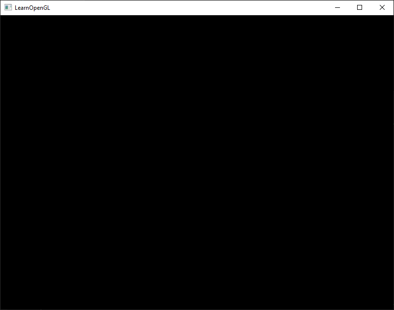
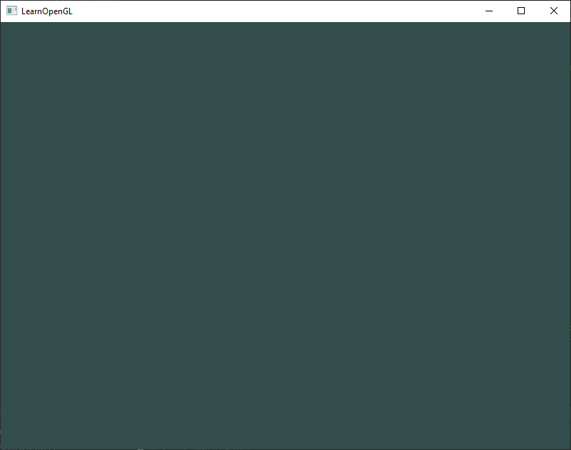
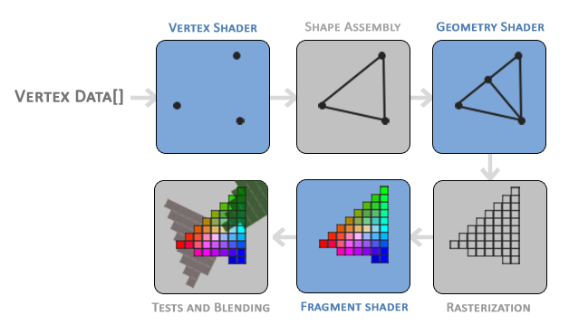
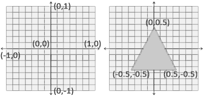

# OpenGL_Notebook


## References

Learn OpenGL (EN): https://learnopengl.com/

Learn OpenGL's PDF(EN): https://learnopengl.com/book/book_pdf.pdf

The Chinese Vision: https://learnopengl-cn.github.io/intro/

## Getting started

### OpenGL

#### What's OpenGL?

Before starting our journey we should first define what OpenGL actually is. OpenGL is mainly considered an API (an Application Programming Interface) that provides us with a large set of functions that we can use to manipulate graphics and images. However, ***OpenGL by itself is not an API, but merely a specification***, developed and maintained by the [Khronos Group](http://www.khronos.org/).

The OpenGL specification specifies exactly what the result/output of each function should be and how it should perform. It is then up to the developers *implementing* this specification to come up with a solution of how this function should operate. 

Since the OpenGL specification does not give us implementation details, the actual developed versions of OpenGL are allowed to have different implementations, as long as their results comply with the specification (and are thus the same to the user).

Khronos publicly hosts all specification documents for all the OpenGL versions. The interested reader can find the OpenGL specification of version 3.3 (which is what we'll be using) [here](https://www.opengl.org/registry/doc/glspec33.core.20100311.withchanges.pdf) which is a good read if you want to delve into the details of OpenGL (note how they mostly just describe results and not implementations). The specifications also provide a great reference for finding the **exact** workings of its functions. 

#### Core-profile vs Immediate mode

**In the old days, using OpenGL meant developing in immediate mode** (often referred to as the fixed function pipeline) which was an easy-to-use method for drawing graphics. Most of the functionality of OpenGL was hidden inside the library and developers did not have much control over how OpenGL does its calculations. 

Developers eventually got hungry for more flexibility and over time the specifications became more flexible as a result; developers gained more control over their graphics. **The immediate mode is really easy to use and understand, but it is also extremely inefficient.** 

For that reason the specification started to deprecate immediate mode functionality from version 3.2 onwards and started motivating developers to develop in OpenGL's **core-profile mode**, **which is a division of OpenGL's specification that removed all old deprecated functionality.**

When using OpenGL's core-profile, **OpenGL forces us to use modern practices**. Whenever we try to use one of OpenGL's deprecated functions, OpenGL raises an error and stops drawing. The advantage of learning the modern approach is that it is very flexible and efficient. However, it's also more difficult to learn. The immediate mode abstracted quite a lot from the **actual** operations OpenGL performed and while it was easy to learn, it was hard to grasp how OpenGL actually operates. The modern approach requires the developer to truly understand OpenGL and graphics programming and while it is a bit difficult, it allows for much more flexibility, more efficiency and most importantly: a much better understanding of graphics programming.

#### Why choose OpenGL 3.3 ?

As of today, higher versions of OpenGL are available to choose from (at the time of writing 4.6) at which you may ask: why do I want to learn OpenGL 3.3 when OpenGL 4.6 is out? 

The answer to that question is relatively simple. **All future versions of OpenGL starting from 3.3 add extra useful features to OpenGL without changing OpenGL's core mechanics**; the newer versions just introduce slightly more efficient or more useful ways to accomplish the same tasks. The result is that all concepts and techniques remain the same over the modern OpenGL versions so it is perfectly valid to learn OpenGL 3.3. Whenever you're ready and/or more experienced you can easily use specific functionality from more recent OpenGL versions.

##### NOTE

When using functionality from the most recent version of OpenGL, only the most modern graphics cards will be able to run your application. **This is often why most developers generally target lower versions of OpenGL and optionally enable higher version functionality.**

#### Extensions

A great feature of OpenGL is its support of extensions. Whenever a graphics company comes up with a new technique or a new large optimization for rendering this is often found in an extension implemented in the drivers. If the hardware an application runs on supports such an extension the developer can use the functionality provided by the extension for more advanced or efficient graphics. This way, **a graphics developer can still use these new rendering techniques without having to wait for OpenGL to include the functionality in its future versions, simply by checking if the extension is supported by the graphics card.** Often, when an extension is popular or very useful it eventually becomes part of future OpenGL versions.

The developer has to query whether any of these extensions are available before using them (or use an OpenGL extension library). This allows the developer to do things better or more efficient, based on whether an extension is available:

```c++
if(GL_ARB_extension_name)
{
    // Do cool new and modern stuff supported by hardware
}
else
{
    // Extension not supported: do it the old way
}
```

With OpenGL version 3.3 we rarely need an extension for most techniques, but wherever it is necessary proper instructions are provided.

#### State machine

OpenGL is by itself a large state machine: **a collection of variables that define how OpenGL should currently operate**. The state of OpenGL is commonly referred to as the **OpenGL context**. When using OpenGL, we often change its state by setting some options, manipulating some buffers and then render using the current context.

Whenever we tell OpenGL that we now want to draw lines instead of triangles for example, we change the state of OpenGL by changing some context variable that sets how OpenGL should draw. As soon as we change the context by telling OpenGL it should draw lines, the next drawing commands will now draw lines instead of triangles. 

When working in OpenGL we will **come across several state-changing functions that change the context and several state-using functions that perform some operations based on the current state of OpenGL**. As long as you keep in mind that OpenGL is basically one large state machine, most of its functionality will make more sense. 

#### Objects

The OpenGL libraries are written in C and allows for many derivations in other languages, but in its core it remains a C-library. Since many of C's language-constructs do not translate that well to other higher-level languages, OpenGL was developed with several abstractions in mind. One of those abstractions are objects in OpenGL.

**An object in OpenGL is a collection of options that represents a subset of OpenGL's state.** For example, we could have an object that represents the settings of the drawing window; we could then set its size, how many colors it supports and so on. One could visualize an object as a C-like struct:

```c++
struct object_name {
    float  option1;
    int    option2;
    char[] name;
};
```

Whenever we want to use objects it generally looks something like this (with OpenGL's context visualized as a large struct):

```c++
// The State of OpenGL
struct OpenGL_Context {
  	...
  	object_name* object_Window_Target;
  	...  	
};
```

```c++
// create object
unsigned int objectId = 0;
glGenObject(1, &objectId);
// bind/assign object to context
glBindObject(GL_WINDOW_TARGET, objectId);
// set options of object currently bound to GL_WINDOW_TARGET
glSetObjectOption(GL_WINDOW_TARGET, GL_OPTION_WINDOW_WIDTH,  800);
glSetObjectOption(GL_WINDOW_TARGET, GL_OPTION_WINDOW_HEIGHT, 600);
// set context target back to default
glBindObject(GL_WINDOW_TARGET, 0);
```

This little piece of code is a workflow you'll frequently see when working with OpenGL. 

We first create an object and store a reference to it as an id (the real object's data is stored behind the scenes). 

Then we bind the object (using its id) to the target location of the context (the location of the example window object target is defined as `GL_WINDOW_TARGET`). 

Next we set the window options and finally we un-bind the object by setting the current object id of the window target to `0`. The options we set are stored in the object referenced by `objectId` and restored as soon as we bind the object back to `GL_WINDOW_TARGET`. 

##### Benefits

The great thing about using these objects is that we can define more than one object in our application, set their options and whenever we start an operation that uses OpenGL's state, we bind the object with our preferred settings. 

There are objects for example that act as container objects for 3D model data (a house or a character) and whenever we want to draw one of them, we bind the object containing the model data that we want to draw (we first created and set options for these objects). 

Having several objects allows us to specify many models and whenever we want to draw a specific model, we simply bind the corresponding object before drawing without setting all their options again.

#### Additional resources

- [opengl.org](https://www.opengl.org/): official website of OpenGL.
- [OpenGL registry](https://www.opengl.org/registry/): hosts the OpenGL specifications and extensions for all OpenGL versions.

### Creating a window

The first thing we need to do before we start creating stunning graphics is to create an OpenGL context and an application window to draw in. However, those operations are specific per operating system and OpenGL purposefully tries to abstract itself from these operations. This means we have to create a window, define a context, and handle user input all by ourselves.

Luckily, there are quite a few libraries out there that provide the functionality we seek, some specifically aimed at OpenGL. Those libraries save us all the operation-system specific work and give us a window and an OpenGL context to render in. Some of the more popular libraries are GLUT, SDL, SFML and GLFW. 

In this notebook we will be using **GLFW**. Feel free to use any of the other libraries, the setup for most is similar to GLFW's setup.

#### GLFW

GLFW is a library, written in C, specifically targeted at OpenGL. GLFW gives us the bare necessities required for rendering goodies to the screen. It allows us to create an OpenGL context, define window parameters, and handle user input, which is plenty enough for our purposes. 

The focus of this and the next chapter is to get GLFW up and running, making sure it properly creates an OpenGL context and that it displays a simple window for us to mess around in. 

More guides of GLFW's install can be found in https://learnopengl.com/Getting-started/Creating-a-window

##### OpenGL library on Windows

If you're on Windows the OpenGL library `opengl32.lib` comes with the Microsoft SDK, which is installed by default when you install Visual Studio. Since this chapter uses the VS compiler and is on windows we add `opengl32.lib` to the linker settings. Note that the 64-bit equivalent of the OpenGL library is called `opengl32.lib`, just like the 32-bit equivalent, which is a bit of an unfortunate name.

##### OpenGL library on Linux

On Linux systems you need to link to the `libGL.so` library by adding `-lGL` to your linker settings. If you can't find the library you probably need to install any of the Mesa, NVidia or AMD dev packages.

Then, once you've added both the GLFW and OpenGL library to the linker settings you can include the header files for GLFW as follows:

```c++
#include <GLFW/glfw3.h>
```

###### NOTE

For Linux users compiling with GCC, the following command line options may help you compile the project: `-lglfw -lGL -lX11 -lpthread -lXrandr -lXi -ldl`. Not correctly linking the corresponding libraries will generate many *undefined reference* errors.

#### GLAD

We're still not quite there yet, since there is one other thing we still need to do. Because OpenGL is only really a standard/specification it is up to the driver manufacturer to implement the specification to a driver that the specific graphics card supports. Since there are many different versions of OpenGL drivers, the location of most of its functions is not known at compile-time and needs to be queried at run-time. It is then the task of the developer to retrieve the location of the functions he/she needs and store them in function pointers for later use. Retrieving those locations is [OS-specific](https://www.khronos.org/opengl/wiki/Load_OpenGL_Functions). In Windows it looks something like this:

```c++
// define the function's prototype
typedef void (*GL_GENBUFFERS) (GLsizei, GLuint*);
// find the function and assign it to a function pointer
GL_GENBUFFERS glGenBuffers  = (GL_GENBUFFERS)wglGetProcAddress("glGenBuffers");
// function can now be called as normal
unsigned int buffer;
glGenBuffers(1, &buffer);
```

As you can see the code looks complex and it's a cumbersome process to do this for each function you may need that is not yet declared. Thankfully, there are libraries for this purpose as well where **GLAD** is a popular and up-to-date library. 

##### Setting up GLAD

GLAD is an [open source](https://github.com/Dav1dde/glad) library that manages all that cumbersome work we talked about. GLAD has a slightly different configuration setup than most common open source libraries. GLAD uses a [web service](http://glad.dav1d.de/) where we can tell GLAD for which version of OpenGL we'd like to define and load all relevant OpenGL functions according to that version.  

Go to the GLAD [web service](http://glad.dav1d.de/), make sure the language is set to C++, and in the API section select an OpenGL version of at least 3.3 (which is what we'll be using; higher versions are fine as well). Also make sure the profile is set to *Core* and that the *Generate a loader* option is ticked. Ignore the extensions (for now) and click *Generate* to produce the resulting library files.

**GLAD by now should have provided you a zip file containing two include folders, and a single `glad.c` file. Copy both include folders (`glad` and `KHR`) into your include(s) directory (or add an extra item pointing to these folders), and add the `glad.c` file to your project.**

After the previous steps, you should be able to add the following include directive above your file:

```c++
#include <glad/glad.h> 
```

#### Additional resources

- [GLFW: Window Guide](http://www.glfw.org/docs/latest/window_guide.html): official GLFW guide on setting up and configuring a GLFW window.
- [Building applications](http://www.opengl-tutorial.org/miscellaneous/building-your-own-c-application/): provides great info about the compilation/linking process of your application and a large list of possible errors (plus solutions) that may come up.
- [GLFW with Code::Blocks](http://wiki.codeblocks.org/index.php?title=Using_GLFW_with_Code::Blocks): building GLFW in Code::Blocks IDE.
- [Running CMake](http://www.cmake.org/runningcmake/): short overview of how to run CMake on both Windows and Linux.
- [Writing a build system under Linux](https://learnopengl.com/demo/autotools_tutorial.txt): an autotools tutorial by Wouter Verholst on how to write a build system in Linux.
- [Polytonic/Glitter](https://github.com/Polytonic/Glitter): a simple boilerplate project that comes pre-configured with all relevant libraries; great for if you want a sample project without the hassle of having to compile all the libraries yourself.

### Hello Window

First, add the following includes to the top of .cpp file.

```c++
#include <glad/glad.h>
#include <GLFW/glfw3.h>
```

Be sure to include GLAD before GLFW. The include file for GLAD includes the required OpenGL headers behind the scenes (like `GL/gl.h`) so **be sure to include GLAD before other header files that require OpenGL (like GLFW)**. 

Then create the main function where we will instantiate the GLFW window.

```c++
int main()
{
    glfwInit();
    glfwWindowHint(GLFW_CONTEXT_VERSION_MAJOR, 3);
    glfwWindowHint(GLFW_CONTEXT_VERSION_MINOR, 3);
    glfwWindowHint(GLFW_OPENGL_PROFILE, GLFW_OPENGL_CORE_PROFILE);
    //glfwWindowHint(GLFW_OPENGL_FORWARD_COMPAT, GL_TRUE);
  
    return 0;
}
```

In the main function we first initialize GLFW with `glfwInit`, after which we can configure GLFW using `glfwWindowHint`. 

The first argument of `glfwWindowHint` tells us what option we want to configure, where we can select the option from a large enum of possible options prefixed with `GLFW_`. 

The second argument is an integer that sets the value of our option. A list of all the possible options and its corresponding values can be found at [GLFW's window handling](http://www.glfw.org/docs/latest/window.html#window_hints) documentation. 

If you try to run the application now and it gives a lot of *undefined reference* errors it means you didn't successfully link the GLFW library.

Since the focus of this book is on OpenGL version 3.3 we'd like to tell GLFW that 3.3 is the OpenGL version we want to use. This way GLFW can make the proper arrangements when creating the OpenGL context. This ensures that when a user does not have the proper OpenGL version GLFW fails to run. We set the major and minor version both to `3`. 

We also tell GLFW we want to explicitly use the core-profile. Telling GLFW we want to use the core-profile means we'll get access to a smaller subset of OpenGL features without backwards-compatible features we no longer need. 

Note that on Mac OS X you need to add `glfwWindowHint(GLFW_OPENGL_FORWARD_COMPAT, GL_TRUE);` to your initialization code for it to work.

```c++
#ifdef __APPLE__
    glfwWindowHint(GLFW_OPENGL_FORWARD_COMPAT, GL_TRUE);
#endif
```

Next we're required to create a window object. This window object holds all the windowing data and is required by most of GLFW's other functions. 

```c++
GLFWwindow* window = glfwCreateWindow(800, 600, "LearnOpenGL", NULL, NULL);
if (window == NULL)
{
    std::cout << "Failed to create GLFW window" << std::endl;
    glfwTerminate();
    return -1;
}
glfwMakeContextCurrent(window);
```

The `glfwCreateWindow` function requires the window width and height as its first two arguments respectively. The third argument allows us to create a name for the window; for now we call it `"LearnOpenGL"` but you're allowed to name it however you like. 

We can ignore the last 2 parameters. The function returns a `GLFWwindow` object that we'll later need for other GLFW operations. After that we tell GLFW to make the context of our window the main context on the current thread.

#### GLAD

GLAD manages function pointers for OpenGL so we want to initialize GLAD before we call any OpenGL function:

```c++
if (!gladLoadGLLoader((GLADloadproc)glfwGetProcAddress))
{
    std::cout << "Failed to initialize GLAD" << std::endl;
    return -1;
} 
```

We pass GLAD the function to load the address of the OpenGL function pointers which is OS-specific. GLFW gives us `glfwGetProcAddress` that defines the correct function based on which OS we're compiling for.

#### Viewport

Before we can start rendering we have to do one last thing. We have to **tell OpenGL the size of the rendering window** so OpenGL knows how we want to display the data and coordinates with respect to the window. We can set those *dimensions* via the `glViewport` function:

```c++
glViewport(0, 0, 800, 600);
```

The first two parameters of `glViewport` set the location of the lower left corner of the window. The third and fourth parameter set the width and height of the rendering window in pixels, which we set equal to GLFW's window size. 

We could actually **set the viewport dimensions at values smaller than GLFW's dimensions**; then all the OpenGL rendering would be displayed in a smaller window and we could for example **display other elements outside the OpenGL viewport**.

> **NOTE**
>
> Behind the scenes OpenGL uses the data specified via `glViewport` to transform the 2D coordinates it processed to coordinates on your screen. For example, a processed point of location `(-0.5,0.5)` would (as its final transformation) be mapped to `(200,450)` in screen coordinates. 
>
> Note that processed coordinates in OpenGL are between -1 and 1 so we effectively map from the range `(-1 to 1)` to `(0, 800)` and `(0, 600)`.

However, the moment a user resizes the window the viewport should be adjusted as well. We can register a callback function on the window that gets called each time the window is resized. This resize callback function has the following prototype: 

```c++
void framebuffer_size_callback(GLFWwindow* window, int width, int height); 
```

The framebuffer size function takes a GLFWwindow as its first argument and two integers indicating the new window dimensions. Whenever the window changes in size, GLFW calls this function and fills in the proper arguments for you to process. 

```c++
void framebuffer_size_callback(GLFWwindow* window, int width, int height)
{
    glViewport(0, 0, width, height);
}
```

We do have to tell GLFW we want to call this function on every window resize by registering it:

```c++
glfwSetFramebufferSizeCallback(window, framebuffer_size_callback); 
```

When the window is first displayed `framebuffer_size_callback` gets called as well with the resulting window dimensions. For retina displays width and height will end up significantly higher than the original input values.

There are many callbacks functions we can set to register our own functions. For example, we can make a callback function to process joystick input changes, process error messages etc. We register the callback functions after we've created the window and before the render loop is initiated.

#### Ready you engines

We don't want the application to draw a single image and then immediately quit and close the window. We want the application to keep drawing images and handling user input until the program has been explicitly told to stop. 

For this reason we have to create a while loop, that we now call the **render loop**, that keeps on running until we tell GLFW to stop. The following code shows a very simple render loop:

```c++
while(!glfwWindowShouldClose(window))
{
    glfwSwapBuffers(window);
    glfwPollEvents();    
}
```

The `glfwWindowShouldClose` function checks at the start of each loop iteration if GLFW has been instructed to close. If so, the function returns `true` and the render loop stops running, after which we can close the application.

The `glfwPollEvents` function checks if any events are triggered (like keyboard input or mouse movement events), updates the window state, and calls the corresponding functions (which we can register via callback methods). 

The `glfwSwapBuffers` will swap the color buffer (a large 2D buffer that contains color values for each pixel in GLFW's window) that is used to render to during this render iteration and show it as output to the screen. 

##### Double buffer

When an application draws in a single buffer the resulting image may display flickering issues. This is because the resulting output image is not drawn in an instant, but drawn pixel by pixel and usually from left to right and top to bottom. Because this image is not displayed at an instant to the user while still being rendered to, the result may contain artifacts. 

To circumvent these issues, windowing applications apply a double buffer for rendering. The **front** buffer contains the final output image that is shown at the screen, while all the rendering commands draw to the **back** buffer. As soon as all the rendering commands are finished we **swap** the back buffer to the front buffer so the image can be displayed without still being rendered to, removing all the aforementioned artifacts.

#### One last thing

As soon as we exit the render loop we would like to properly clean/delete all of GLFW's resources that were allocated. We can do this via the `glfwTerminate` function that we call at the end of the main function.

```c++
glfwTerminate();
return 0;
```

This will clean up all the resources and properly exit the application.  Now try to compile your application and if everything went well you  should see the following output:  



***<u>check the full source code [here](code/01_hello_window/main.cpp)</u>*** 

#### Input

We also want to have some form of input control in GLFW and we can achieve this with several of GLFW's input functions. We'll be using GLFW's `glfwGetKey` function that takes the window as input together with a key. The function returns whether this key is currently being pressed. We're creating a processInput function to keep all input code organized:

```c++
void processInput(GLFWwindow *window)
{
    if(glfwGetKey(window, GLFW_KEY_ESCAPE) == GLFW_PRESS)
        glfwSetWindowShouldClose(window, true);
}
```

Here we check whether the user has pressed the escape key (if it's not pressed, `glfwGetKey` returns `GLFW_RELEASE`). If the user did press the escape key, we close GLFW by setting its `WindowShouldClose property` to `true` using `glfwSetwindowShouldClose`. The next condition check of the main `while` loop will then fail and the application closes.

We then call processInput every iteration of the render loop:

```c++
while (!glfwWindowShouldClose(window))
{
    processInput(window);

    glfwSwapBuffers(window);
    glfwPollEvents();
}  
```

This gives us an easy way to check for specific key presses and react accordingly every frame. An iteration of the render loop is more commonly called a frame.

#### Rendering

We want to place all the rendering commands in the render loop, since we want to execute all the rendering commands each iteration or frame of the loop. This would look a bit like this: 

```c++
// render loop
while(!glfwWindowShouldClose(window))
{
    // input
    processInput(window);

    // rendering commands here
    ...

    // check and call events and swap the buffers
    glfwPollEvents();
    glfwSwapBuffers(window);
}
```

Just to test if things actually work we want to clear the screen with a color of our choice. At the start of frame we want to clear the screen. Otherwise we would still see the results from the previous frame (this could be the effect you're looking for, but usually you don't). 

We can clear the screen's color buffer using `glClear` where we pass in buffer bits to specify which buffer we would like to clear. The possible bits we can set are `GL_COLOR_BUFFER_BIT`, `GL_DEPTH_BUFFER_BIT` and `GL_STENCIL_BUFFER_BIT`. Right now we only care about the color values so we only clear the color buffer.

```c++
glClearColor(0.2f, 0.3f, 0.3f, 1.0f);
glClear(GL_COLOR_BUFFER_BIT);
```

Note that we also specify the color to clear the screen with using `glClearColor`. Whenever we call `glClear` and clear the color buffer, the entire color buffer will be filled with the color as configured by `glClearColor`. This will result in a dark green-blueish color. 

The `glClearColor` function is a *state-setting* function and `glClear` is a *state-using* function in that it uses the current state to retrieve the clearing color from.



### Hello Triangle

In OpenGL everything is in 3D space, but the screen or window is a 2D array of pixels so **a large part of OpenGL's work is about transforming all 3D coordinates to 2D pixels that fit on your screen**. The process of transforming 3D coordinates to 2D pixels is managed by the graphics pipeline of OpenGL. 

The graphics pipeline can be divided into two large parts: 

- the first transforms your 3D coordinates into 2D coordinates
- the second part transforms the 2D coordinates into actual colored pixels. 

In this chapter we'll briefly discuss the graphics pipeline and how we can use it to our advantage to create fancy pixels.

The graphics pipeline takes as input a set of 3D coordinates and transforms these to colored 2D pixels on your screen. The graphics pipeline can be divided into several steps where each step requires the output of the previous step as its input. All of these steps are highly specialized (they have one specific function) and can easily be executed in parallel. **Because of their parallel nature, graphics cards of today have thousands of small processing cores to quickly process your data within the graphics pipeline.** The processing cores run small programs on the GPU for each step of the pipeline. These small programs are called **shaders**.

Some of these shaders are configurable by the developer which allows us to write our own shaders to replace the existing default shaders. This gives us much more fine-grained control over specific parts of the pipeline and because they run on the GPU, they can also save us valuable CPU time. 

Shaders are written in the OpenGL Shading Language (GLSL) and we'll delve more into that in [the next chapter](#shader).

Below you'll find an abstract representation of all the stages of the graphics pipeline. Note that the blue sections represent sections where we can inject our own shaders.



As input to the graphics pipeline we pass in a list of three 3D coordinates that should form a triangle in an array here called `Vertex Data`; this vertex data is a collection of vertices. A vertex is a collection of data per 3D coordinate. This vertex's data is represented using vertex attributes that can contain any data we'd like, but for simplicity's sake let's assume that each vertex consists of just a 3D position and some color value.

> In order for OpenGL to know what to make of your collection of coordinates and color values OpenGL requires you to hint what kind of render types you want to form with the data. 
>
> Do we want the data rendered as a collection of points, a collection of triangles or perhaps just one long line? 
>
> Those hints are called **primitives** and are given to OpenGL while calling any of the drawing commands. 
>
> Some of these hints are `GL_POINTS`, `GL_TRIANGLES` and `GL_LINE_STRIP`.

#### Pipeline

The first part of the pipeline is the ***<u>vertex shader</u>*** that takes as input a single vertex. The **main purpose** of the vertex shader is to **transform 3D coordinates into different 3D coordinates** and the vertex shader **allows us to do some basic processing on the vertex attributes**. 

The ***<u>primitive assembly</u>*** stage takes as input all the vertices (or vertex if GL_POINTS is chosen) from the vertex shader that **form a primitive and assembles all the point(s) in the primitive shape given**; in this case a triangle.

The output of the primitive assembly stage is passed to the **<u>*geometry shader*</u>**. The geometry shader **takes as input a collection of vertices that form a primitive** and has the ability to **generate other shapes by emitting new vertices to form new (or other) primitive(s)**. In this example case, it generates a second triangle out of the given shape.

The output of the geometry shader is then passed on to the ***<u>rasterization stage</u>*** where it **maps the resulting primitive(s) to the corresponding pixels on the final screen, resulting in fragments for the fragment shader to use**. Before the fragment shaders run, clipping is performed. Clipping discards all fragments that are outside your view, increasing performance.

**NOTE:** A **fragment** in OpenGL is all the data required for OpenGL to render a single pixel. 

The main purpose of the *<u>**fragment shader**</u>* is to **calculate the final color of a pixel** and this is usually the stage **where all the advanced OpenGL effects occur**. Usually the fragment shader contains data about the 3D scene that it can use to calculate the final pixel color (like lights, shadows, color of the light and so on).

After all the corresponding color values have been determined, the final object will then pass through one more stage that we call the **<u>*alpha test and blending stage*</u>**. This stage **checks the corresponding depth (and stencil) value of the fragment and uses those to check if the resulting fragment is in front or behind other objects and should be discarded accordingly**. **The stage also checks for alpha values (alpha values define the opacity of an object) and blends the objects accordingly.** So even if a pixel output color is calculated in the fragment shader, the final pixel color could still be something entirely different when rendering multiple triangles.

As you can see, the graphics pipeline is quite a complex whole and contains many configurable parts. However, for almost all the cases we only have to work with the vertex and fragment shader. The geometry shader is optional and usually left to its default shader. There is also the tessellation stage and transform feedback loop that we haven't depicted here, but that's something for later. 

In modern OpenGL we are **required** to define at least a vertex and fragment shader of our own (there are no default vertex/fragment shaders on the GPU). For this reason it is often quite difficult to start learning modern OpenGL since a great deal of knowledge is required before being able to render your first triangle.

- Overview
  - Vertex shader
    - transform 3D coordinates into different 3D coordinates
    - allows us to do some basic processing on the vertex attributes
  - Primitive assembly
    - form a primitive and assembles all the point(s) in the primitive shape given
  - Geometry shader
    - takes as input a collection of vertices that form a primitive
    - generate other shapes by emitting new vertices to form new (or other) primitive(s)
  - Rasterization stage
    - maps the resulting primitive(s) to the corresponding pixels on the final screen, resulting in fragments for the fragment shader to use
    - A **fragment** in OpenGL is all the data required for OpenGL to render a single pixel.
  - Fragment shader
    - calculate the final color of a pixel
    - where all the advanced OpenGL effects occur
  - Alpha test and Blending stage
    - check the corresponding depth (and stencil) value of the fragment and uses those to check if the resulting fragment is in front or behind other objects and should be discarded accordingly
    - check for alpha values (alpha values define the opacity of an object) and blends the objects accordingly

#### Vertex Input

To start drawing something we have to first give OpenGL some input vertex data. OpenGL is a 3D graphics library so all coordinates that we specify in OpenGL are in 3D (`x`, `y` and `z` coordinate). 

OpenGL doesn't simply transform **all** your 3D coordinates to 2D pixels on your screen; 

**OpenGL only processes 3D coordinates when they're in a specific range between `-1.0` and `1.0` on all 3 axes (`x`, `y` and `z`).** 

All coordinates within this so called normalized device coordinates range will end up visible on your screen (and all coordinates outside this region won't). 

> **Normalized Device Coordinates (NDC)**
>
> Once your vertex coordinates have been processed in the vertex shader, they should be in normalized device coordinates which is a small space where the `x`, `y` and `z` values vary from `-1.0` to `1.0`. **Any coordinates that fall outside this range will be discarded/clipped and won't be visible on your screen.** Below you can see the triangle we specified within normalized device coordinates (ignoring the `z` axis): 
>
> 
>
> Unlike usual screen coordinates the positive y-axis points in the up-direction and the `(0,0)` coordinates are at the center of the graph, instead of top-left. Eventually you want all the (transformed) coordinates to end up in this coordinate space, otherwise they won't be visible.
>
> Your **NDC coordinates will then be transformed to screen-space coordinates via the viewport transform using the data you provided with `glViewport`**. The resulting screen-space coordinates are then transformed to fragments as inputs to your fragment shader.

Because we want to render a single triangle we want to specify a total of three vertices with each vertex having a 3D position. We define them in normalized device coordinates (the visible region of OpenGL) in a `float` array:

```c++
float vertices[] = {
    -0.5f, -0.5f, 0.0f,
     0.5f, -0.5f, 0.0f,
     0.0f,  0.5f, 0.0f
};  
```

Because OpenGL works in 3D space we render a 2D triangle with each vertex having a `z` coordinate of `0.0`. This way the *depth* of the triangle remains the same making it look like it's 2D.

With the vertex data defined we'd like to send it as input to the first process of the graphics pipeline: the vertex shader. This is done by creating memory on the GPU where we store the vertex data, configure how OpenGL should interpret the memory and specify how to send the data to the graphics card. The vertex shader then processes as much vertices as we tell it to from its memory.

We manage this memory via so called **vertex buffer objects (VBO)** that can store a large number of vertices in the GPU's memory. The advantage of using those buffer objects is that we can send large batches of data all at once to the graphics card, and keep it there if there's enough memory left, without having to send data one vertex at a time. Sending data to the graphics card from the CPU is relatively slow, so wherever we can we try to send as much data as possible at once. Once the data is in the graphics card's memory the vertex shader has almost instant access to the vertices making it extremely fast

Just like any object in OpenGL, VBO has a unique ID corresponding to that buffer, so we can **generate one with a buffer ID using the `glGenBuffers` function**: 

```c++
unsigned int VBO;
glGenBuffers(1, &VBO);
```

OpenGL has many types of buffer objects and the buffer type of a vertex buffer object is `GL_ARRAY_BUFFER`. **OpenGL allows us to bind to several buffers at once as long as they have a different buffer type.** We can bind the newly created buffer to the `GL_ARRAY_BUFFER` target with the `glBindBuffer` function:

```c++
glBindBuffer(GL_ARRAY_BUFFER, VBO);
```

From that point on **any buffer calls we make (on the `GL_ARRAY_BUFFER` target) will be used to configure the currently bound buffer, which is VBO**. Then we can make a call to the `glBufferData` function that copies the previously defined vertex data into the buffer's memory:

```c++
glBufferData(GL_ARRAY_BUFFER, sizeof(vertices), vertices, GL_STATIC_DRAW);
```

`glBufferData` is a function specifically targeted to copy user-defined data into the currently bound buffer. Its first argument is the type of the buffer we want to copy data into: **the vertex buffer object currently bound to the `GL_ARRAY_BUFFER` target**. 

The second argument specifies the size of the data (in bytes) we want to pass to the buffer; a simple `sizeof` of the vertex data suffices. 

The third parameter is the actual data we want to send.

The fourth parameter specifies how we want the graphics card to manage the given data. This can take 3 forms:

- `GL_STREAM_DRAW`: the data is set only once and used by the GPU at most a few times.
- `GL_STATIC_DRAW`: the data is set only once and used many times.
- `GL_DYNAMIC_DRAW`: the data is changed a lot and used many times.

The position data of the triangle does not change, is used a lot, and stays the same for every render call so its usage type should best be `GL_STATIC_DRAW`. If, for instance, one would have a buffer with data that is likely to change frequently, a usage type of `GL_DYNAMIC_DRAW` ensures the graphics card will place the data in memory that allows for faster writes.

As of now we stored the vertex data within memory on the graphics card as managed by a vertex buffer object named VBO. Next we want to create a vertex and fragment shader that actually processes this data, so let's start building those.

#### Vertex Shader

The vertex shader is one of the shaders that are programmable by people like us. Modern OpenGL requires that we at least set up a vertex and fragment shader if we want to do some rendering so we will briefly introduce shaders and configure two very simple shaders for drawing our first triangle. In the next chapter we'll discuss shaders in more detail.

The first thing we need to do is **write the vertex shader in the shader language GLSL** (OpenGL Shading Language) and then **compile this shader** so we can use it in our application. Below you'll find the source code of a very basic vertex shader in GLSL:

```c++
#version 330 core
layout (location = 0) in vec3 aPos;

void main()
{
    gl_Position = vec4(aPos.x, aPos.y, aPos.z, 1.0);
}
```

As you can see, GLSL looks similar to C. **Each shader begins with a declaration of its version**. Since OpenGL 3.3 and higher the version numbers of GLSL match the version of OpenGL (GLSL version 420 corresponds to OpenGL version 4.2 for example). We also **explicitly mention we're using core profile functionality**.

Next we **declare all the input vertex attributes in the vertex shader with the `in` keyword**. Right now we only care about position data so we only need a single vertex attribute. **GLSL has a vector datatype that contains 1 to 4 floats based on its postfix digit.** 

**Since each vertex has a 3D coordinate we create a `vec3` input variable with the name aPos.** We also specifically set the location of the input variable via `layout (location = 0)` and you'll later see that why we're going to need that location.

> **Vector**
> In graphics programming we use the mathematical concept of a vector quite often, since it neatly represents positions/directions in any space and has useful mathematical properties. 
>
> A vector in GLSL has a maximum size of 4 and each of its values can be retrieved via `vec.x`, `vec.y`, `vec.z` and `vec.w` respectively where each of them represents a coordinate in space. 
>
> Note that **the `vec.w` component is not used as a position in space (we're dealing with 3D, not 4D) but is used for something called perspective division.**


### Shader

## Lighting

## Model Loading

## Advanced OpenGL

## Advanced Lighting

## PBR

## In practice

