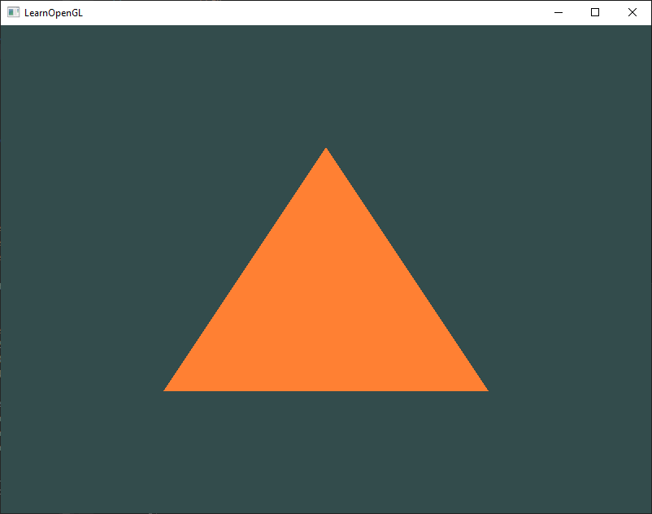
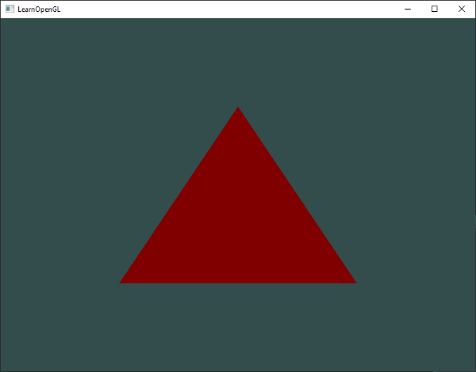
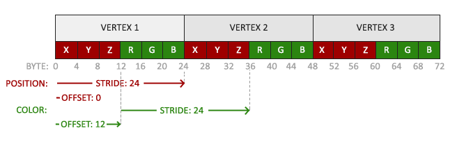
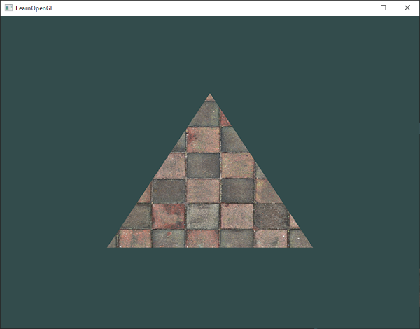
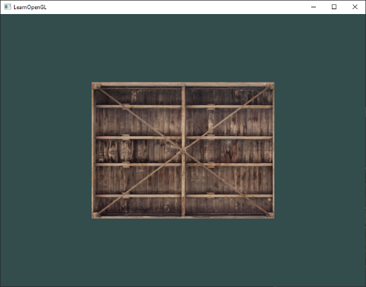
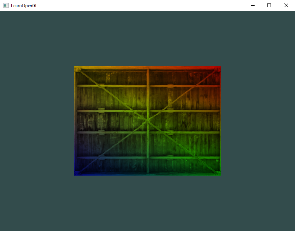
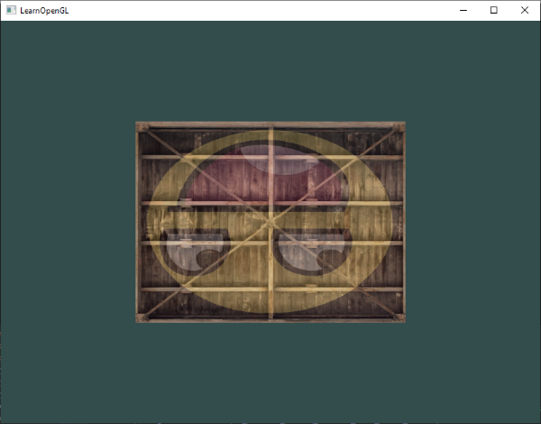
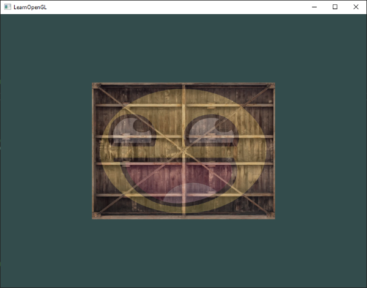

# OpenGL_Notebook


## References

Learn OpenGL (EN): https://learnopengl.com/

Learn OpenGL's PDF(EN): https://learnopengl.com/book/book_pdf.pdf

The Chinese Vision: https://learnopengl-cn.github.io/intro/

## Getting started

### OpenGL

#### What's OpenGL?

Before starting our journey we should first define what OpenGL actually is. OpenGL is mainly considered an API (an Application Programming Interface) that provides us with a large set of functions that we can use to manipulate graphics and images. However, ***OpenGL by itself is not an API, but merely a specification***, developed and maintained by the [Khronos Group](http://www.khronos.org/).

The OpenGL specification specifies exactly what the result/output of each function should be and how it should perform. It is then up to the developers *implementing* this specification to come up with a solution of how this function should operate. 

Since the OpenGL specification does not give us implementation details, the actual developed versions of OpenGL are allowed to have different implementations, as long as their results comply with the specification (and are thus the same to the user).

Khronos publicly hosts all specification documents for all the OpenGL versions. The interested reader can find the OpenGL specification of version 3.3 (which is what we'll be using) [here](https://www.opengl.org/registry/doc/glspec33.core.20100311.withchanges.pdf) which is a good read if you want to delve into the details of OpenGL (note how they mostly just describe results and not implementations). The specifications also provide a great reference for finding the **exact** workings of its functions. 

#### Core-profile vs Immediate mode

**In the old days, using OpenGL meant developing in immediate mode** (often referred to as the fixed function pipeline) which was an easy-to-use method for drawing graphics. Most of the functionality of OpenGL was hidden inside the library and developers did not have much control over how OpenGL does its calculations. 

Developers eventually got hungry for more flexibility and over time the specifications became more flexible as a result; developers gained more control over their graphics. **The immediate mode is really easy to use and understand, but it is also extremely inefficient.** 

For that reason the specification started to deprecate immediate mode functionality from version 3.2 onwards and started motivating developers to develop in OpenGL's **core-profile mode**, **which is a division of OpenGL's specification that removed all old deprecated functionality.**

When using OpenGL's core-profile, **OpenGL forces us to use modern practices**. Whenever we try to use one of OpenGL's deprecated functions, OpenGL raises an error and stops drawing. The advantage of learning the modern approach is that it is very flexible and efficient. However, it's also more difficult to learn. The immediate mode abstracted quite a lot from the **actual** operations OpenGL performed and while it was easy to learn, it was hard to grasp how OpenGL actually operates. The modern approach requires the developer to truly understand OpenGL and graphics programming and while it is a bit difficult, it allows for much more flexibility, more efficiency and most importantly: a much better understanding of graphics programming.

#### Why choose OpenGL 3.3 ?

As of today, higher versions of OpenGL are available to choose from (at the time of writing 4.6) at which you may ask: why do I want to learn OpenGL 3.3 when OpenGL 4.6 is out? 

The answer to that question is relatively simple. **All future versions of OpenGL starting from 3.3 add extra useful features to OpenGL without changing OpenGL's core mechanics**; the newer versions just introduce slightly more efficient or more useful ways to accomplish the same tasks. The result is that all concepts and techniques remain the same over the modern OpenGL versions so it is perfectly valid to learn OpenGL 3.3. Whenever you're ready and/or more experienced you can easily use specific functionality from more recent OpenGL versions.

##### NOTE

When using functionality from the most recent version of OpenGL, only the most modern graphics cards will be able to run your application. **This is often why most developers generally target lower versions of OpenGL and optionally enable higher version functionality.**

#### Extensions

A great feature of OpenGL is its support of extensions. Whenever a graphics company comes up with a new technique or a new large optimization for rendering this is often found in an extension implemented in the drivers. If the hardware an application runs on supports such an extension the developer can use the functionality provided by the extension for more advanced or efficient graphics. This way, **a graphics developer can still use these new rendering techniques without having to wait for OpenGL to include the functionality in its future versions, simply by checking if the extension is supported by the graphics card.** Often, when an extension is popular or very useful it eventually becomes part of future OpenGL versions.

The developer has to query whether any of these extensions are available before using them (or use an OpenGL extension library). This allows the developer to do things better or more efficient, based on whether an extension is available:

```c++
if(GL_ARB_extension_name)
{
    // Do cool new and modern stuff supported by hardware
}
else
{
    // Extension not supported: do it the old way
}
```

With OpenGL version 3.3 we rarely need an extension for most techniques, but wherever it is necessary proper instructions are provided.

#### State machine

OpenGL is by itself a large state machine: **a collection of variables that define how OpenGL should currently operate**. The state of OpenGL is commonly referred to as the **OpenGL context**. When using OpenGL, we often change its state by setting some options, manipulating some buffers and then render using the current context.

Whenever we tell OpenGL that we now want to draw lines instead of triangles for example, we change the state of OpenGL by changing some context variable that sets how OpenGL should draw. As soon as we change the context by telling OpenGL it should draw lines, the next drawing commands will now draw lines instead of triangles. 

When working in OpenGL we will **come across several state-changing functions that change the context and several state-using functions that perform some operations based on the current state of OpenGL**. As long as you keep in mind that OpenGL is basically one large state machine, most of its functionality will make more sense. 

#### Objects

The OpenGL libraries are written in C and allows for many derivations in other languages, but in its core it remains a C-library. Since many of C's language-constructs do not translate that well to other higher-level languages, OpenGL was developed with several abstractions in mind. One of those abstractions are objects in OpenGL.

**An object in OpenGL is a collection of options that represents a subset of OpenGL's state.** For example, we could have an object that represents the settings of the drawing window; we could then set its size, how many colors it supports and so on. One could visualize an object as a C-like struct:

```c++
struct object_name {
    float  option1;
    int    option2;
    char[] name;
};
```

Whenever we want to use objects it generally looks something like this (with OpenGL's context visualized as a large struct):

```c++
// The State of OpenGL
struct OpenGL_Context {
  	...
  	object_name* object_Window_Target;
  	...  	
};
```

```c++
// create object
unsigned int objectId = 0;
glGenObject(1, &objectId);
// bind/assign object to context
glBindObject(GL_WINDOW_TARGET, objectId);
// set options of object currently bound to GL_WINDOW_TARGET
glSetObjectOption(GL_WINDOW_TARGET, GL_OPTION_WINDOW_WIDTH,  800);
glSetObjectOption(GL_WINDOW_TARGET, GL_OPTION_WINDOW_HEIGHT, 600);
// set context target back to default
glBindObject(GL_WINDOW_TARGET, 0);
```

This little piece of code is a workflow you'll frequently see when working with OpenGL. 

We first create an object and store a reference to it as an id (the real object's data is stored behind the scenes). 

Then we bind the object (using its id) to the target location of the context (the location of the example window object target is defined as `GL_WINDOW_TARGET`). 

Next we set the window options and finally we un-bind the object by setting the current object id of the window target to `0`. The options we set are stored in the object referenced by `objectId` and restored as soon as we bind the object back to `GL_WINDOW_TARGET`. 

##### Benefits

The great thing about using these objects is that we can define more than one object in our application, set their options and whenever we start an operation that uses OpenGL's state, we bind the object with our preferred settings. 

There are objects for example that act as container objects for 3D model data (a house or a character) and whenever we want to draw one of them, we bind the object containing the model data that we want to draw (we first created and set options for these objects). 

Having several objects allows us to specify many models and whenever we want to draw a specific model, we simply bind the corresponding object before drawing without setting all their options again.

#### Additional resources

- [opengl.org](https://www.opengl.org/): official website of OpenGL.
- [OpenGL registry](https://www.opengl.org/registry/): hosts the OpenGL specifications and extensions for all OpenGL versions.

### Creating a window

The first thing we need to do before we start creating stunning graphics is to create an OpenGL context and an application window to draw in. However, those operations are specific per operating system and OpenGL purposefully tries to abstract itself from these operations. This means we have to create a window, define a context, and handle user input all by ourselves.

Luckily, there are quite a few libraries out there that provide the functionality we seek, some specifically aimed at OpenGL. Those libraries save us all the operation-system specific work and give us a window and an OpenGL context to render in. Some of the more popular libraries are GLUT, SDL, SFML and GLFW. 

In this notebook we will be using **GLFW**. Feel free to use any of the other libraries, the setup for most is similar to GLFW's setup.

#### GLFW

GLFW is a library, written in C, specifically targeted at OpenGL. GLFW gives us the bare necessities required for rendering goodies to the screen. It allows us to create an OpenGL context, define window parameters, and handle user input, which is plenty enough for our purposes. 

The focus of this and the next chapter is to get GLFW up and running, making sure it properly creates an OpenGL context and that it displays a simple window for us to mess around in. 

More guides of GLFW's install can be found in https://learnopengl.com/Getting-started/Creating-a-window

##### OpenGL library on Windows

If you're on Windows the OpenGL library `opengl32.lib` comes with the Microsoft SDK, which is installed by default when you install Visual Studio. Since this chapter uses the VS compiler and is on windows we add `opengl32.lib` to the linker settings. Note that the 64-bit equivalent of the OpenGL library is called `opengl32.lib`, just like the 32-bit equivalent, which is a bit of an unfortunate name.

##### OpenGL library on Linux

On Linux systems you need to link to the `libGL.so` library by adding `-lGL` to your linker settings. If you can't find the library you probably need to install any of the Mesa, NVidia or AMD dev packages.

Then, once you've added both the GLFW and OpenGL library to the linker settings you can include the header files for GLFW as follows:

```c++
#include <GLFW/glfw3.h>
```

###### NOTE

For Linux users compiling with GCC, the following command line options may help you compile the project: `-lglfw -lGL -lX11 -lpthread -lXrandr -lXi -ldl`. Not correctly linking the corresponding libraries will generate many *undefined reference* errors.

#### GLAD

We're still not quite there yet, since there is one other thing we still need to do. Because OpenGL is only really a standard/specification it is up to the driver manufacturer to implement the specification to a driver that the specific graphics card supports. Since there are many different versions of OpenGL drivers, the location of most of its functions is not known at compile-time and needs to be queried at run-time. It is then the task of the developer to retrieve the location of the functions he/she needs and store them in function pointers for later use. Retrieving those locations is [OS-specific](https://www.khronos.org/opengl/wiki/Load_OpenGL_Functions). In Windows it looks something like this:

```c++
// define the function's prototype
typedef void (*GL_GENBUFFERS) (GLsizei, GLuint*);
// find the function and assign it to a function pointer
GL_GENBUFFERS glGenBuffers  = (GL_GENBUFFERS)wglGetProcAddress("glGenBuffers");
// function can now be called as normal
unsigned int buffer;
glGenBuffers(1, &buffer);
```

As you can see the code looks complex and it's a cumbersome process to do this for each function you may need that is not yet declared. Thankfully, there are libraries for this purpose as well where **GLAD** is a popular and up-to-date library. 

##### Setting up GLAD

GLAD is an [open source](https://github.com/Dav1dde/glad) library that manages all that cumbersome work we talked about. GLAD has a slightly different configuration setup than most common open source libraries. GLAD uses a [web service](http://glad.dav1d.de/) where we can tell GLAD for which version of OpenGL we'd like to define and load all relevant OpenGL functions according to that version.  

Go to the GLAD [web service](http://glad.dav1d.de/), make sure the language is set to C++, and in the API section select an OpenGL version of at least 3.3 (which is what we'll be using; higher versions are fine as well). Also make sure the profile is set to *Core* and that the *Generate a loader* option is ticked. Ignore the extensions (for now) and click *Generate* to produce the resulting library files.

**GLAD by now should have provided you a zip file containing two include folders, and a single `glad.c` file. Copy both include folders (`glad` and `KHR`) into your include(s) directory (or add an extra item pointing to these folders), and add the `glad.c` file to your project.**

After the previous steps, you should be able to add the following include directive above your file:

```c++
#include <glad/glad.h> 
```

#### Additional resources

- [GLFW: Window Guide](http://www.glfw.org/docs/latest/window_guide.html): official GLFW guide on setting up and configuring a GLFW window.
- [Building applications](http://www.opengl-tutorial.org/miscellaneous/building-your-own-c-application/): provides great info about the compilation/linking process of your application and a large list of possible errors (plus solutions) that may come up.
- [GLFW with Code::Blocks](http://wiki.codeblocks.org/index.php?title=Using_GLFW_with_Code::Blocks): building GLFW in Code::Blocks IDE.
- [Running CMake](http://www.cmake.org/runningcmake/): short overview of how to run CMake on both Windows and Linux.
- [Writing a build system under Linux](https://learnopengl.com/demo/autotools_tutorial.txt): an autotools tutorial by Wouter Verholst on how to write a build system in Linux.
- [Polytonic/Glitter](https://github.com/Polytonic/Glitter): a simple boilerplate project that comes pre-configured with all relevant libraries; great for if you want a sample project without the hassle of having to compile all the libraries yourself.

### Hello Window

First, add the following includes to the top of .cpp file.

```c++
#include <glad/glad.h>
#include <GLFW/glfw3.h>
```

Be sure to include GLAD before GLFW. The include file for GLAD includes the required OpenGL headers behind the scenes (like `GL/gl.h`) so **be sure to include GLAD before other header files that require OpenGL (like GLFW)**. 

Then create the main function where we will instantiate the GLFW window.

```c++
int main()
{
    glfwInit();
    glfwWindowHint(GLFW_CONTEXT_VERSION_MAJOR, 3);
    glfwWindowHint(GLFW_CONTEXT_VERSION_MINOR, 3);
    glfwWindowHint(GLFW_OPENGL_PROFILE, GLFW_OPENGL_CORE_PROFILE);
    //glfwWindowHint(GLFW_OPENGL_FORWARD_COMPAT, GL_TRUE);
  
    return 0;
}
```

In the main function we first initialize GLFW with `glfwInit`, after which we can configure GLFW using `glfwWindowHint`. 

The first argument of `glfwWindowHint` tells us what option we want to configure, where we can select the option from a large enum of possible options prefixed with `GLFW_`. 

The second argument is an integer that sets the value of our option. A list of all the possible options and its corresponding values can be found at [GLFW's window handling](http://www.glfw.org/docs/latest/window.html#window_hints) documentation. 

If you try to run the application now and it gives a lot of *undefined reference* errors it means you didn't successfully link the GLFW library.

Since the focus of this book is on OpenGL version 3.3 we'd like to tell GLFW that 3.3 is the OpenGL version we want to use. This way GLFW can make the proper arrangements when creating the OpenGL context. This ensures that when a user does not have the proper OpenGL version GLFW fails to run. We set the major and minor version both to `3`. 

We also tell GLFW we want to explicitly use the core-profile. Telling GLFW we want to use the core-profile means we'll get access to a smaller subset of OpenGL features without backwards-compatible features we no longer need. 

Note that on Mac OS X you need to add `glfwWindowHint(GLFW_OPENGL_FORWARD_COMPAT, GL_TRUE);` to your initialization code for it to work.

```c++
#ifdef __APPLE__
    glfwWindowHint(GLFW_OPENGL_FORWARD_COMPAT, GL_TRUE);
#endif
```

Next we're required to create a window object. This window object holds all the windowing data and is required by most of GLFW's other functions. 

```c++
GLFWwindow* window = glfwCreateWindow(800, 600, "LearnOpenGL", NULL, NULL);
if (window == NULL)
{
    std::cout << "Failed to create GLFW window" << std::endl;
    glfwTerminate();
    return -1;
}
glfwMakeContextCurrent(window);
```

The `glfwCreateWindow` function requires the window width and height as its first two arguments respectively. The third argument allows us to create a name for the window; for now we call it `"LearnOpenGL"` but you're allowed to name it however you like. 

We can ignore the last 2 parameters. The function returns a `GLFWwindow` object that we'll later need for other GLFW operations. After that we tell GLFW to make the context of our window the main context on the current thread.

#### GLAD

GLAD manages function pointers for OpenGL so we want to initialize GLAD before we call any OpenGL function:

```c++
if (!gladLoadGLLoader((GLADloadproc)glfwGetProcAddress))
{
    std::cout << "Failed to initialize GLAD" << std::endl;
    return -1;
} 
```

We pass GLAD the function to load the address of the OpenGL function pointers which is OS-specific. GLFW gives us `glfwGetProcAddress` that defines the correct function based on which OS we're compiling for.

#### Viewport

Before we can start rendering we have to do one last thing. We have to **tell OpenGL the size of the rendering window** so OpenGL knows how we want to display the data and coordinates with respect to the window. We can set those *dimensions* via the `glViewport` function:

```c++
glViewport(0, 0, 800, 600);
```

The first two parameters of `glViewport` set the location of the lower left corner of the window. The third and fourth parameter set the width and height of the rendering window in pixels, which we set equal to GLFW's window size. 

We could actually **set the viewport dimensions at values smaller than GLFW's dimensions**; then all the OpenGL rendering would be displayed in a smaller window and we could for example **display other elements outside the OpenGL viewport**.

> **NOTE**
>
> Behind the scenes OpenGL uses the data specified via `glViewport` to transform the 2D coordinates it processed to coordinates on your screen. For example, a processed point of location `(-0.5,0.5)` would (as its final transformation) be mapped to `(200,450)` in screen coordinates. 
>
> Note that processed coordinates in OpenGL are between -1 and 1 so we effectively map from the range `(-1 to 1)` to `(0, 800)` and `(0, 600)`.

However, the moment a user resizes the window the viewport should be adjusted as well. We can register a callback function on the window that gets called each time the window is resized. This resize callback function has the following prototype: 

```c++
void framebuffer_size_callback(GLFWwindow* window, int width, int height); 
```

The framebuffer size function takes a GLFWwindow as its first argument and two integers indicating the new window dimensions. Whenever the window changes in size, GLFW calls this function and fills in the proper arguments for you to process. 

```c++
void framebuffer_size_callback(GLFWwindow* window, int width, int height)
{
    glViewport(0, 0, width, height);
}
```

We do have to tell GLFW we want to call this function on every window resize by registering it:

```c++
glfwSetFramebufferSizeCallback(window, framebuffer_size_callback); 
```

When the window is first displayed `framebuffer_size_callback` gets called as well with the resulting window dimensions. For retina displays width and height will end up significantly higher than the original input values.

There are many callbacks functions we can set to register our own functions. For example, we can make a callback function to process joystick input changes, process error messages etc. We register the callback functions after we've created the window and before the render loop is initiated.

#### Ready you engines

We don't want the application to draw a single image and then immediately quit and close the window. We want the application to keep drawing images and handling user input until the program has been explicitly told to stop. 

For this reason we have to create a while loop, that we now call the **render loop**, that keeps on running until we tell GLFW to stop. The following code shows a very simple render loop:

```c++
while(!glfwWindowShouldClose(window))
{
    glfwSwapBuffers(window);
    glfwPollEvents();    
}
```

The `glfwWindowShouldClose` function checks at the start of each loop iteration if GLFW has been instructed to close. If so, the function returns `true` and the render loop stops running, after which we can close the application.

The `glfwPollEvents` function checks if any events are triggered (like keyboard input or mouse movement events), updates the window state, and calls the corresponding functions (which we can register via callback methods). 

The `glfwSwapBuffers` will swap the color buffer (a large 2D buffer that contains color values for each pixel in GLFW's window) that is used to render to during this render iteration and show it as output to the screen. 

##### Double buffer

When an application draws in a single buffer the resulting image may display flickering issues. This is because the resulting output image is not drawn in an instant, but drawn pixel by pixel and usually from left to right and top to bottom. Because this image is not displayed at an instant to the user while still being rendered to, the result may contain artifacts. 

To circumvent these issues, windowing applications apply a double buffer for rendering. The **front** buffer contains the final output image that is shown at the screen, while all the rendering commands draw to the **back** buffer. As soon as all the rendering commands are finished we **swap** the back buffer to the front buffer so the image can be displayed without still being rendered to, removing all the aforementioned artifacts.

#### One last thing

As soon as we exit the render loop we would like to properly clean/delete all of GLFW's resources that were allocated. We can do this via the `glfwTerminate` function that we call at the end of the main function.

```c++
glfwTerminate();
return 0;
```

This will clean up all the resources and properly exit the application.  Now try to compile your application and if everything went well you  should see the following output:  


***<u>check the full source code [here](code/01_hello_window/main.cpp)</u>*** 

#### Input

We also want to have some form of input control in GLFW and we can achieve this with several of GLFW's input functions. We'll be using GLFW's `glfwGetKey` function that takes the window as input together with a key. The function returns whether this key is currently being pressed. We're creating a processInput function to keep all input code organized:

```c++
void processInput(GLFWwindow *window)
{
    if(glfwGetKey(window, GLFW_KEY_ESCAPE) == GLFW_PRESS)
        glfwSetWindowShouldClose(window, true);
}
```

Here we check whether the user has pressed the escape key (if it's not pressed, `glfwGetKey` returns `GLFW_RELEASE`). If the user did press the escape key, we close GLFW by setting its `WindowShouldClose property` to `true` using `glfwSetwindowShouldClose`. The next condition check of the main `while` loop will then fail and the application closes.

We then call processInput every iteration of the render loop:

```c++
while (!glfwWindowShouldClose(window))
{
    processInput(window);

    glfwSwapBuffers(window);
    glfwPollEvents();
}  
```

This gives us an easy way to check for specific key presses and react accordingly every frame. An iteration of the render loop is more commonly called a frame.

#### Rendering

We want to place all the rendering commands in the render loop, since we want to execute all the rendering commands each iteration or frame of the loop. This would look a bit like this: 

```c++
// render loop
while(!glfwWindowShouldClose(window))
{
    // input
    processInput(window);

    // rendering commands here
    ...

    // check and call events and swap the buffers
    glfwPollEvents();
    glfwSwapBuffers(window);
}
```

Just to test if things actually work we want to clear the screen with a color of our choice. At the start of frame we want to clear the screen. Otherwise we would still see the results from the previous frame (this could be the effect you're looking for, but usually you don't). 

We can clear the screen's color buffer using `glClear` where we pass in buffer bits to specify which buffer we would like to clear. The possible bits we can set are `GL_COLOR_BUFFER_BIT`, `GL_DEPTH_BUFFER_BIT` and `GL_STENCIL_BUFFER_BIT`. Right now we only care about the color values so we only clear the color buffer.

```c++
glClearColor(0.2f, 0.3f, 0.3f, 1.0f);
glClear(GL_COLOR_BUFFER_BIT);
```

Note that we also specify the color to clear the screen with using `glClearColor`. Whenever we call `glClear` and clear the color buffer, the entire color buffer will be filled with the color as configured by `glClearColor`. This will result in a dark green-blueish color. 

The `glClearColor` function is a *state-setting* function and `glClear` is a *state-using* function in that it uses the current state to retrieve the clearing color from.


### Hello Triangle

In OpenGL everything is in 3D space, but the screen or window is a 2D array of pixels so **a large part of OpenGL's work is about transforming all 3D coordinates to 2D pixels that fit on your screen**. The process of transforming 3D coordinates to 2D pixels is managed by the graphics pipeline of OpenGL. 

The graphics pipeline can be divided into two large parts: 

- the first transforms your 3D coordinates into 2D coordinates
- the second part transforms the 2D coordinates into actual colored pixels. 

In this chapter we'll briefly discuss the graphics pipeline and how we can use it to our advantage to create fancy pixels.

The graphics pipeline takes as input a set of 3D coordinates and transforms these to colored 2D pixels on your screen. The graphics pipeline can be divided into several steps where each step requires the output of the previous step as its input. All of these steps are highly specialized (they have one specific function) and can easily be executed in parallel. **Because of their parallel nature, graphics cards of today have thousands of small processing cores to quickly process your data within the graphics pipeline.** The processing cores run small programs on the GPU for each step of the pipeline. These small programs are called **shaders**.

Some of these shaders are configurable by the developer which allows us to write our own shaders to replace the existing default shaders. This gives us much more fine-grained control over specific parts of the pipeline and because they run on the GPU, they can also save us valuable CPU time. 

Shaders are written in the OpenGL Shading Language (GLSL) and we'll delve more into that in [the next chapter](#shader).

Below you'll find an abstract representation of all the stages of the graphics pipeline. Note that the blue sections represent sections where we can inject our own shaders.


As input to the graphics pipeline we pass in a list of three 3D coordinates that should form a triangle in an array here called `Vertex Data`; this vertex data is a collection of vertices. A vertex is a collection of data per 3D coordinate. This vertex's data is represented using vertex attributes that can contain any data we'd like, but for simplicity's sake let's assume that each vertex consists of just a 3D position and some color value.

> In order for OpenGL to know what to make of your collection of coordinates and color values OpenGL requires you to hint what kind of render types you want to form with the data. 
>
> Do we want the data rendered as a collection of points, a collection of triangles or perhaps just one long line? 
>
> Those hints are called **primitives** and are given to OpenGL while calling any of the drawing commands. 
>
> Some of these hints are `GL_POINTS`, `GL_TRIANGLES` and `GL_LINE_STRIP`.

#### Pipeline

The first part of the pipeline is the ***<u>vertex shader</u>*** that takes as input a single vertex. The **main purpose** of the vertex shader is to **transform 3D coordinates into different 3D coordinates** and the vertex shader **allows us to do some basic processing on the vertex attributes**. 

The ***<u>primitive assembly</u>*** stage takes as input all the vertices (or vertex if GL_POINTS is chosen) from the vertex shader that **form a primitive and assembles all the point(s) in the primitive shape given**; in this case a triangle.

The output of the primitive assembly stage is passed to the **<u>*geometry shader*</u>**. The geometry shader **takes as input a collection of vertices that form a primitive** and has the ability to **generate other shapes by emitting new vertices to form new (or other) primitive(s)**. In this example case, it generates a second triangle out of the given shape.

The output of the geometry shader is then passed on to the ***<u>rasterization stage</u>*** where it **maps the resulting primitive(s) to the corresponding pixels on the final screen, resulting in fragments for the fragment shader to use**. Before the fragment shaders run, clipping is performed. Clipping discards all fragments that are outside your view, increasing performance.

**NOTE:** A **fragment** in OpenGL is all the data required for OpenGL to render a single pixel. 

The main purpose of the *<u>**fragment shader**</u>* is to **calculate the final color of a pixel** and this is usually the stage **where all the advanced OpenGL effects occur**. Usually the fragment shader contains data about the 3D scene that it can use to calculate the final pixel color (like lights, shadows, color of the light and so on).

After all the corresponding color values have been determined, the final object will then pass through one more stage that we call the **<u>*alpha test and blending stage*</u>**. This stage **checks the corresponding depth (and stencil) value of the fragment and uses those to check if the resulting fragment is in front or behind other objects and should be discarded accordingly**. **The stage also checks for alpha values (alpha values define the opacity of an object) and blends the objects accordingly.** So even if a pixel output color is calculated in the fragment shader, the final pixel color could still be something entirely different when rendering multiple triangles.

As you can see, the graphics pipeline is quite a complex whole and contains many configurable parts. However, for almost all the cases we only have to work with the vertex and fragment shader. The geometry shader is optional and usually left to its default shader. There is also the tessellation stage and transform feedback loop that we haven't depicted here, but that's something for later. 

In modern OpenGL we are **required** to define at least a vertex and fragment shader of our own (there are no default vertex/fragment shaders on the GPU). For this reason it is often quite difficult to start learning modern OpenGL since a great deal of knowledge is required before being able to render your first triangle.

- Overview
  - Vertex shader
    - transform 3D coordinates into different 3D coordinates
    - allows us to do some basic processing on the vertex attributes
  - Primitive assembly
    - form a primitive and assembles all the point(s) in the primitive shape given
  - Geometry shader
    - takes as input a collection of vertices that form a primitive
    - generate other shapes by emitting new vertices to form new (or other) primitive(s)
  - Rasterization stage
    - maps the resulting primitive(s) to the corresponding pixels on the final screen, resulting in fragments for the fragment shader to use
    - A **fragment** in OpenGL is all the data required for OpenGL to render a single pixel.
  - Fragment shader
    - calculate the final color of a pixel
    - where all the advanced OpenGL effects occur
  - Alpha test and Blending stage
    - check the corresponding depth (and stencil) value of the fragment and uses those to check if the resulting fragment is in front or behind other objects and should be discarded accordingly
    - check for alpha values (alpha values define the opacity of an object) and blends the objects accordingly

#### Vertex Input

To start drawing something we have to first give OpenGL some input vertex data. OpenGL is a 3D graphics library so all coordinates that we specify in OpenGL are in 3D (`x`, `y` and `z` coordinate). 

OpenGL doesn't simply transform **all** your 3D coordinates to 2D pixels on your screen; 

**OpenGL only processes 3D coordinates when they're in a specific range between `-1.0` and `1.0` on all 3 axes (`x`, `y` and `z`).** 

All coordinates within this so called normalized device coordinates range will end up visible on your screen (and all coordinates outside this region won't). 

> **Normalized Device Coordinates (NDC)**
>
> Once your vertex coordinates have been processed in the vertex shader, they should be in normalized device coordinates which is a small space where the `x`, `y` and `z` values vary from `-1.0` to `1.0`. **Any coordinates that fall outside this range will be discarded/clipped and won't be visible on your screen.** Below you can see the triangle we specified within normalized device coordinates (ignoring the `z` axis): 
>
> 
>
> Unlike usual screen coordinates the positive y-axis points in the up-direction and the `(0,0)` coordinates are at the center of the graph, instead of top-left. Eventually you want all the (transformed) coordinates to end up in this coordinate space, otherwise they won't be visible.
>
> Your **NDC coordinates will then be transformed to screen-space coordinates via the viewport transform using the data you provided with `glViewport`**. The resulting screen-space coordinates are then transformed to fragments as inputs to your fragment shader.

Because we want to render a single triangle we want to specify a total of three vertices with each vertex having a 3D position. We define them in normalized device coordinates (the visible region of OpenGL) in a `float` array:

```c++
float vertices[] = {
    -0.5f, -0.5f, 0.0f,
     0.5f, -0.5f, 0.0f,
     0.0f,  0.5f, 0.0f
};  
```

Because OpenGL works in 3D space we render a 2D triangle with each vertex having a `z` coordinate of `0.0`. This way the *depth* of the triangle remains the same making it look like it's 2D.

With the vertex data defined we'd like to send it as input to the first process of the graphics pipeline: the vertex shader. This is done by creating memory on the GPU where we store the vertex data, configure how OpenGL should interpret the memory and specify how to send the data to the graphics card. The vertex shader then processes as much vertices as we tell it to from its memory.

We manage this memory via so called **vertex buffer objects (VBO)** that can store a large number of vertices in the GPU's memory. The advantage of using those buffer objects is that we can send large batches of data all at once to the graphics card, and keep it there if there's enough memory left, without having to send data one vertex at a time. Sending data to the graphics card from the CPU is relatively slow, so wherever we can we try to send as much data as possible at once. Once the data is in the graphics card's memory the vertex shader has almost instant access to the vertices making it extremely fast

Just like any object in OpenGL, VBO has a unique ID corresponding to that buffer, so we can **generate one with a buffer ID using the `glGenBuffers` function**: 

```c++
unsigned int VBO;
glGenBuffers(1, &VBO);
```

OpenGL has many types of buffer objects and the buffer type of a vertex buffer object is `GL_ARRAY_BUFFER`. **OpenGL allows us to bind to several buffers at once as long as they have a different buffer type.** We can bind the newly created buffer to the `GL_ARRAY_BUFFER` target with the `glBindBuffer` function:

```c++
glBindBuffer(GL_ARRAY_BUFFER, VBO);
```

From that point on **any buffer calls we make (on the `GL_ARRAY_BUFFER` target) will be used to configure the currently bound buffer, which is VBO**. Then we can make a call to the `glBufferData` function that copies the previously defined vertex data into the buffer's memory:

```c++
glBufferData(GL_ARRAY_BUFFER, sizeof(vertices), vertices, GL_STATIC_DRAW);
```

`glBufferData` is a function specifically targeted to copy user-defined data into the currently bound buffer. Its first argument is the type of the buffer we want to copy data into: **the vertex buffer object currently bound to the `GL_ARRAY_BUFFER` target**. 

The second argument specifies the size of the data (in bytes) we want to pass to the buffer; a simple `sizeof` of the vertex data suffices. 

The third parameter is the actual data we want to send.

The fourth parameter specifies how we want the graphics card to manage the given data. This can take 3 forms:

- `GL_STREAM_DRAW`: the data is set only once and used by the GPU at most a few times.
- `GL_STATIC_DRAW`: the data is set only once and used many times.
- `GL_DYNAMIC_DRAW`: the data is changed a lot and used many times.

The position data of the triangle does not change, is used a lot, and stays the same for every render call so its usage type should best be `GL_STATIC_DRAW`. If, for instance, one would have a buffer with data that is likely to change frequently, a usage type of `GL_DYNAMIC_DRAW` ensures the graphics card will place the data in memory that allows for faster writes.

As of now we stored the vertex data within memory on the graphics card as managed by a vertex buffer object named VBO. Next we want to create a vertex and fragment shader that actually processes this data, so let's start building those.

#### Vertex Shader

The vertex shader is one of the shaders that are programmable by people like us. Modern OpenGL requires that we at least set up a vertex and fragment shader if we want to do some rendering so we will briefly introduce shaders and configure two very simple shaders for drawing our first triangle. In the next chapter we'll discuss shaders in more detail.

The first thing we need to do is **write the vertex shader in the shader language GLSL** (OpenGL Shading Language) and then **compile this shader** so we can use it in our application. Below you'll find the source code of a very basic vertex shader in GLSL:

```c++
#version 330 core
layout (location = 0) in vec3 aPos;

void main()
{
    gl_Position = vec4(aPos.x, aPos.y, aPos.z, 1.0);
}
```

As you can see, GLSL looks similar to C. **Each shader begins with a declaration of its version**. Since OpenGL 3.3 and higher the version numbers of GLSL match the version of OpenGL (GLSL version 420 corresponds to OpenGL version 4.2 for example). We also **explicitly mention we're using core profile functionality**.

Next we **declare all the input vertex attributes in the vertex shader with the `in` keyword**. Right now we only care about position data so we only need a single vertex attribute. **GLSL has a vector datatype that contains 1 to 4 floats based on its postfix digit.** 

**Since each vertex has a 3D coordinate we create a `vec3` input variable with the name aPos.** We also specifically set the location of the input variable via `layout (location = 0)` and you'll later see that why we're going to need that location.

> **Vector**
> In graphics programming we use the mathematical concept of a vector quite often, since it neatly represents positions/directions in any space and has useful mathematical properties. 
>
> A vector in GLSL has a maximum size of 4 and each of its values can be retrieved via `vec.x`, `vec.y`, `vec.z` and `vec.w` respectively where each of them represents a coordinate in space. 
>
> Note that **the `vec.w` component is not used as a position in space (we're dealing with 3D, not 4D) but is used for something called perspective division.**

#### Compiling a shader

We take the source code for the vertex shader and store it in a const C string at the top of the code file for now: 

```c++
const char *vertexShaderSource = "#version 330 core\n"
    "layout (location = 0) in vec3 aPos;\n"
    "void main()\n"
    "{\n"
    "   gl_Position = vec4(aPos.x, aPos.y, aPos.z, 1.0);\n"
    "}\0";
```

In order for OpenGL to use the shader it has to dynamically compile it at run-time from its source code. The first thing we need to do is create a shader object, again referenced by an ID. So we store the vertex shader as an `unsigned int` and create the shader with `glCreateShader`:

```c++
unsigned int vertexShader;
vertexShader = glCreateShader(GL_VERTEX_SHADER);
```

We provide the type of shader we want to create as an argument to `glCreateShader`. Since we're creating a vertex shader we pass in `GL_VERTEX_SHADER`.

Next we attach the shader source code to the shader object and compile the shader:

```c++
glShaderSource(vertexShader, 1, &vertexShaderSource, NULL);
glCompileShader(vertexShader);
```

The `glShaderSource` function takes the shader object to compile to as its first argument. The second argument specifies how many strings we're passing as source code, which is only one. The third parameter is the actual source code of the vertex shader and we can leave the 4th parameter to `NULL`.

> You probably want to check if compilation was successful after the call to glCompileShader and if not, what errors were found so you can fix those. Checking for compile-time errors is accomplished as follows: 
>
> ```c++
> int  success;
> char infoLog[512];
> glGetShaderiv(vertexShader, GL_COMPILE_STATUS, &success);
> ```
>
> First we define an integer to indicate success and a storage container for the error messages (if any). Then we check if compilation was successful with `glGetShaderiv`. If compilation failed, we should retrieve the error message with `glGetShaderInfoLog` and print the error message. 
>
> ```c++
> if(!success)
> {
>     glGetShaderInfoLog(vertexShader, 512, NULL, infoLog);
>     std::cout << "ERROR::SHADER::VERTEX::COMPILATION_FAILED\n" << infoLog << std::endl;
> }
> ```

#### Fragment shader

The fragment shader is the second and final shader we're going to create for rendering a triangle. The fragment shader is all about calculating the color output of your pixels. To keep things simple the fragment shader will always output an orange-ish color.

> Colors in computer graphics are represented as an array of 4 values: the red, green, blue and alpha (opacity) component, commonly abbreviated to RGBA. When defining a color in OpenGL or GLSL we set the strength of each component to a value between `0.0` and `1.0`. 
>
> If, for example, we would set red to `1.0` and green to `1.0` we would get a mixture of both colors and get the color yellow. Given those 3 color components we can generate over 16 million different colors!

```c++
#version 330 core
out vec4 FragColor;

void main()
{
    FragColor = vec4(1.0f, 0.5f, 0.2f, 1.0f);
} 
```

The fragment shader only requires one output variable and that is a vector of size 4 that defines the final color output that we should calculate ourselves. We can declare output values with the `out` keyword, that we here promptly named `FragColor`. Next we simply assign a `vec4` to the color output as an orange color with an alpha value of `1.0` (`1.0` being completely opaque).

The process for compiling a fragment shader is similar to the vertex shader, although this time we use the `GL_FRAGMENT_SHADER` constant as the shader type:

```c++
unsigned int fragmentShader;
fragmentShader = glCreateShader(GL_FRAGMENT_SHADER);
glShaderSource(fragmentShader, 1, &fragmentShaderSource, NULL);
glCompileShader(fragmentShader);
```

Both the shaders are now compiled and the only thing left to do is link both shader objects into a shader program that we can use for rendering. Make sure to check for compile errors here as well!

#### Shader program

A shader program object is the final linked version of multiple shaders combined. To use the recently compiled shaders we have to link them to a shader program object and then activate this shader program when rendering objects. The activated shader program's shaders will be used when we issue render calls. 

When linking the shaders into a program it links the outputs of each shader to the inputs of the next shader. This is also where you'll get linking errors if your outputs and inputs do not match. 

Creating a program object is easy:

```c++
unsigned int shaderProgram;
shaderProgram = glCreateProgram();
```

The `glCreateProgram` function creates a program and returns the ID reference to the newly created program object. Now we need to attach the previously compiled shaders to the program object and then link them with `glLinkProgram`:

```c++
glAttachShader(shaderProgram, vertexShader);
glAttachShader(shaderProgram, fragmentShader);
glLinkProgram(shaderProgram);
```

The code should be pretty self-explanatory, we attach the shaders to the program and link them via `glLinkProgram`. 

> Just like shader compilation we can also check if linking a shader program failed and retrieve the corresponding log. However, instead of using `glGetShaderiv` and `glGetShaderInfoLog` we now use:
>
> ```
> glGetProgramiv(shaderProgram, GL_LINK_STATUS, &success);
> if(!success) {
>     glGetProgramInfoLog(shaderProgram, 512, NULL, infoLog);
>     ...
> }
> ```

The result is a program object that we can activate by calling `glUseProgram` with the newly created program object as its argument:

```c++
glUseProgram(shaderProgram);
```

Every shader and rendering call after `glUseProgram` will now use this program object (and thus the shaders).

Oh yeah, and don't forget to delete the shader objects once we've linked them into the program object; we no longer need them anymore:

```c++
glDeleteShader(vertexShader);
glDeleteShader(fragmentShader);
```

Right now we sent the input vertex data to the GPU and instructed the GPU how it should process the vertex data within a vertex and fragment shader. We're almost there, but not quite yet. OpenGL does not yet know how it should interpret the vertex data in memory and how it should connect the vertex data to the vertex shader's attributes. We'll be nice and tell OpenGL how to do that.

#### Linking Vertex Attributes

The vertex shader allows us to specify any input we want in the form of vertex attributes and while this allows for great flexibility, it does mean we have to manually specify what part of our input data goes to which vertex attribute in the vertex shader. This means we have to specify how OpenGL should interpret the vertex data before rendering.

Our vertex buffer data is formatted as follows:


- The position data is stored as 32-bit (4 byte) floating point values.
- Each position is composed of 3 of those values.
- There is no space (or other values) between each set of 3 values. The values are tightly packed in the array.
- The first value in the data is at the beginning of the buffer.

With this knowledge we can tell OpenGL how it should interpret the vertex data (per vertex attribute) using `glVertexAttribPointer`:

```c++
glVertexAttribPointer(0, 3, GL_FLOAT, GL_FALSE, 3 * sizeof(float), (void*)0);
glEnableVertexAttribArray(0);
```

The function `glVertexAttribPointer` has quite a few parameters so let's carefully walk through them:

- The first parameter specifies which vertex attribute we want to configure. **Remember that we specified the location of the position vertex attribute in the vertex shader with `layout (location = 0)`.** This sets the location of the vertex attribute to `0` and since we want to pass data to this vertex attribute, we pass in `0`.
- The next argument specifies the size of the vertex attribute. The vertex attribute is a `vec3` so it is composed of `3` values.
- The third argument specifies the type of the data which is `GL_FLOAT` (a `vec*` in GLSL consists of floating point values).
- The next argument specifies if we want the data to be normalized. If we're inputting integer data types (int, byte) and we've set this to `GL_TRUE`, the integer data is normalized to `0` (or `-1` for signed data) and `1` when converted to float. This is not relevant for us so we'll leave this at `GL_FALSE`.
- The fifth argument is known as the stride and tells us the space between consecutive vertex attributes. Since the next set of position data is located exactly 3 times the size of a `float` away we specify that value as the stride. Note that since we know that the array is tightly packed (there is no space between the next vertex attribute value) we could've also specified the stride as `0` to let OpenGL determine the stride (this only works when values are tightly packed). Whenever we have more vertex attributes we have to carefully define the spacing between each vertex attribute but we'll get to see more examples of that later on.
- The last parameter is of type `void*` and thus requires that weird cast. This is the offset of where the position data begins in the buffer. Since the position data is at the start of the data array this value is just `0`. We will explore this parameter in more detail later on

> Each vertex attribute takes its data from memory managed by a VBO and which VBO it takes its data from (you can have multiple VBOs) is determined by the VBO currently bound to `GL_ARRAY_BUFFER` when calling `glVertexAttribPointer`. Since the previously defined VBO is still bound before calling `glVertexAttribPointer` vertex attribute `0` is now associated with its vertex data. 

Now that we specified how OpenGL should interpret the vertex data we should also enable the vertex attribute with `glEnableVertexAttribArray` giving the vertex attribute location as its argument; vertex attributes are disabled by default. From that point on we have everything set up: we initialized the vertex data in a buffer using a vertex buffer object, set up a vertex and fragment shader and told OpenGL how to link the vertex data to the vertex shader's vertex attributes. Drawing an object in OpenGL would now look something like this:

```c++
// 0. copy our vertices array in a buffer for OpenGL to use
glBindBuffer(GL_ARRAY_BUFFER, VBO);
glBufferData(GL_ARRAY_BUFFER, sizeof(vertices), vertices, GL_STATIC_DRAW);
// 1. then set the vertex attributes pointers
glVertexAttribPointer(0, 3, GL_FLOAT, GL_FALSE, 3 * sizeof(float), (void*)0);
glEnableVertexAttribArray(0);  
// 2. use our shader program when we want to render an object
glUseProgram(shaderProgram);
// 3. now draw the object 
someOpenGLFunctionThatDrawsOurTriangle(); 
```

We have to repeat this process every time we want to draw an object. It may not look like that much, but imagine if we have over 5 vertex attributes and perhaps 100s of different objects (which is not uncommon). Binding the appropriate buffer objects and configuring all vertex attributes for each of those objects quickly becomes a cumbersome process. What if there was some way we could store all these state configurations into an object and simply bind this object to restore its state?

#### Vertex Array Object

A vertex array object (also known as VAO) can be bound just like a vertex buffer object and any subsequent vertex attribute calls from that point on will be stored inside the VAO. This has the advantage that when configuring vertex attribute pointers you only have to make those calls once and whenever we want to draw the object, we can just bind the corresponding VAO. This makes switching between different vertex data and attribute configurations as easy as binding a different VAO. All the state we just set is stored inside the VAO.

> Core OpenGL **requires** that we use a VAO so it knows what to do with our vertex inputs. If we fail to bind a VAO, OpenGL will most likely refuse to draw anything. 

A vertex array object stores the following:

- Calls to `glEnableVertexAttribArray` or `glDisableVertexAttribArray`.
- Vertex attribute configurations via `glVertexAttribPointer`.
- Vertex buffer objects associated with vertex attributes by calls to `glVertexAttribPointer`.


The process to generate a VAO looks similar to that of a VBO:

```c++
unsigned int VAO;
glGenVertexArrays(1, &VAO);
```

To use a VAO all you have to do is bind the VAO using glBindVertexArray. From that point on we should bind/configure the corresponding VBO(s) and attribute pointer(s) and then unbind the VAO for later use. As soon as we want to draw an object, we simply bind the VAO with the preferred settings before drawing the object and that is it. In code this would look a bit like this:

```c++
// ..:: Initialization code (done once (unless your object frequently changes)) :: ..
// 1. bind Vertex Array Object
glBindVertexArray(VAO);
// 2. copy our vertices array in a buffer for OpenGL to use
glBindBuffer(GL_ARRAY_BUFFER, VBO);
glBufferData(GL_ARRAY_BUFFER, sizeof(vertices), vertices, GL_STATIC_DRAW);
// 3. then set our vertex attributes pointers
glVertexAttribPointer(0, 3, GL_FLOAT, GL_FALSE, 3 * sizeof(float), (void*)0);
glEnableVertexAttribArray(0);  
[...]
// ..:: Drawing code (in render loop) :: ..
// 4. draw the object
glUseProgram(shaderProgram);
glBindVertexArray(VAO);
someOpenGLFunctionThatDrawsOurTriangle();
```

And that is it! Everything we did the last few million pages led up to this moment, a VAO that stores our vertex attribute configuration and which VBO to use. Usually when you have multiple objects you want to draw, you first generate/configure all the VAOs (and thus the required VBO and attribute pointers) and store those for later use. The moment we want to draw one of our objects, we take the corresponding VAO, bind it, then draw the object and unbind the VAO again.

#### The triangle we've all been waiting for

To draw our objects of choice, OpenGL provides us with the `glDrawArrays` function that draws primitives using the currently active shader, the previously defined vertex attribute configuration and with the VBO's vertex data (indirectly bound via the VAO).

```c++
glUseProgram(shaderProgram);
glBindVertexArray(VAO);
glDrawArrays(GL_TRIANGLES, 0, 3);
```

The `glDrawArrays` function takes as its first argument the OpenGL primitive type we would like to draw. Since I said at the start we wanted to draw a triangle, and I don't like lying to you, we pass in `GL_TRIANGLES`. The second argument specifies the starting index of the vertex array we'd like to draw; we just leave this at `0`. The last argument specifies how many vertices we want to draw, which is `3` (we only render 1 triangle from our data, which is exactly 3 vertices long).

Now try to compile the code and work your way backwards if any errors popped up. As soon as your application compiles, you should see the following result:



**The source code for the complete program can be found here](code/02_hello_triangle/main.cpp) .**

#### Element Buffer Objects

There is one last thing we'd like to discuss when rendering vertices and that is element buffer objects abbreviated to EBO. To explain how element buffer objects work it's best to give an example: suppose we want to draw a rectangle instead of a triangle. We can draw a rectangle using two triangles (**OpenGL mainly works with triangles**). This will generate the following set of vertices:

```c++
float vertices[] = {
    // first triangle
     0.5f,  0.5f, 0.0f,  // top right
     0.5f, -0.5f, 0.0f,  // bottom right
    -0.5f,  0.5f, 0.0f,  // top left 
    // second triangle
     0.5f, -0.5f, 0.0f,  // bottom right
    -0.5f, -0.5f, 0.0f,  // bottom left
    -0.5f,  0.5f, 0.0f   // top left
};
```

As you can see, there is some overlap on the vertices specified. We specify `bottom right` and `top left` twice! This is an overhead of 50% since the same rectangle could also be specified with only 4 vertices, instead of 6. This will only get worse as soon as we have more complex models that have over 1000s of triangles where there will be large chunks that overlap. What would be a better solution is to store only the unique vertices and then specify the order at which we want to draw these vertices in. In that case we would only have to store 4 vertices for the rectangle, and then just specify at which order we'd like to draw them. Wouldn't it be great if OpenGL provided us with a feature like that?

Thankfully, element buffer objects work exactly like that. An EBO is a buffer, just like a vertex buffer object, that **stores indices that OpenGL uses to decide what vertices to draw**. This so called **indexed drawing** is exactly the solution to our problem. To get started we first have to specify the (unique) vertices and the indices to draw them as a rectangle:

```c++
float vertices[] = {
     0.5f,  0.5f, 0.0f,  // top right
     0.5f, -0.5f, 0.0f,  // bottom right
    -0.5f, -0.5f, 0.0f,  // bottom left
    -0.5f,  0.5f, 0.0f   // top left 
};
unsigned int indices[] = {  // note that we start from 0!
    0, 1, 3,   // first triangle
    1, 2, 3    // second triangle
};  
```

You can see that, when using indices, we only need 4 vertices instead of 6. Next we need to create the element buffer object:

```c++
unsigned int EBO;
glGenBuffers(1, &EBO);
```

Similar to the VBO we bind the EBO and copy the indices into the buffer with `glBufferData`. Also, just like the VBO we want to place those calls between a bind and an unbind call, although this time we specify `GL_ELEMENT_ARRAY_BUFFER` as the buffer type. 

```c++
glBindBuffer(GL_ELEMENT_ARRAY_BUFFER, EBO);
glBufferData(GL_ELEMENT_ARRAY_BUFFER, sizeof(indices), indices, GL_STATIC_DRAW); 
```

Note that we're now giving `GL_ELEMENT_ARRAY_BUFFER` as the buffer target. The last thing left to do is replace the `glDrawArrays` call with `glDrawElements` to indicate we want to render the triangles from an index buffer. When using `glDrawElements` we're going to draw using indices provided in the element buffer object currently bound:

```c++
glBindBuffer(GL_ELEMENT_ARRAY_BUFFER, EBO);
glDrawElements(GL_TRIANGLES, 6, GL_UNSIGNED_INT, 0);
```

The first argument specifies the mode we want to draw in, similar to `glDrawArrays`. The second argument is the count or number of elements we'd like to draw. We specified 6 indices so we want to draw 6 vertices in total. The third argument is the type of the indices which is of type `GL_UNSIGNED_INT`. The last argument allows us to specify an offset in the EBO (or pass in an index array, but that is when you're not using element buffer objects), but we're just going to leave this at 0.

The `glDrawElements` function takes its indices from the EBO currently bound to the `GL_ELEMENT_ARRAY_BUFFER` target. This means we have to bind the corresponding EBO each time we want to render an object with indices which again is a bit cumbersome. It just so happens that a vertex array object also keeps track of element buffer object bindings. The last element buffer object that gets bound while a VAO is bound, is stored as the VAO's element buffer object. Binding to a VAO then also automatically binds that EBO.


> A VAO stores the `glBindBuffer` calls when the target is `GL_ELEMENT_ARRAY_BUFFER`. This also means it stores its unbind calls so make sure you don't unbind the element array buffer before unbinding your VAO, otherwise it doesn't have an EBO configured.

The resulting initialization and drawing code now looks something like this:

```c++
// ..:: Initialization code :: ..
// 1. bind Vertex Array Object
glBindVertexArray(VAO);
// 2. copy our vertices array in a vertex buffer for OpenGL to use
glBindBuffer(GL_ARRAY_BUFFER, VBO);
glBufferData(GL_ARRAY_BUFFER, sizeof(vertices), vertices, GL_STATIC_DRAW);
// 3. copy our index array in a element buffer for OpenGL to use
glBindBuffer(GL_ELEMENT_ARRAY_BUFFER, EBO);
glBufferData(GL_ELEMENT_ARRAY_BUFFER, sizeof(indices), indices, GL_STATIC_DRAW);
// 4. then set the vertex attributes pointers
glVertexAttribPointer(0, 3, GL_FLOAT, GL_FALSE, 3 * sizeof(float), (void*)0);
glEnableVertexAttribArray(0);  

[...]
  
// ..:: Drawing code (in render loop) :: ..
glUseProgram(shaderProgram);
glBindVertexArray(VAO);
glDrawElements(GL_TRIANGLES, 6, GL_UNSIGNED_INT, 0)
glBindVertexArray(0);
```

Running the program should give an image as depicted below. The left image should look familiar and the right image is the rectangle drawn in wireframe mode. The wireframe rectangle shows that the rectangle indeed consists of two triangles.


> **Wireframe mode**
>  To draw your triangles in wireframe mode, you can configure how OpenGL draws its primitives via `glPolygonMode(GL_FRONT_AND_BACK, GL_LINE)`. The first argument says we want to apply it to the front and back of all triangles and the second line tells us to draw them as lines. Any subsequent drawing calls will render the triangles in wireframe mode until we set it back to its default using `glPolygonMode(GL_FRONT_AND_BACK, GL_FILL)`.

If you managed to draw a triangle or a rectangle just like we did then congratulations, you managed to make it past one of the hardest parts of modern OpenGL: drawing your first triangle. This is a difficult part since there is a large chunk of knowledge required before being able to draw your first triangle.

#### Additional resources

- [antongerdelan.net/hellotriangle](http://antongerdelan.net/opengl/hellotriangle.html): Anton Gerdelan's take on rendering the first triangle.
- [open.gl/drawing](https://open.gl/drawing): Alexander Overvoorde's take on rendering the first triangle.
- [antongerdelan.net/vertexbuffers](http://antongerdelan.net/opengl/vertexbuffers.html): some extra insights into vertex buffer objects.
- [learnopengl.com/In-Practice/Debugging](https://learnopengl.com/In-Practice/Debugging): there are a lot of steps involved in this chapter; if you're stuck it may be worthwhile to read a bit on debugging in OpenGL (up until the debug output section).

#### Exercises

To really get a good grasp of the concepts discussed a few exercises were set up. It is advised to work through them before continuing to the next subject to make sure you get a good grasp of what's going on.

1. Try to draw 2 triangles next to each other using `glDrawArrays` by adding more vertices to your data: [Official solution](https://learnopengl.com/code_viewer_gh.php?code=src/1.getting_started/2.3.hello_triangle_exercise1/hello_triangle_exercise1.cpp). [My solution](code/02_hello_triangle/ex_1/main.cpp)
2. Now create the same 2 triangles using two different VAOs and VBOs for their data: [Official solution](https://learnopengl.com/code_viewer_gh.php?code=src/1.getting_started/2.4.hello_triangle_exercise2/hello_triangle_exercise2.cpp). [My solution](code/02_hello_triangle/ex_2/main.cpp)
3. Create two shader programs where the second program uses a different fragment shader that outputs the color yellow; draw both triangles again where one outputs the color yellow: [Official solution](https://learnopengl.com/code_viewer_gh.php?code=src/1.getting_started/2.5.hello_triangle_exercise3/hello_triangle_exercise3.cpp). [My solution](code/02_hello_triangle/ex_3/main.cpp)

### Shader

#### GLSL

Shders are written in the C-like language GLSL. GLSL is tailored for use with graphics and contains useful features specifically targeted at vector and matrix manipulation.

Shaders always begin with a version declaration, followed by a list of input and output variables, uniforms and its `main` function. Each shader's entry point is at its `main` function where we process any input variables and output the results in its output variables. Don't worry if you don't know what uniforms are, we'll get to those shortly.

A shader typically has the following structure:

```c
#version version_number
in type in_variable_name;
in type in_variable_name;

out type out_variable_name;

uniform type_uniform_name;

void main(){
  // process input(s) and do some weird graphics stuff
  ...
  // output processed stuff to output variable
  out_variable_name = weird_stuff_we_processed;
}

```

When we're talking specifically about the vertex shader each input variable is also known as a **vertex attribute**. There is a maximum number of vertex attributes we're allowed to declare limited by the hardware. OpenGL guarantees there are always **at least 16 4-component vertex attributes** available, but some hardware may allow for more which you can retrieve by querying `GL_MAX_VERTEX_ATTRIBS`

```c++
int nrAttributes;
glGetIntegerv(GL_MAX_VERTEX_ATTRIBS, &nrAttributes);
std::cout << "Maximum nr of vertex attributes supported: " << nrAttributes << std::endl;
```

This often returns the minimum of **16** which should be more than enough for most purposes.

##### Types

GLSL has most of the default basic types we know from languages like C: `int`, `float`, `double`, `uint` and `bool`. GLSL also features two container types that we'll be using a lot, namely `vectors` and `matrices`. We'll discuss matrices in a later chapter.

###### Vectors

A vector in GLSL is a 2,3 or 4 component container for any of the basic types just mentioned. They can take the following form (`n` represents the number of components):

- `vecn`: the default vector of `n` floats.
- `bvecn`: a vector of `n` booloeans.
- `ivecn`: a vector of `n` integers.
- `uvecn`: a vector of `n` unsigned integers.
- `dvecn`: a vector of `n` double components.

Most of the time we will be using the basic `vecn` since floats are sufficient for most of our purposes.

Components of a vector can be accessed via `vec.x` where `x` is the first component of the vector. You can use `.x`, `.y`, `.z` and `.w` to access their first, second, third and fourth component respectively. 

GLSL also allows you to use `rgba` for colors or `stpq` for texture coordinates, accessing the same components. 

The vector datatype allows for some interesting and flexible component selection called **swizzling**. Swizzling allows us to use syntax like this: 

```c++
vec2 someVec;
vec4 differentVec = someVec.xyxx;
vec3 anotherVec = differentVec.zyw;
vec4 otherVec = someVec.xxxx + anotherVec.yxzy;
```

You can use any combination of up to 4 letters to create a new vector (of the same type) as long as the original vector has those components; it is not allowed to access the `.z` component of a `vec2` for example. We can also pass vectors as arguments to different vector constructor calls, reducing the number of arguments required:  

```c++
vec2 vect = vec2(0.5, 0.7);
vec4 result = vec4(vect, 0.0, 0.0);
vec4 otherResult = vec4(result.xyz, 1.0);
```

Vectors are thus a flexible data type that we can use for all kinds of input and output. Throughout the book you'll see plenty of examples of how we can creatively manage vectors.  

###### Ins and outs

GLSL defined the `in` and `out` keywords. Each shader can specify inputs and outputs using those keywords and wherever an output variable matches with an input variable of the next shader stage they're passed along. The vertex and fragment shader differ a bit though.

The vertex shader **should** receive some form of input otherwise it would be pretty ineffective. The vertex shader differs in its input, in that it receives its input straight from the vertex data. To define how the vertex data is organized we specify the input variables with location metadata so we can configure the vertex attributes on the CPU. We've seen this in the previous chapter as `layout (location = 0)`. The vertex shader thus requires an extra layout specification for its inputs so we can link it with the vertex data. 

The other exception is that the fragment shader requires a `vec4` color output variable, since the fragment shaders needs to generate a final output color. If you fail to specify an output color in your fragment shader, the color buffer output for those fragments will be undefined (which usually means OpenGL will render them either black or white). 

So if we want to send data from one shader to the other we'd have to declare an output in the sending shader and a similar input in the receiving shader. When the types and the names are equal on both sides OpenGL will link those variables together and then it is possible to send data between shaders (this is done when linking a program object). To show you how this works in practice we're going to alter the shaders from the previous chapter to let the vertex shader decide the color for the fragment shader.  

###### Vertex shader

```c++
#version 330 core
layout (location = 0) in vec3 aPos; // the position variable has attribute position 0
  
out vec4 vertexColor; // specify a color output to the fragment shader

void main()
{
    gl_Position = vec4(aPos, 1.0); // see how we directly give a vec3 to vec4's constructor
    vertexColor = vec4(0.5, 0.0, 0.0, 1.0); // set the output variable to a dark-red color
}
```

###### Fragment shader

```c++
#version 330 core
out vec4 FragColor;
  
in vec4 vertexColor; // the input variable from the vertex shader (same name and same type)  

void main()
{
    FragColor = vertexColor;
} 
```

You can see we declared a `vertexColor` variable as a `vec4` output that we set in the vertex shader and we declare a similar `vertexColor` input in the fragment shader. Since they both have the same type and name, the `vertexColor` in the fragment shader is linked to the `vertexColor` in the vertex shader. Because we set the color to a dark-red color in the vertex shader, the resulting fragments should be dark-red as well. The following image shows the output: 



###### Uniforms

Uniforms are another way to **pass data from our application on the CPU to the shaders on the GPU**. Uniforms are however slightly different compared to vertex attributes. 

First of all, uniforms are global. Global, meaning that a uniform variable is unique per shader program object, and can be accessed from any shader at any stage in the shader program. 

Second, whatever you set the uniform value to, uniforms will keep their values until they're either reset or updated. 

To declare a uniform in GLSL we simply add the `uniform` keyword to a shader with a type and a name. From that point on we can use the newly declared uniform in the shader. Let's see if this time we can set the color of the triangle via a uniform:  

```c++
#version 330 core
out vec4 FragColor;
  
uniform vec4 ourColor; // we set this variable in the OpenGL code.

void main()
{
    FragColor = ourColor;
} 
```

We declared a uniform `vec4` ourColor in the fragment shader and set the fragment's output color to the content of this uniform value. Since uniforms are global variables, we can define them in any shader stage we'd like so no need to go through the vertex shader again to get something to the fragment shader. We're not using this uniform in the vertex shader so there's no need to define it there. 

***If you declare a uniform that isn't used anywhere in your GLSL code the compiler will silently remove the variable from the compiled version which is the cause for several frustrating errors; keep this in mind!*** 

The uniform is currently empty; we haven't added any data to the uniform yet so let's try that. We first need to find the index/location of the uniform attribute in our shader. Once we have the index/location of the uniform, we can update its values. Instead of passing a single color to the fragment shader, let's spice things up by gradually changing color over time: 

```c++
float timeValue = glfwGetTime();
float greenValue = (sin(timeValue) / 2.0f) + 0.5f;
int vertexColorLocation = glGetUniformLocation(shaderProgram, "ourColor");
glUseProgram(shaderProgram);
glUniform4f(vertexColorLocation, 0.0f, greenValue, 0.0f, 1.0f);
```

First, we retrieve the running time in seconds via `glfwGetTime()`. Then we vary the color in the range of `0.0` - `1.0` by using the sin function and store the result in `greenValue`.  

Then we query for the location of the ourColor uniform using `glGetUniformLocation`. We supply the shader program and the name of the uniform (that we want to retrieve the location from) to the query function. If `glGetUniformLocation` returns `-1`, it could not find the location. 

Lastly we can set the uniform value using the `glUniform4f` function.

***Note that finding the uniform location does not require you to use the shader program first, but updating a uniform does require you to first use the program (by calling `glUseProgram`), because it sets the uniform on the currently active shader program.*** 

> Because OpenGL is in its core a C library it does not have native support for function overloading, so wherever a function can be called with different types OpenGL defines new functions for each type required; `glUniform` is a perfect example of this. The function requires a specific postfix for the type of the uniform you want to set. A few of the possible postfixes are: 
>
> - `f`: the function expects a `float` as its value.
> - `i`: the function expects an `int` as its value.
> - `ui`: the function expects an `unsigned int` as its value.
> - `3f`: the function expects 3 `float`s as its value.
> - `fv`: the function expects a `float` vector/array as its value.
>
> Whenever you want to configure an option of OpenGL simply pick the overloaded function that corresponds with your type. In our case we want to set 4 floats of the uniform individually so we pass our data via `glUniform4f` (note that we also could've used the `fv` version).

Now that we know how to set the values of uniform variables, we can use them for rendering. If we want the color to gradually change, we want to update this uniform every frame, otherwise the triangle would maintain a single solid color if we only set it once. So we calculate the `greenValue` and update the uniform each render iteration:  

```c++
while(!glfwWindowShouldClose(window))
{
    // input
    processInput(window);

    // render
    // clear the colorbuffer
    glClearColor(0.2f, 0.3f, 0.3f, 1.0f);
    glClear(GL_COLOR_BUFFER_BIT);

    // be sure to activate the shader
    glUseProgram(shaderProgram);
  
    // update the uniform color
    float timeValue = glfwGetTime();
    float greenValue = sin(timeValue) / 2.0f + 0.5f;
    int vertexColorLocation = glGetUniformLocation(shaderProgram, "ourColor");
    glUniform4f(vertexColorLocation, 0.0f, greenValue, 0.0f, 1.0f);

    // now render the triangle
    glBindVertexArray(VAO);
    glDrawArrays(GL_TRIANGLES, 0, 3);
  
    // swap buffers and poll IO events
    glfwSwapBuffers(window);
    glfwPollEvents();
}
```

The code is a relatively straightforward adaptation of the previous code. This time, we update a uniform value each frame before drawing the triangle. If you update the uniform correctly you should see the color of your triangle gradually change from green to black and back to green. 

Which looks like: https://learnopengl.com/video/getting-started/shaders.mp4

[Official solution](https://learnopengl.com/code_viewer_gh.php?code=src/1.getting_started/3.1.shaders_uniform/shaders_uniform.cpp)

[My solution](code/03_shader/uniform/main.cpp)

###### More attributes!

We saw in the previous chapter how we can fill a `VBO`, configure vertex attribute pointers and store it all in a `VAO`. This time, we also want to add color data to the vertex data. We're going to add color data as 3 `float`s to the vertices array. We assign a red, green and blue color to each of the corners of our triangle respectively: 

```c++
float vertices[] = {
    // positions         // colors
     0.5f, -0.5f, 0.0f,  1.0f, 0.0f, 0.0f,   // bottom right
    -0.5f, -0.5f, 0.0f,  0.0f, 1.0f, 0.0f,   // bottom left
     0.0f,  0.5f, 0.0f,  0.0f, 0.0f, 1.0f    // top 
};    
```

Since we now have more data to send to the vertex shader, it is necessary to adjust the vertex shader to also receive our color value as a vertex attribute input. Note that we set the location of the `aColor` attribute to 1 with the layout specifier:

```c++
#version 330 core
layout (location = 0) in vec3 aPos;   // the position variable has attribute position 0
layout (location = 1) in vec3 aColor; // the color variable has attribute position 1
  
out vec3 ourColor; // output a color to the fragment shader

void main()
{
    gl_Position = vec4(aPos, 1.0);
    ourColor = aColor; // set ourColor to the input color we got from the vertex data
}       
```

Since we no longer use a uniform for the fragment's color, but now use the ourColor output variable we'll have to change the fragment shader as well: 

```c++
#version 330 core
out vec4 FragColor;  
in vec3 ourColor;
  
void main()
{
    FragColor = vec4(ourColor, 1.0);
}
```

Because we added another vertex attribute and updated the VBO's memory we have to re-configure the vertex attribute pointers. The updated data in the VBO's memory now looks a bit like this:



Knowing the current layout we can update the vertex format with glVertexAttribPointer:

```c++
// position attribute
glVertexAttribPointer(0, 3, GL_FLOAT, GL_FALSE, 6 * sizeof(float), (void*)0);
glEnableVertexAttribArray(0);
// color attribute
glVertexAttribPointer(1, 3, GL_FLOAT, GL_FALSE, 6 * sizeof(float), (void*)(3* sizeof(float)));
glEnableVertexAttribArray(1);
```

The first few arguments of `glVertexAttribPointer` are relatively straightforward. This time we are configuring the vertex attribute on attribute location `1`. The color values have a size of `3` `float`s and we do not normalize the values.  

Since we now have two vertex attributes we have to re-calculate the *stride* value. To get the next attribute value (e.g. the next `x` component of the position vector) in the data array we have to move `6` `float`s to the right, three for the position values and three for the color values. This gives us a stride value of 6 times the size of a `float` in bytes (= `24` bytes). 
Also, this time we have to specify an offset. For each vertex, the position vertex attribute is first so we declare an offset of `0`. The color attribute starts after the position data so the offset is `3 * sizeof(float)` in bytes (= `12` bytes).

Running the application should result in the following image:


[Official solution](https://learnopengl.com/code_viewer_gh.php?code=src/1.getting_started/3.2.shaders_interpolation/shaders_interpolation.cpp)

[My solution](code/03_shader/rainbow/main.cpp)

The image may not be exactly what you would expect, since we only supplied 3 colors, not the huge color palette we're seeing right now. 

This is all the result of something called ***fragment interpolation*** in the fragment shader. When rendering a triangle the rasterization stage usually results in a lot more fragments than vertices originally specified. The rasterizer then determines the positions of each of those fragments based on where they reside on the triangle shape.
Based on these positions, it interpolates all the fragment shader's input variables. Say for example we have a line where the upper point has a green color and the lower point a blue color. If the fragment shader is run at a fragment that resides around a position at `70%` of the line, its resulting color input attribute would then be a linear combination of green and blue; to be more precise: `30%` blue and `70%` green. 

This is exactly what happened at the triangle. We have 3 vertices and thus 3 colors, and judging from the triangle's pixels it probably contains around 50000 fragments, where the fragment shader interpolated the colors among those pixels. **If you take a good look at the colors you'll see it all makes sense: red to blue first gets to purple and then to blue. Fragment interpolation is applied to all the fragment shader's input attributes.**

#### Our own shader class

Writing, compiling and managing shaders can be quite cumbersome. As a final touch on the shader subject we're going to make our life a bit easier by building a shader class that reads shaders from disk, compiles and links them, checks for errors and is easy to use. This also gives you a bit of an idea how we can encapsulate some of the knowledge we learned so far into useful abstract objects. 

We will create the shader class entirely in a header file, mainly for learning purposes and portability. Let's start by adding the required includes and by defining the class structure: 

```c++
#ifndef SHADER_H
#define SHADER_H

#include <glad/glad.h> // include glad to get all the required OpenGL headers
  
#include <string>
#include <fstream>
#include <sstream>
#include <iostream>
  

class Shader
{
public:
    // the program ID
    unsigned int ID;
  
    // constructor reads and builds the shader
    Shader(const char* vertexPath, const char* fragmentPath);
    // use/activate the shader
    void use();
    // utility uniform functions
    void setBool(const std::string &name, bool value) const;  
    void setInt(const std::string &name, int value) const;   
    void setFloat(const std::string &name, float value) const;
};
  
#endif
```

> We used several **preprocessor directives** at the top of the header file. Using these little lines of code informs your compiler to only include and compile this header file if it hasn't been included yet, even if multiple files include the shader header. This prevents linking conflicts.

The shader class holds the ID of the shader program. Its constructor requires the file paths of the source code of the vertex and fragment shader respectively that we can store on disk as simple text files. To add a little extra we also add several utility functions to ease our lives a little: use activates the shader program, and all set... functions query a uniform location and set its value.

#### Reading from file

We're using C++ filestreams to read the content from the file into several `string` objects:

```c++
Shader(const char* vertexPath, const char* fragmentPath)
{
    // 1. retrieve the vertex/fragment source code from filePath
    std::string vertexCode;
    std::string fragmentCode;
    std::ifstream vShaderFile;
    std::ifstream fShaderFile;
    // ensure ifstream objects can throw exceptions:
    vShaderFile.exceptions (std::ifstream::failbit | std::ifstream::badbit);
    fShaderFile.exceptions (std::ifstream::failbit | std::ifstream::badbit);
    try 
    {
        // open files
        vShaderFile.open(vertexPath);
        fShaderFile.open(fragmentPath);
        std::stringstream vShaderStream, fShaderStream;
        // read file's buffer contents into streams
        vShaderStream << vShaderFile.rdbuf();
        fShaderStream << fShaderFile.rdbuf();		
        // close file handlers
        vShaderFile.close();
        fShaderFile.close();
        // convert stream into string
        vertexCode   = vShaderStream.str();
        fragmentCode = fShaderStream.str();		
    }
    catch(std::ifstream::failure e)
    {
        std::cout << "ERROR::SHADER::FILE_NOT_SUCCESFULLY_READ" << std::endl;
    }
    const char* vShaderCode = vertexCode.c_str();
    const char* fShaderCode = fragmentCode.c_str();
    [...]
```

Next we need to compile and link the shaders. Note that we're also  reviewing if compilation/linking failed and if so, print the  compile-time errors. This is extremely useful when debugging (you are  going to need those error logs eventually):  

```c++
// 2. compile shaders
unsigned int vertex, fragment;
int success;
char infoLog[512];
   
// vertex Shader
vertex = glCreateShader(GL_VERTEX_SHADER);
glShaderSource(vertex, 1, &vShaderCode, NULL);
glCompileShader(vertex);
// print compile errors if any
glGetShaderiv(vertex, GL_COMPILE_STATUS, &success);
if(!success)
{
    glGetShaderInfoLog(vertex, 512, NULL, infoLog);
    std::cout << "ERROR::SHADER::VERTEX::COMPILATION_FAILED\n" << infoLog << std::endl;
};
  
// similiar for Fragment Shader
[...]
  
// shader Program
ID = glCreateProgram();
glAttachShader(ID, vertex);
glAttachShader(ID, fragment);
glLinkProgram(ID);
// print linking errors if any
glGetProgramiv(ID, GL_LINK_STATUS, &success);
if(!success)
{
    glGetProgramInfoLog(ID, 512, NULL, infoLog);
    std::cout << "ERROR::SHADER::PROGRAM::LINKING_FAILED\n" << infoLog << std::endl;
}
  
// delete the shaders as they're linked into our program now and no longer necessary
glDeleteShader(vertex);
glDeleteShader(fragment);
```

 The use function is straightforward:  

```c++
void use() 
{ 
    glUseProgram(ID);
}  
```

  Similarly for any of the uniform setter functions:

```c++
void setBool(const std::string &name, bool value) const
{         
    glUniform1i(glGetUniformLocation(ID, name.c_str()), (int)value); 
}
void setInt(const std::string &name, int value) const
{ 
    glUniform1i(glGetUniformLocation(ID, name.c_str()), value); 
}
void setFloat(const std::string &name, float value) const
{ 
    glUniform1f(glGetUniformLocation(ID, name.c_str()), value); 
} 
```

And there we have it, a completed shader class. Using the shader class is fairly easy; 

[shader class official solution](https://learnopengl.com/code_viewer_gh.php?code=includes/learnopengl/shader_s.h)

[My solution](code/include/shader_s.h)

we create a shader object once and from that point on simply start using it:  

```c++
Shader ourShader("path/to/shaders/vertex.glsl", "path/to/shaders/fragment.glsl");
[...]
while(...)
{
    ourShader.use();
    ourShader.setFloat("someUniform", 1.0f);
    DrawStuff();
}
```

Here we stored the vertex and fragment shader source code in two files called `shader.vs` and `shader.fs`. You're free to name your shader files however you like; I personally find the extensions `.vs` and `.fs` quite intuitive.

[Official solution](https://learnopengl.com/code_viewer_gh.php?code=src/1.getting_started/3.3.shaders_class/shaders_class.cpp)

[My solution](code/03_shader/shader_class/main.cpp) (NOTE: I define `shader.vs` and `shader.fs` as `verect.glsl` and `fragment.glsl` instead)

#### Exercises

1. Adjust the vertex shader so that the triangle is upside down: [Official solution](https://learnopengl.com/code_viewer_gh.php?code=src/1.getting_started/3.4.shaders_exercise1/shaders_exercise1.cpp). [My solution](code/03_shader/ex_1/main.cpp)
2. Specify a horizontal offset via a uniform and move the triangle to the right side of the screen in the vertex shader using this offset value: [Official solution](https://learnopengl.com/code_viewer_gh.php?code=src/1.getting_started/3.5.shaders_exercise2/shaders_exercise2.cpp). [My solution](code/03_shader/ex_2/main.cpp)
3. Output the vertex position to the fragment shader using the `out` keyword and set the fragment's color equal to this vertex position (see how even the vertex position values are interpolated across the triangle). Once you managed to do this; try to answer the following question: why is the bottom-left side of our triangle black?: [Official solution](https://learnopengl.com/code_viewer_gh.php?code=src/1.getting_started/3.6.shaders_exercise3/shaders_exercise3.cpp). [My solution](code/03_shader/ex_3/main.cpp) [My answer](code/03_shader/ex_3/answer.md)

### Textures

What artists and programmers generally prefer is to use a texture. A texture is a 2D image (even 1D and 3D textures exist) used to add detail to an object; think of a texture as a piece of paper with a nice brick image (for example) on it neatly folded over your 3D house so it looks like your house has a stone exterior. Because we can insert a lot of detail in a single image, we can give the illusion the object is extremely detailed without having to specify extra vertices.



In order to map a texture to the triangle we need to tell each vertex of the triangle which part of the texture it corresponds to. Each vertex should thus have a **texture coordinate** associated with them that specifies what part of the texture image to sample from. Fragment interpolation then does the rest for the other fragments.

Texture coordinates range from `0` to `1` in the `x` and `y` axis (remember that we use 2D texture images). Retrieving the texture color using texture coordinates is called **sampling**. Texture coordinates start at `(0,0)` for the lower left corner of a texture image to `(1,1)` for the upper right corner of a texture image. The following image shows how we map texture coordinates to the triangle:


We specify 3 texture coordinate points for the triangle. We want the bottom-left side of the triangle to correspond with the bottom-left side of the texture so we use the `(0,0)` texture coordinate for the triangle's bottom-left vertex. The same applies to the bottom-right side with a `(1,0)` texture coordinate. The top of the triangle should correspond with the top-center of the texture image so we take `(0.5,1.0)` as its texture coordinate. We only have to pass 3 texture coordinates to the vertex shader, which then passes those to the fragment shader that neatly interpolates all the texture coordinates for each fragment.

The resulting texture coordinates would then look like this:

```c++
float texCoords[] = {
    0.0f, 0.0f,  // lower-left corner  
    1.0f, 0.0f,  // lower-right corner
    0.5f, 1.0f   // top-center corner
};
```

Texture sampling has a loose interpretation and can be done in many different ways. It is thus our job to tell OpenGL how it should *sample* its textures.

#### Texture Wrapping

Texture coordinates usually range from `(0,0)` to `(1,1)` but what happens if we specify coordinates outside this range? The default behavior of OpenGL is to repeat the texture images (we basically ignore the integer part of the floating point texture coordinate), but there are more options OpenGL offers:

- `GL_REPEAT`: The default behavior for textures. Repeats the texture image.
- `GL_MIRRORED_REPEAT`: Same as `GL_REPEAT` but mirrors the image with each repeat.
- `GL_CLAMP_TO_EDGE`: Clamps the coordinates between `0` and `1`. The result is that higher coordinates become clamped to the edge, resulting in a stretched edge pattern.
- `GL_CLAMP_TO_BORDER`: Coordinates outside the range are now given a user-specified border color.

Each of the options have a different visual output when using texture coordinates outside the default range. Let's see what these look like on a sample texture image (original image by Hólger Rezende): 


Each of the aforementioned options can be set per coordinate axis (`s`, `t` (and `r` if you're using 3D textures) equivalent to `x`,`y`,`z`) with the `glTexParameter*` function:

```c++
glTexParameteri(GL_TEXTURE_2D, GL_TEXTURE_WRAP_S, GL_MIRRORED_REPEAT);
glTexParameteri(GL_TEXTURE_2D, GL_TEXTURE_WRAP_T, GL_MIRRORED_REPEAT);
```

The first argument specifies the texture target; we're working with 2D textures so the texture target is `GL_TEXTURE_2D`. The second argument requires us to tell what option we want to set and for which texture axis; we want to configure it for both the `S` and `T` axis. The last argument requires us to pass in the texture wrapping mode we'd like and in this case OpenGL will set its texture wrapping option on the currently active texture with `GL_MIRRORED_REPEAT`.

If we choose the `GL_CLAMP_TO_BORDER` option we should also specify a border color. This is done using the `fv` equivalent of the `glTexParameter` function with `GL_TEXTURE_BORDER_COLOR` as its option where we pass in a float array of the border's color value:

```c++
float borderColor[] = { 1.0f, 1.0f, 0.0f, 1.0f };
glTexParameterfv(GL_TEXTURE_2D, GL_TEXTURE_BORDER_COLOR, borderColor);
```

#### Texture Filtering

Texture coordinates do not depend on resolution but can be any floating point value, thus OpenGL has to figure out which texture pixel (also known as a texel ) to map the texture coordinate to. This becomes especially important if you have a very large object and a low resolution texture. You probably guessed by now that OpenGL has options for this texture filtering as well. There are several options available but for now we'll discuss the most important options: `GL_NEAREST` and `GL_LINEAR`. 

`GL_NEAREST` (also known as **nearest neighbor or point filtering**) is the default texture filtering method of OpenGL. When set to `GL_NEAREST`, OpenGL selects the texel that center is closest to the texture coordinate. Below you can see 4 pixels where the cross represents the exact texture coordinate. The upper-left texel has its center closest to the texture coordinate and is therefore chosen as the sampled color:


`GL_LINEAR` (also known as **(bi)linear filtering**) takes an interpolated value from the texture coordinate's neighboring texels, approximating a color between the texels. The smaller the distance from the texture coordinate to a texel's center, the more that texel's color contributes to the sampled color. Below we can see that a mixed color of the neighboring pixels is returned:


But what is the visual effect of such a texture filtering method? Let's see how these methods work when using a texture with a low resolution on a large object (texture is therefore scaled upwards and individual texels are noticeable):


`GL_NEAREST` results in blocked patterns where we can clearly see the pixels that form the texture while `GL_LINEAR` produces a smoother pattern where the individual pixels are less visible. `GL_LINEAR` produces a more realistic output, but some developers prefer a more 8-bit look and as a result pick the `GL_NEAREST` option. 

Texture filtering can be set for magnifying and minifying operations (when scaling up or downwards) so you could for example use nearest neighbor filtering when textures are scaled downwards and linear filtering for upscaled textures. We thus have to specify the filtering method for both options via `glTexParameter*`. The code should look similar to setting the wrapping method:

```c++
glTexParameteri(GL_TEXTURE_2D, GL_TEXTURE_MIN_FILTER, GL_NEAREST);
glTexParameteri(GL_TEXTURE_2D, GL_TEXTURE_MAG_FILTER, GL_LINEAR);
```

#### Mipmaps

Imagine we had a large room with thousands of objects, each with an attached texture. There will be objects far away that have the same high resolution texture attached as the objects close to the viewer. Since the objects are far away and probably only produce a few fragments, OpenGL has difficulties retrieving the right color value for its fragment from the high resolution texture, since it has to pick a texture color for a fragment that spans a large part of the texture. This will produce visible artifacts on small objects, not to mention the waste of memory bandwidth using high resolution textures on small objects.

To solve this issue OpenGL uses a concept called **mipmaps** that is basically a collection of texture images where each subsequent texture is twice as small compared to the previous one. The idea behind mipmaps should be easy to understand: after a certain distance threshold from the viewer, OpenGL will use a different mipmap texture that best suits the distance to the object. Because the object is far away, the smaller resolution will not be noticeable to the user. OpenGL is then able to sample the correct texels, and there's less cache memory involved when sampling that part of the mipmaps. Let's take a closer look at what a mipmapped texture looks like:


Creating a collection of mipmapped textures for each texture image is cumbersome to do manually, but luckily OpenGL is able to do all the work for us with a single call to glGenerateMipmaps after we've created a texture.

When switching between mipmaps levels during rendering OpenGL may show some artifacts like sharp edges visible between the two mipmap layers. Just like normal texture filtering, it is also possible to filter between mipmap levels using `NEAREST` and `LINEAR` filtering for switching between mipmap levels. To specify the filtering method between mipmap levels we can replace the original filtering methods with one of the following four options:

- `GL_NEAREST_MIPMAP_NEAREST`: takes the nearest mipmap to match the pixel size and uses nearest neighbor interpolation for texture sampling.
- `GL_LINEAR_MIPMAP_NEAREST`: takes the nearest mipmap level and samples that level using linear interpolation. 
- `GL_NEAREST_MIPMAP_LINEAR`: linearly interpolates between the two mipmaps that most closely match the size of a pixel and samples the interpolated level via nearest neighbor interpolation. 
- `GL_LINEAR_MIPMAP_LINEAR`: linearly interpolates between the two closest mipmaps and samples the interpolated level via linear interpolation.

Just like texture filtering we can set the filtering method to one of the 4 aforementioned methods using `glTexParameteri`:

```c++
glTexParameteri(GL_TEXTURE_2D, GL_TEXTURE_MIN_FILTER, GL_LINEAR_MIPMAP_LINEAR);
glTexParameteri(GL_TEXTURE_2D, GL_TEXTURE_MAG_FILTER, GL_LINEAR);
```

A common mistake is to set one of the mipmap filtering options as the magnification filter. This doesn't have any effect since mipmaps are primarily used for when textures get downscaled: texture magnification doesn't use mipmaps and giving it a mipmap filtering option will generate an OpenGL `GL_INVALID_ENUM` error code.

#### Loading and creating textures

Texture images can be stored in dozens of file formats, each with their own structure and ordering of data, so how do we get those images in our application? 

One solution would be to choose a file format we'd like to use, say `.PNG` and write our own image loader to convert the image format into a large array of bytes. While it's not very hard to write your own image loader, it's still cumbersome and what if you want to support more file formats? You'd then have to write an image loader for each format you want to support.

Another solution, and probably a good one, is to use an image-loading library that supports several popular formats and does all the hard work for us. A library like `stb_image.h`.

##### stb_image.h

 `stb_image.h` is a very popular single header image loading library by [Sean Barrett](https://github.com/nothings) that is able to load most popular file formats and is easy to integrate in your project(s). `stb_image.h` can be downloaded from [here](https://github.com/nothings/stb/blob/master/stb_image.h). Simply download the single header file, add it to your project as `stb_image.h`, and create an additional C++ file with the following code:

```c++
#define STB_IMAGE_IMPLEMENTATION
#include "stb_image.h"
```

By defining STB_IMAGE_IMPLEMENTATION the preprocessor modifies the header file such that it only contains the relevant definition source code, effectively turning the header file into a `.cpp` file, and that's about it. Now simply include `stb_image.h` somewhere in your program and compile.

For the following texture sections we're going to use an image of a [wooden container](https://learnopengl.com/img/textures/container.jpg). To load an image using `stb_image.h` we use its stbi_load function:

```c++
int width, height, nrChannels;
unsigned char *data = stbi_load("container.jpg", &width, &height, &nrChannels, 0); 
```

The function first takes as input the location of an image file. It then expects you to give three `ints` as its second, third and fourth argument that `stb_image.h` will fill with the resulting image's *width*, *height* and *number* of color channels. We need the image's width and height for generating textures later on. 

##### Generating a texture

Like any of the previous objects in OpenGL, textures are referenced with an ID; let's create one:

```c++
unsigned int texture;
glGenTextures(1, &texture);  
```

The `glGenTextures` function first takes as input how many textures we want to generate and stores them in a `unsigned int` array given as its second argument (in our case just a single `unsigned int`). Just like other objects we need to bind it so any subsequent texture commands will configure the currently bound texture:

```c++
glBindTexture(GL_TEXTURE_2D, texture);  
```

Now that the texture is bound, we can start generating a texture using the previously loaded image data. Textures are generated with `glTexImage2D`:

```c++
glTexImage2D(GL_TEXTURE_2D, 0, GL_RGB, width, height, 0, GL_RGB, GL_UNSIGNED_BYTE, data);
glGenerateMipmap(GL_TEXTURE_2D);
```

This is a large function with quite a few parameters so we'll walk through them step-by-step: 

- The first argument specifies the texture target; setting this to `GL_TEXTURE_2D` means this operation will generate a texture on the currently bound texture object at the same target (so any textures bound to targets `GL_TEXTURE_1D` or `GL_TEXTURE_3D` will not be affected).
- The second argument specifies the mipmap level for which we want to create a texture for if you want to set each mipmap level manually, but we'll leave it at the base level which is `0`.
- The third argument tells OpenGL in what kind of format we want to store the texture. Our image has only `RGB` values so we'll store the texture with `RGB` values as well.
- The 4th and 5th argument sets the width and height of the resulting texture. We stored those earlier when loading the image so we'll use the corresponding variables.
- The next argument should always be `0` (some legacy stuff).
- The 7th and 8th argument specify the format and datatype of the source image. We loaded the image with `RGB` values and stored them as `char`s (bytes) so we'll pass in the corresponding values.
- The last argument is the actual image data.

Once `glTexImage2D` is called, the currently bound texture object now has the texture image attached to it. However, currently it only has the base-level of the texture image loaded and if we want to use mipmaps we have to specify all the different images manually (by continually incrementing the second argument) or, we could call `glGenerateMipmap` after generating the texture. This will automatically generate all the required mipmaps for the currently bound texture.

  After we're done generating the texture and its corresponding mipmaps, it is good practice to free the image memory:

```c++
stbi_image_free(data);
```

 The whole process of generating a texture thus looks something like this:

```c++
unsigned int texture;
glGenTextures(1, &texture);
glBindTexture(GL_TEXTURE_2D, texture);
// set the texture wrapping/filtering options (on the currently bound texture object)
glTexParameteri(GL_TEXTURE_2D, GL_TEXTURE_WRAP_S, GL_REPEAT);	
glTexParameteri(GL_TEXTURE_2D, GL_TEXTURE_WRAP_T, GL_REPEAT);
glTexParameteri(GL_TEXTURE_2D, GL_TEXTURE_MIN_FILTER, GL_LINEAR_MIPMAP_LINEAR);
glTexParameteri(GL_TEXTURE_2D, GL_TEXTURE_MAG_FILTER, GL_LINEAR);
// load and generate the texture
int width, height, nrChannels;
unsigned char *data = stbi_load("container.jpg", &width, &height, &nrChannels, 0);
if (data)
{
    glTexImage2D(GL_TEXTURE_2D, 0, GL_RGB, width, height, 0, GL_RGB, GL_UNSIGNED_BYTE, data);
    glGenerateMipmap(GL_TEXTURE_2D);
}
else
{
    std::cout << "Failed to load texture" << std::endl;
}
stbi_image_free(data);
```

##### Applying textures

For the upcoming sections we will use the rectangle shape drawn with `glDrawElements` from the final part of the [Hello Triangle](https://learnopengl.com/Getting-started/Hello-Triangle) chapter.  We need to inform OpenGL how to sample the texture so we'll have to update the vertex data with the texture coordinates:

```c++
float vertices[] = {
    // positions          // colors           // texture coords
     0.5f,  0.5f, 0.0f,   1.0f, 0.0f, 0.0f,   1.0f, 1.0f,   // top right
     0.5f, -0.5f, 0.0f,   0.0f, 1.0f, 0.0f,   1.0f, 0.0f,   // bottom right
    -0.5f, -0.5f, 0.0f,   0.0f, 0.0f, 1.0f,   0.0f, 0.0f,   // bottom left
    -0.5f,  0.5f, 0.0f,   1.0f, 1.0f, 0.0f,   0.0f, 1.0f    // top left 
};
```

  Since we've added an extra vertex attribute we again have to notify OpenGL of the new vertex format:


```c++
glVertexAttribPointer(2, 2, GL_FLOAT, GL_FALSE, 8 * sizeof(float), (void*)(6 * sizeof(float)));
glEnableVertexAttribArray(2);  
```

Note that we have to adjust the stride parameter of the previous two vertex attributes to `8 * sizeof(float)` as well.

Next we need to alter the vertex shader to accept the texture coordinates as a vertex attribute and then forward the coordinates to the fragment shader:

```c++
#version 330 core
layout (location = 0) in vec3 aPos;
layout (location = 1) in vec3 aColor;
layout (location = 2) in vec2 aTexCoord;

out vec3 ourColor;
out vec2 TexCoord;

void main()
{
    gl_Position = vec4(aPos, 1.0);
    ourColor = aColor;
    TexCoord = aTexCoord;
}
```

The fragment shader should then accept the `TexCoord` output variable as an input variable. 

The fragment shader should also have access to the texture object, but how do we pass the texture object to the fragment shader? GLSL has a built-in data-type for texture objects called a sampler that takes as a postfix the texture type we want e.g. `sampler1D`, `sampler3D` or in our case `sampler2D`. We can then add a texture to the fragment shader by simply declaring a `uniform sampler2D` that we later assign our texture to.

```c++
#version 330 core
out vec4 FragColor;
  
in vec3 ourColor;
in vec2 TexCoord;

uniform sampler2D ourTexture;

void main()
{
    FragColor = texture(ourTexture, TexCoord);
}
```

To sample the color of a texture we use GLSL's built-in texture function that takes as its first argument a texture sampler and as its second argument the corresponding texture coordinates. The texture function then samples the corresponding color value using the texture parameters we set earlier. The output of this fragment shader is then the (filtered) color of the texture at the (interpolated) texture coordinate.

All that's left to do now is to bind the texture before calling `glDrawElements` and it will then automatically assign the texture to the fragment shader's sampler:

```c++
glBindTexture(GL_TEXTURE_2D, texture);
glBindVertexArray(VAO);
glDrawElements(GL_TRIANGLES, 6, GL_UNSIGNED_INT, 0);
```

If you did everything right you should see the following image: 



[my solution](code/04_texture/generate_texture/main.cpp)

To get a little funky we can also mix the resulting texture color with the vertex colors. We simply multiply the resulting texture color with the vertex color in the fragment shader to mix both colors:

```c++
FragColor = texture(ourTexture, TexCoord) * vec4(ourColor, 1.0); 
```

The result should be a mixture of the vertex's color and the texture's color:



#### Texture Units

You probably wondered why the `sampler2D` variable is a uniform if we didn't even assign it some value with `glUniform`. Using `glUniform1i` we can actually assign a *location* value to the texture sampler so we can set multiple textures at once in a fragment shader. This location of a texture is more commonly known as a texture unit. The default texture unit for a texture is `0` which is the default active texture unit so we didn't need to assign a location in the previous section; note that not all graphics drivers assign a default texture unit so the previous section may not have rendered for you.

 The main purpose of texture units is to allow us to use more than 1 texture in our shaders. By assigning texture units to the samplers, we can bind to multiple textures at once as long as we activate the corresponding texture unit first. Just like `glBindTexture` we can activate texture units using `glActiveTexture` passing in the texture unit we'd like to use:

```c++
glActiveTexture(GL_TEXTURE0); // activate the texture unit first before binding texture
glBindTexture(GL_TEXTURE_2D, texture);
```

After activating a texture unit, a subsequent `glBindTexture` call will bind that texture to the currently active texture unit. Texture unit `GL_TEXTURE0` is always by default activated, so we didn't have to activate any texture units in the previous example when using `glBindTexture`.

> OpenGL should have a at least a minimum of 16 texture units for you to use which you can activate using `GL_TEXTURE0` to `GL_TEXTURE15`. They are defined in order so we could also get `GL_TEXTURE8`via `GL_TEXTURE0` + 8 for example, which is useful when we'd have to loop over several texture units.

We still however need to edit the fragment shader to accept another sampler. This should be relatively straightforward now:

```c++
#version 330 core
...

uniform sampler2D texture1;
uniform sampler2D texture2;

void main()
{
    FragColor = mix(texture(texture1, TexCoord), texture(texture2, TexCoord), 0.2);
}
```

The final output color is now the combination of two texture lookups. GLSL's built-in mix function takes two values as input and linearly interpolates between them based on its third argument. If the third value is `0.0` it returns the first input; if it's `1.0` it returns the second input value. A value of `0.2` will return `80%` of the first input color and `20%` of the second input color, resulting in a mixture of both our textures.

We now want to load and create another texture; you should be familiar with the steps now. Make sure to create another texture object, load the image and generate the final texture using glTexImage2D. For the second texture we'll use an image of your [facial expression while learning OpenGL](https://learnopengl.com/img/textures/awesomeface.png):

```c++
unsigned char *data = stbi_load("awesomeface.png", &width, &height, &nrChannels, 0);
if (data)
{
    glTexImage2D(GL_TEXTURE_2D, 0, GL_RGB, width, height, 0, GL_RGBA, GL_UNSIGNED_BYTE, data);
    glGenerateMipmap(GL_TEXTURE_2D);
}
```

Note that we now load a `.png` image that includes an alpha (transparency) channel. This means we now need to specify that the image data contains an alpha channel as well by using `GL_RGBA`; otherwise OpenGL will incorrectly interpret the image data.

To use the second texture (and the first texture) we'd have to change the rendering procedure a bit by binding both textures to the corresponding texture unit:

```c++
glActiveTexture(GL_TEXTURE0);
glBindTexture(GL_TEXTURE_2D, texture1);
glActiveTexture(GL_TEXTURE1);
glBindTexture(GL_TEXTURE_2D, texture2);

glBindVertexArray(VAO);
glDrawElements(GL_TRIANGLES, 6, GL_UNSIGNED_INT, 0); 
```

We also have to tell OpenGL to which texture unit each shader sampler belongs to by setting each sampler using `glUniform1i`. We only have to set this once, so we can do this before we enter the render loop:

```c++
ourShader.use(); // don't forget to activate the shader before setting uniforms!  
glUniform1i(glGetUniformLocation(ourShader.ID, "texture1"), 0); // set it manually
ourShader.setInt("texture2", 1); // or with shader class
  
while(...) 
{
    [...]
}
```

By setting the samplers via `glUniform1i` we make sure each uniform sampler corresponds to the proper texture unit. You should get the following result:



You probably noticed that the texture is flipped upside-down! This happens because OpenGL expects the `0.0` coordinate on the y-axis to be on the bottom side of the image, but images usually have `0.0` at the top of the y-axis. Luckily for us, `stb_image.h` can flip the y-axis during image loading by adding the following statement before loading any image

```c++
stbi_set_flip_vertically_on_load(true);  
```

After telling `stb_image.h` to flip the y-axis when loading images you should get the following result:



[Official solution](https://learnopengl.com/code_viewer_gh.php?code=src/1.getting_started/4.2.textures_combined/textures_combined.cpp)

[My solution](code/04_texture/mix_texture/main.cpp)

#### Exercises

- Make sure **only** the happy face looks in the other/reverse direction by changing the fragment shader: [Official solution](https://learnopengl.com/code_viewer_gh.php?code=src/1.getting_started/4.3.textures_exercise1/textures_exercise1.cpp). [My solution](code/04_texture/ex_1/fragment.glsl)
- Experiment with the different texture wrapping methods by specifying texture coordinates in the range `0.0f` to `2.0f` instead of `0.0f` to `1.0f`. See if you can display 4 smiley faces on a single container image clamped at its edge: [Official solution](https://learnopengl.com/code_viewer_gh.php?code=src/1.getting_started/4.4.textures_exercise2/textures_exercise2.cpp), [result](https://learnopengl.com/img/getting-started/textures_exercise2.png). See if you can experiment with other wrapping methods as well. [My solution](code/04_texture/ex_2/main.cpp)
- Try to display only the center pixels of the texture image on the  rectangle in such a way that the individual pixels are getting visible  by changing the texture coordinates. Try to set the texture filtering  method to `GL_NEAREST` to see the pixels more clearly: [Official solution](https://learnopengl.com/code_viewer_gh.php?code=src/1.getting_started/4.5.textures_exercise3/textures_exercise3.cpp). [My solution](code/04_texture/ex_3/main.cpp)
- Use a uniform variable as the mix function's third  parameter to vary the amount  the two textures are visible. Use the up  and down arrow keys to change how much the container or the smiley face  is visible: [Official solution](https://learnopengl.com/code_viewer_gh.php?code=src/1.getting_started/4.6.textures_exercise4/textures_exercise4.cpp).[My solution](code/04_texture/ex_4/main.cpp)

## Lighting

## Model Loading

## Advanced OpenGL

## Advanced Lighting

## PBR

## In practice

